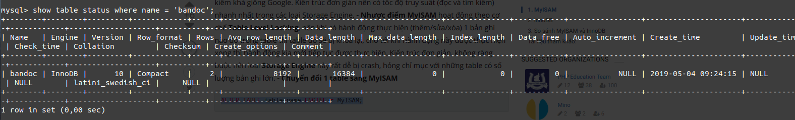

# Mục lục 
1. [MyISAM trong MYSQL ](#a)
2. [InnoDB trong MYSQL](#b)
3. [Storage Engine Default](#e)
4. [Chuyển đổi Storage Engine của bảng](#c)


Trong MYSQL khi tạo ra một bảng thì sẽ có nhiều kiểu Storage Engine(lưu trữ) để ta có thể lựa chọn. Storage Engine ảnh hưởng đến tốc độ truy vấn của DB. Hai Storage Engine có hiệu suất cao được chú ý đến đó là `MyISAM` và `InnoDB` 

<a name='a'>

## 1. MyISAM trong MYSQL </a>
Đây là một Storage Engine mặc định được sử dụng phổ biến. 

Ưu điểm 
- Hỗ trợ Full Text Index do đó  có tốc độ truy vấn nhanh 
- Phù hợp với yêu cầu về tốc độ truy vấn 
- Không hỗ trợ khóa ngoại 

Nhược điểm
- Hoạt động theo cơ chế  Table Level Locking Nên khi ta chỉnh sửa bản ghi trong table thì table sẽ bị khóa lại 
- Kiến trúc đơn giản nên dễ bị hỏng đối với một table có số lượng bản ghi lớn 
- Không hỗ trợ giao dịch 

<a name='b'>

##  2. InnoDB trong MYSQL</a>
Đây là Storage Engine mới hơn có nhiều tính năng và ưu điểm vượt trội hơn so với MyISAM

Ưu điểm
- Có tính rằng buộc dữ liệu cao do hoạt động theo cơ chế ROW level locking 
- Khi chỉnh sửa bản ghi trong table thì các bản ghi khác vẫn hoạt động bình thường 
- Phù hợp với môi trường dữ liệu lớn 
- Hỗ trợ khóa ngoại
- Hỗ trợ giao dịch 

Nhược điểm 
- Sử dụng lượng RAM lớn

<a name='e'>

# 3. Storage Engine Default</a>
Thay đổi mặc định trong mysql Storage Engine là MyISAM thành InnoDB ta sẽ vào file `/etc/my.cnf` và thêm một vào dòng sau
```
default_st Storage_engine = InnoDB
```
<a name='c'>

# 4. Chuyển đổi Storage Engine của bảng</a>
Chuyển từ `InnoDB` sang `MyISAM` 
```
ALTER TABLE table_name ENGINE = MyISAM;
```

Đầu tiên ta kiểm tra xem Storage Engine của bảng 



Sau đó ta chuyển đổi và kiểm tra lại 


# Tài liệu thao khảo 
https://viblo.asia/p/su-khac-nhau-giua-2-storage-engine-myisam-va-innodb-bJzKmgVPl9N

https://viblo.asia/p/myisam-innodb-in-mysql-924lJOkm5PM

https://stackoverflow.com/questions/12614541/whats-the-difference-between-myisam-and-innodb


