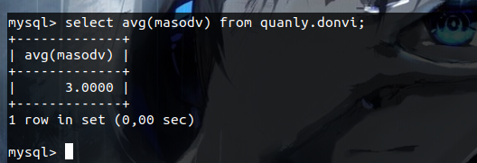

# MỤC LỤC
1. [Truy vấn select](#select)
2. [Mệnh đề where](#where)
3. [Lệnh update](#update)
4. [Lệnh delete](#delete)
5. [Mệnh đề like](#like)
6. [Mệnh đề order by](#orderby)
7. [Truy vấn join](#join)
8. [Lệnh alter](#alter)
9. [Sử dụng in](#in)
10. [Dùng between](#between)
11. [lệnh insert](#insert)
12. [Sử dụng view](#view)
13. [File log trong mysql](#log)
<a name="select">

# 1. Truy vấn Select</a>
Dùng để lấy dữ liệu trong các bảng của MYSQL.

Cú pháp 
```
SELECT truong1, truong2,...truongN FROM ten_bang
```
ví dụ hiển thị tất cả  dữ liệu trong bang1 thì ta dùng dấu * muốn hiển thị trường nào thì ta chọn từng trường theo cú pháp.


- `Select DISTINCT` là truy vấn dùng để loại bỏ nhưng hàng trùng lặp trong một cột 


- `select min` là truy vấn được sử dụng để  trả về giá trị min của cột chọn. kiểu số sẽ so sánh lớn nhỏ còn kiểu text sẽ so sánh theo bảng chữ cái 
- `select max` giống với `select min` nhưng nó sẽ trả về giá trị max.


- `select count` sẽ trả về số lượng hàng của cột đã chỉ định 


- `select avg` sẽ trả về giá trị trung bình của cột đó. Nếu là kiểu text thì nó sẽ là 0. Chỉ áp dụng với kiểu số



- `select sum` sẽ trả về giá trị tổng của cột đó. Chỉ áp dụng với kiểu số.


<a name="where">

# 2. Mệnh đề where</a>
Dùng để thêm điều kiện vào cho câu lệnh

Cú pháp 
```
SELECT truong1, truong2,...truongN FROM ten_bang
[WHERE dieuKien1 [AND [OR]] dieuKien2.....
```


- Đằng trước có thể là `select` hoặc một lệnh khác như  `delete` hay `update`
- Có thể xác định bất kỳ điều kiện nào khi sử dụng mệnh đề where
- Mệnh đề where có thể đi kèm với `and` `or` và `not` ở trong điều kiện


<a name="update">

# 3. Lệnh update</a>
Dùng để sywar đổi dữ liệu trong bảng của mysql 

Cú pháp
```
UPDATE ten_bang SET truong1=giaTri_moi_1, truong2=giaTri_moi_2
[MenhDe WHERE];
```


Khi update thì ở mệnh đề where ta phải ghi điều kiện là khóa chính hoặc khóa ngoại để có thể update chính xác được trường của bản ghi mà ta muốn thay đổi.

<a name="delete">

# 4. Lệnh delete</a>
Dùng để  xóa dữ liệu trong bảng chỉ định; hoặc xóa các user...

Cú pháp
```
DELETE FROM ten_bang [Menhde WHERE]
```


<a name="like">

# 5. Mệnh đề like</a>
Like thường được sử dụng kết hợp với các mệnh đề khác. Hay được dùng chung với WHERE và được thay thế cho dấu bằng. Có thể dùng ký tự `%` để tìm kiếm giống như `*` trong linux.

<a name="orderby">

# 6. Mệnh đề order by</a>
Dùng để sắp xếp các kết quả trả về sau khi truy vấn 

Cú pháp
```
SELECT truong1, truong2,...truongN FROM ten_bang
ORDER BY truong1, [truong2...] [ASC [DESC]]
```
Với thì thứ tự sẽ được sắp xếp theo 2 loại là ASC (tăng dần) và DESC(giảm dần).


<a name="join">

# 7. Sử dụng join</a>
Được sử dụng để lấy dữ liệu từ nhiều bảng và ghép chúng lại với nhau
```
SELECT truong1, truong2 
    FROM bang1  function JOIN bang 2
    on bang1.truong = bang2.truong;
```

Một số function trong lệnh join 
- `inner join` : lấy những phần chung của 2 bảng. 


- `right join` : lấy những phần dữ liệu chung của 2 bảng và bảng 2


- `left join` : lấy những phần dữ liệu chung của 2 bảng và bảng 1


<a name="alter">

# 8. Sử dụng Alter</a>
Dùng để sửa dữ liệu trường của bảng có thể thêm xóa và sửa đổi được trường của bảng 

Cú pháp 
```
ALTER TABLE tên-bảng change truong cũ trường mới;
```


<a name="in">

# 9. Sử dụng in</a>
Dùng để thay thế cho lệnh or khi viết điều kiện where trong lệnh

Ví dụ muốn chọn những bạn có điểm thi bằng 8.5 9 và 9.5 thay vì viết 3 or thì ta sử dụng in 
```
SELECT * FROM sinhvienk58 
    WHERE diemthi IN ( 8.50, 9.00, 9.50 );
```

<a name="between">

# 10. Dùng between</a>
Dùng để chỉ ra khoảng ở dữ của 2 số 
```
select * from tên-bảng
where diemthi BETWEEN 8 and 10;
```

<a name="insert">

# 11. Dùng insert</a>
Dùng để chèn dữ liệu vào trong bảng mà ta Muốn 
```
INSERT INTO ten_bang ( `truong1`, `truong2`,...`truongN` )
                       VALUES
                       ( 'giatri1', 'giatri2',...'giatriN' );
```

<a name="view">

# 12. Sử dụng view</a>
`view` Được dùng để để lưu một truy vấn mặc định nào đó như là một bảng.
Cấu trúc 
```
create view `tên view` as truy vấn
```

ví dụ là ta sẽ tạo ra một view như là một truy vấn bao gồm masonv, hoten, ngaysinh, masodv có cấu trúc như sau 

```
create view `test` as select masonv, hoten, ngaysinh, masodv from quanly.nhanvien
```
sau đó ta đọc view như đọc bảng bằng truy vấn 
```
SELECT * FROM `accounts_v_members`;
```
sự khác nhau của view và tables

| view | tables |
|------|--------|
| được tạo ra từ một truy vấn. không phải là nơi lưu trữ dữ liệu | là nơi lưu trữ dữ liệu nếu xóa đi thì dữ liệu sẽ bị mất đi   |
| Không tăng kích thước dung lượng của nó lên | sẽ tăng kích thước dung lượng khi ta thêm dữ liệu vào đó |
| chỉ cho phép đọc dữ liệu không thể chỉnh sửa | có thể chỉnh sửa dữ liệu trên bảng | 

<a name="log">

# 13. File log trong mysql</a>
- Ta sẽ dùng lệnh hoặc sử file `/etc/my.cnf` để có thể enable được file log này lên 
```
SET global general_log = 1;
```
hoặc sửa file `/etc/my.cnf` ở dưới phần `mysqld`
```
general_log_file = /path/to/query.log
general_log      = 1
```

### Giải thích lệnh trong lúc tạo file log: 
- general_log_file: Tạo bản ghi lịch sử ra một file trong hệ thống 
- general_log = 1 : Bật chế độ log theo dạng table 


# LINK THAM KHẢO 
https://www.w3schools.com/sql/sql_select.asp

https://stackoverflow.com/questions/6479107/how-to-enable-mysql-query-log

https://www.w3schools.com/sql/sql_join.asp

https://freetuts.net/tao-mysql-stored-procedure-dau-tien-279.html