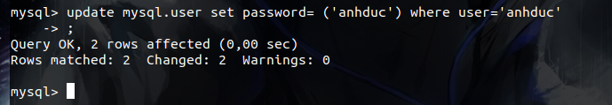

Các lệnh giúp sử dụng MYSQL
# Mục lục 
I. [Thao tác với database](#a)

II. [Thao tác với với user](#b)

III. [Thao tác với table](#c)

Iv. [Thao tác với cột và hàng](#d)

<a name="a">

# I. Thao tác với Database</a>
## 1. Tạo một database
```
CREATE database tên-database;
```


và ta có thể kiểm tra lại các database 
```
show databases;
```

## 2. Xóa một database
```
DROP database tên-database;
```


## 3. Để làm việc với một cơ sở dữ liệu
```
USE tên-database;
```


<a name="b">

# II. Thao tác với user </a>
## 1. Tạo ra một user 
```
create user 'user-name'@'IP' identified by 'password';
```

## 2. Hiển thị toàn bộ user 
```
mysql> SELECT * FROM mysql.user;
```

## 3. Xóa một user 
```
mysql> DELETE FROM mysql.user WHERE user = ' ';
```

## 4.Xóa tất cả user mà không phải root
```
mysql> DELETE FROM mysql.user WHERE NOT (host="localhost" AND user="root");
```

## 5. Đổi tên tài khoản root
```
mysql> UPDATE mysql.user SET user="mydbadmin" WHERE user="root";
```

## 6. Gán quyền cho một user
```
mysql> GRANT ALL PRIVILEGES ON *.* TO 'username'@'localhost'
```

## 7. Đổi mật khẩu cho một user 
```
mysql> UPDATE mysql.user SET password=PASSWORD("newpass") WHERE User='username';
```


<a name="c">

# III. Các thao tác với table </a>
Trong một trường thì có kiểu dữ liệu sẽ được phân ra thì một số kiểu của trường là: 
- Kiểu số : int; float;...
- date time: yyyy-mm-dd : ngày tháng năm ; HH:MM:SS (giờ phút giây)
- Kiểu chuỗi: char; varchar
## 1. Tạo bảng table 
```
CREATE TABLES name(trường trong bảng );
```

## 2. Hiển thị tất cả các bảng
```
show tables;
```

## 3. Đổi tên bảng 
```
rename table (tên bảng 1) to (tên bảng 2);
```

## 4. Xóa bảng 
```
drop table (tên bảng);
```

## 5. Hiển thị dữ liệu trong bảng 
```
SELECT * FROM tablename;
```


<a name="d">

# IV. Thao tác với cột và hàng </a>
## 1. Hiển thị các cột trong bảng 
```
mysql> DESC mytable;
hoặc
mysql> SHOW COLUMNS FROM mytable;
```

## 2. Thêm cột cho bảng 
```
alter table tablename add column varchar(40) first;
```

ta kiểm tra lại bằng `show tables`


Xóa một cột tương tự thêm thay `add` bằng `drop`

## 3.Thay đôi tên của cột 
```
alter table sinhvien change columnold columnnew (thuộc tính của trường);
```


Giải thích đọc bảng 
- filed : tên cột 
- Type : Kiểu của trường
- NULL : có được để giá trị null không
- key : có là key chính hay không
- default : mặc định của cột là 

# link tham khảo 

https://freetuts.net/hoc-mysql/mysql-can-ban