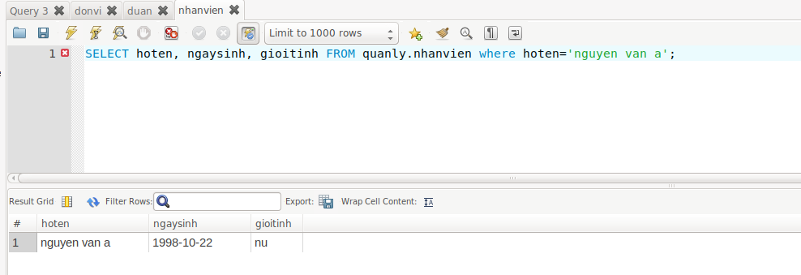

# Đề bài 
1. Tạo cơ sở dữ liệu quản lý đơn vị gồm 3 bảng: Nhân viên, đơn vị và dự án có cấu trúc như sau:
NHANVIEN (masoNV,  hoten , ngaysinh , gioitinh, luong, masoDV,masoDA)
DONVI (masoDV, tenDV , nguoiQL, ngaybatdau)
DUAN (masoDA, tenDA, diadiemDA, masoDV)
-  Kiểu dữ liệu của các trường sinh viên tự thiết kế
- Các trường có gạch chân là khóa chính của các bảng.
- Mặc định địa điểm dự án là ‘141 Duong Chien Thang’.
- Tên đơn vị không được để trống.
2. Thiết lập mối quan hệ giữa các bảng vừa tạo ra.
3. Nhập dữ liệu vào các bảng trên, mỗi bảng ít nhất 3 bản ghi.
4. Hiển thị họ tên, ngày sinh, giới tính của những nhân viên có tên ‘A’
5. Cho biết danh sách những đơn vị tham gia một dự án cụ thể nào?
6. Đưa ra danh sách các nhân viên có lương lớn hơn lương trung bình
7. Tạo một view để đưa ra mã nhân viên, họ tên, ngày sinh, tên đơn vị có lương lớn hơn 3500. Có thể dùng view này để bổ sung bản ghi có được không?

# Thực hành 
1. Sử dụng mysql workbench để tạo ra 3 bảng như yêu cầu. 
2. Tạo thêm liên kết giữa các bảng bằng cách tạo ra khóa ngoại với option `foreign key(masodv) references donvi(masodv)` khi ta tạo bảng `duan` và `nhanvien`
3. Nhập dữ liệu 
- Bảng nhân viên 

- Bảng đơn vị 

- Bảng dự án 

4. sử dụng truy xuất `select` và `where` 

5. 

6. 

7. 
