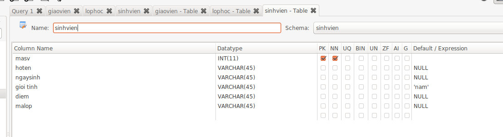

1. Tạo cơ sở dữ liệu quản lý sinh viên gồm 3 bảng Sinh viên, Giáo viên và Lớp học. Cấu trúc các bảng như sau:
- SINHVIEN ( *maSV*, hoten , ngaysinh, gioitinh, diem, malop)

- GIAOVIEN (*maGV* , tenGV, trinhdoCM, malop )

- LOPHOC ( *malop*, tenlop, diadiem, GVCN)

- Kiểu dữ liệu của các trường sinh viên tự thiết kế
- Các trường có gạch chân là khóa chính của các bảng
- Giới tính có giá trị mặc định là ‘Nam’
- Tên lớp không được để trống
2. thiết lập mối quan hệ giữa các bảng vừa tạo ra.
3. nhập dữ liệu vào các bảng trên, mỗi bảng ít nhất 3 bản ghi.
4. đưa ra danh sách các sinh viên nữ đạt điểm giỏi ( điểm >=9 )
5. Hiển thị tên giáo viên, trình độ của tất cả những giáo viên dạy lớp có tên là at5
6. Cho biết họ tên, điểm của các sinh viên có điểm lớn hơn điểm trung bình của lớp
7. tạo một thủ tục lưu trữ có chức năng hiển thị danh sách sinh viên của một lớp bất kỳ