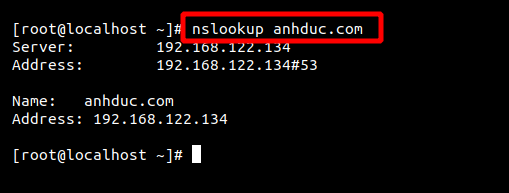

Hướng dãn cài DNS server trên centos7

# Mô hình 
DNS server primary 
- OS: Centos7 
- Ip : 192.168.122.228
- Cài đặt gói : bind 

Client
- OS : centos7
- IP : 192.168.122.134

# Cài đặt SERVER 
## 1. cài đặt gói bind 
```
yum install bind bind-utils -y
```


## 2. Chỉnh sử file `/etc/named.conf`
```
vi /etc/named.conf
```
```
//
// named.conf
//
// Provided by Red Hat bind package to configure the ISC BIND named(8) DNS
// server as a caching only nameserver (as a localhost DNS resolver only).
//
// See /usr/share/doc/bind*/sample/ for example named configuration files.
//
// See the BIND Administrator's Reference Manual (ARM) for details about the
// configuration located in /usr/share/doc/bind-{version}/Bv9ARM.html

options {
        listen-on port 53 { 192.168.122.134; };
        listen-on-v6 port 53 { ::1; };
        directory       "/var/named";
        dump-file       "/var/named/data/cache_dump.db";
        statistics-file "/var/named/data/named_stats.txt";
        memstatistics-file "/var/named/data/named_mem_stats.txt";
        recursing-file  "/var/named/data/named.recursing";
        secroots-file   "/var/named/data/named.secroots";
        allow-query     { 192.168.122.0/24; };
        /*
         - If you are building an AUTHORITATIVE DNS server, do NOT enable recursion.
         - If you are building a RECURSIVE (caching) DNS server, you need to enable
           recursion.
         - If your recursive DNS server has a public IP address, you MUST enable access
           control to limit queries to your legitimate users. Failing to do so will
           cause your server to become part of large scale DNS amplification
           attacks. Implementing BCP38 within your network would greatly
           reduce such attack surface
        */
        recursion yes;

        dnssec-enable yes;
        dnssec-validation yes;

        /* Path to ISC DLV key */
        bindkeys-file "/etc/named.iscdlv.key";

        managed-keys-directory "/var/named/dynamic";

        pid-file "/run/named/named.pid";
        session-keyfile "/run/named/session.key";
};

logging {
        channel default_debug {
                file "data/named.run";
                severity dynamic;
        };
};

zone "." IN {
        type hint;
        file "named.ca";
};

zone "com" IN {
type master;
file "forward.com";
allow-update { none; };
};

zone "192.168.122.in-addr.arpa" IN {
type master;
file "reverse.com";
allow-update { none; };
};

include "/etc/named.rfc1912.zones";
include "/etc/named.root.key";
```
ta chú ý thay đổi một số điểm sau 


## 3. Tạo dữ liệu cho các zone file 
```
vi /var/named/forward.com
```
thêm vào dòng dữ liệu 
```
$TTL 86400
@   IN  SOA     anhduc.com. nguyenanhduchihi@gmail.com. (
        2019052401  ;Serial
        3600        ;Refresh
        1800        ;Retry
        604800      ;Expire
        86400       ;Minimum TTL
)
@       IN  NS          anhduc.com
@       IN  A           192.168.122.228
@       IN  A           192.168.122.134
anhduc         IN  A     192.168.122.228
influxdb      IN  A     192.168.122.134
```
Trong file 
```
vi /var/named/reverse.com
```
thêm vào dữ liệu 
```
$TTL 86400
@   IN  SOA     anhduc.com. nguyenanhduchihi.gmail.com. (
        2019052401  ;Serial
        3600        ;Refresh
        1800        ;Retry
        604800      ;Expire
        86400       ;Minimum TTL
)
@       IN  NS          anhduc.com.
@       IN  PTR         com.
anhduc            IN  A   192.168.122.228
influxdb          IN  A   192.168.122.134
134     IN  PTR         anhduc.com.
228     IN  PTR         influxdb.com.
```
Tiếp theo chúng ta tắt selinux ở trong file /etc/selonux/config


Chúng ta tắt filewall của DNS server 
```
systemctl disable firewalld
systemctl stop firewalld
```
Khởi động DNS 
```
systemctl enable named
systemctl start named
```
sau đó ta trỏ DNS của client tới DNS server 

Rồi thử lại bằng lệnh nslookup xem đã có thể kết nối tới DNS server chưa



# link tham khảo 

https://github.com/MinhKMA/DNS_note/blob/master/docs/install_dns.md