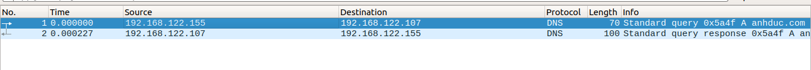
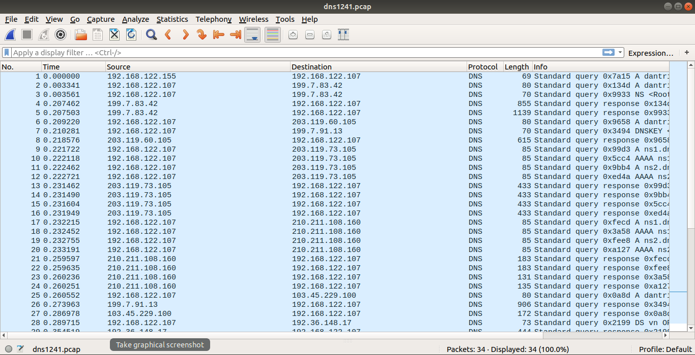
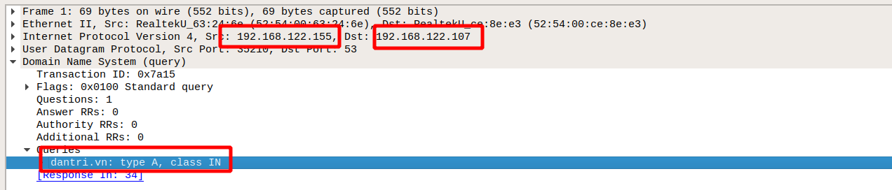
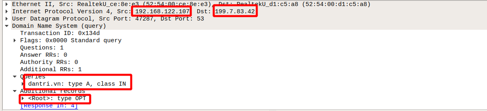
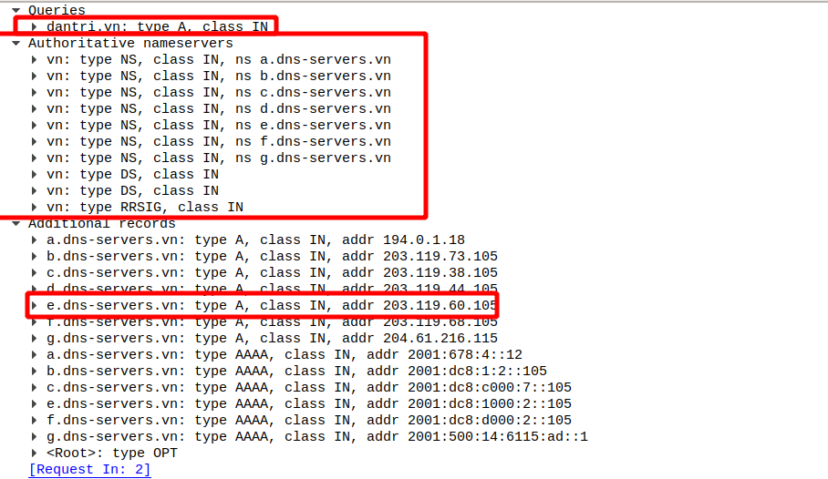
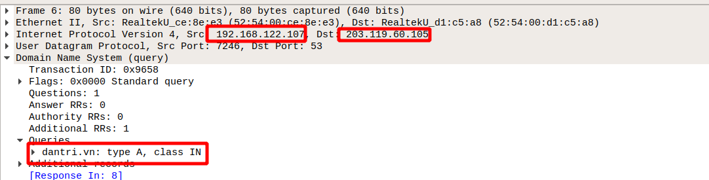
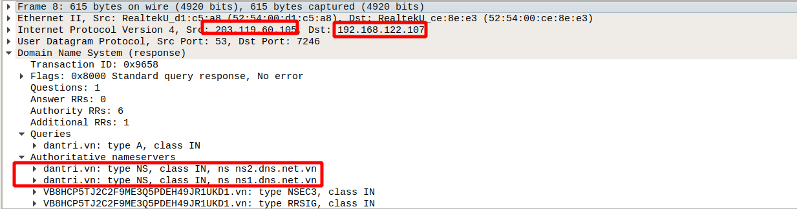

# Ví dụ 1:
kịch bản: bắt gói tin truy vấn từ client(192.168.122.155) đến DNS server(192.168.122.107)

ở client sẽ thực hiện lệnh truy vấn đến Server 
```
nslookup anhduc.com 
```



Kết quả sau khi ta bắt gói tin thì ta sẽ thấy 2 gói tin. Gói tin 1 là truy vấn bản ghi A của DNS 192.168.122.107

Gói tin query 


Chúng ta thấy rằng gói tin được gửi từ địa chỉ là 192.168.122.155 đến server 192.168.122.107 với nội dung query là ` anhduc.com : type A, class IN `

Gói tin answer 


Gói tin này sẽ được trả về từ server 192.168.122.107 đến 192.168.122.155 với nội dung của gói query và có thêm phần câu trả lời answers là ` anhduc.com : type A, class IN, addr 192.168.122.107` 

Ví dụ 2: Truy vấn ra ngoài internet 
kịch bản : client sẽ truy vấn bản ghi A đến trang dantri.vn với lệnh. Sẽ có cả bản ghi AAAA nhưng chúng ta sẽ chỉ quan tâm tới bản ghi A thôi 
```
nslookup dantri.vn 
```
còn ở server sẽ dùng tcpdump để bắt gói tin 
```
tcpdupm -i eth0 -w dns.pcap udp port 53 
```

Sau khi đọc gói tin ta cùng phân tích cách làm việc của DNS server



Đây là những gói tin ta bắt được và ta cùng đi phân tích từng gói tin một 

Gói 1



Với gói tin đầu tiên thì client sẽ truy vấn đến server với câu hỏi là bản ghi A của trang `dantri.vn`

Gói thứ 2



Do không có Bản ghi của trang web dantri.vn nên nó sẽ đi ra ngoài để hỏi về bản ghi của nó và nó tới địa chỉ DNS root 199.7.83.42

Gói thứ 3. và sau đó bản ghi sẽ được DNS root trả về 



Nội dung gói này là DNS root cho DNS server biết rằng cái trang web đó thuộc quyền quản lý của Authoritative nameservers việt nam và cho địa chỉ các nameserver đó.
 
Gói 4. Thì ta để ý server 203.119.60.105 đã được chọn 



ở gói tin này thì DNS server sẽ query tới authoritative hỏi địa chỉ của của dantri.vn 

