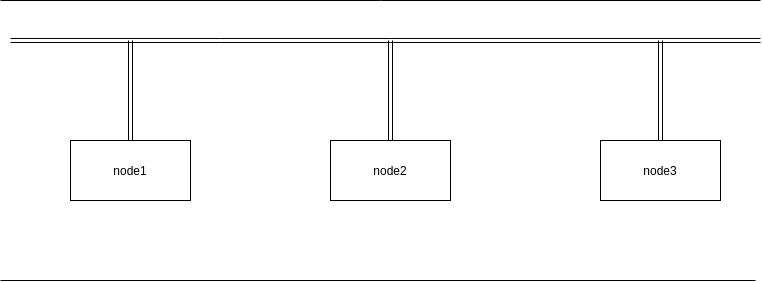
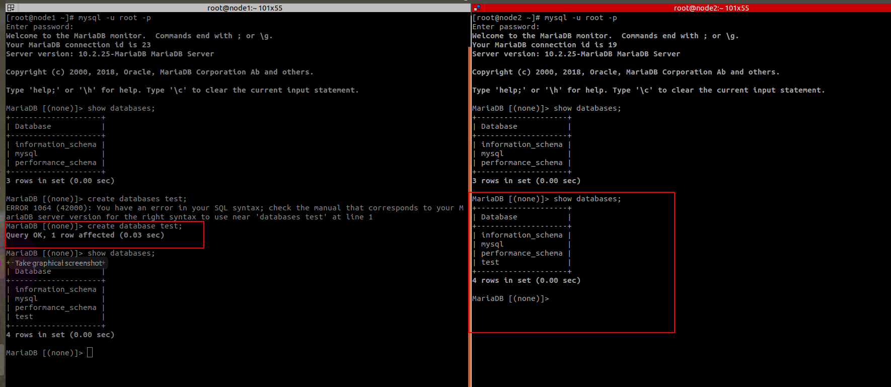

# Galera Cluster Centos7
Đây là một cách để đồng bộ dữ liệu giữa các node trong mô hình của Galera Cluster. Mô hình này theo kiểu lưu trữ active-active. Là ghi dữ liệu dồng thời trên tất cả các node.

# Chuẩn bị 
| Host name | Thông số |
|----|----|
| node1 | 1 CPU; 512 RAM; 10 G; ip: 10.10.10.22 | 
| node2 | 1 CPU; 512 RAM; 10 G; ip: 10.10.10.23 |
| node3 | 1 CPU; 512 RAM; 10 G; ip: 10.10.10.24 |

Mô hình 



# Thực hiện
## Cấu hình VM 
Tại node1 
- Cấu hình đặt tên VM 
```
hostnamectl set-hostname node1
```
Tại node2
- Cấu hình tên VM 
```
hostnamectl set-hostname node2
```
Tại node3
- Cấu hình tên VM 
```
hostnamectl set-hostname node3
```
Trên tất cả các node 
- Cấu hình host 
```
echo "10.10.10.22 node1" >> /etc/hosts
echo "10.10.10.23 node2" >> /etc/hosts
echo "10.10.10.24 node3" >> /etc/hosts
```
- Tắt firewall và selinux 
```
sed -i 's/SELINUX=enforcing/SELINUX=disabled/g' /etc/sysconfig/selinux
sed -i 's/SELINUX=enforcing/SELINUX=disabled/g' /etc/selinux/config
systemctl stop firewalld
systemctl disable firewalld
reboot
```
## Cài đặt mariadb 
- Cài đặt MARIDB
```
yum install -y mariadb mariadb-server
```
- Cài đặt gói `galera` và gói `rsync` hỗ trợ 
```
yum install -y galera rsync
```
- Tắt gói mariadb
```
systemctl stop mariadb
```

*NOTE: khi thiết lập galera mariadb. nếu bật thì sẽ phải restart lại còn nếu tắt chỉ cần start*

## Cài Đặt Galera Cluster 
Tại node 1
```
cp /etc/my.cnf.d/server.cnf /etc/my.cnf.d/server.cnf.bak

echo '[server]
[mysqld]
bind-address=10.10.10.22

[galera]
wsrep_on=ON
wsrep_provider=/usr/lib64/galera/libgalera_smm.so
#add your node ips here
wsrep_cluster_address="gcomm://10.10.10.22,10.10.10.23,10.10.10.24"
binlog_format=row
default_storage_engine=InnoDB
innodb_autoinc_lock_mode=2
#Cluster name
wsrep_cluster_name="portal_cluster"
# Allow server to accept connections on all interfaces.
bind-address=10.10.10.22
# this server ip, change for each server
wsrep_node_address="10.10.10.22"
# this server name, change for each server
wsrep_node_name="node1"
wsrep_sst_method=rsync
[embedded]
[mariadb]
[mariadb-10.2]
' > /etc/my.cnf.d/server.cnf
```

Tại node 2
```
cp /etc/my.cnf.d/server.cnf /etc/my.cnf.d/server.cnf.bak

echo '[server]
[mysqld]
bind-address=10.10.10.23

[galera]
wsrep_on=ON
wsrep_provider=/usr/lib64/galera/libgalera_smm.so
#add your node ips here
wsrep_cluster_address="gcomm://10.10.10.22,10.10.10.23,10.10.10.24"
binlog_format=row
default_storage_engine=InnoDB
innodb_autoinc_lock_mode=2
#Cluster name
wsrep_cluster_name="portal_cluster"
# Allow server to accept connections on all interfaces.
bind-address=10.10.10.23
# this server ip, change for each server
wsrep_node_address="10.10.10.23"
# this server name, change for each server
wsrep_node_name="node2"
wsrep_sst_method=rsync
[embedded]
[mariadb]
[mariadb-10.2]
' > /etc/my.cnf.d/server.cnf
```

Tại node 1
```
cp /etc/my.cnf.d/server.cnf /etc/my.cnf.d/server.cnf.bak

echo '[server]
[mysqld]
bind-address=10.10.10.24

[galera]
wsrep_on=ON
wsrep_provider=/usr/lib64/galera/libgalera_smm.so
#add your node ips here
wsrep_cluster_address="gcomm://10.10.10.22,10.10.10.23,10.10.10.24"
binlog_format=row
default_storage_engine=InnoDB
innodb_autoinc_lock_mode=2
#Cluster name
wsrep_cluster_name="portal_cluster"
# Allow server to accept connections on all interfaces.
bind-address=10.10.10.24
# this server ip, change for each server
wsrep_node_address="10.10.10.24"
# this server name, change for each server
wsrep_node_name="node3"
wsrep_sst_method=rsync
[embedded]
[mariadb]
[mariadb-10.2]
' > /etc/my.cnf.d/server.cnf
```

## Khởi động dịch vụ và test 
Taị node1 
```
galera_new_cluster
systemctl start mariadb
systemctl enable mariadb
```

Tại node2 và node3
```
systemctl start mariadb
systemctl enable mariadb
```

Kiểm tra lại 
```
[root@node1 ~]# mysql -u root -e "SHOW STATUS LIKE 'wsrep_cluster_size'"
+--------------------+-------+
| Variable_name      | Value |
+--------------------+-------+
| wsrep_cluster_size | 3     |
+--------------------+-------+
```



Chỉ cần tạo databases tại một máy thì máy kia cũng có databases. 


# link tham khảo 
https://severalnines.com/resources/tutorials/galera-cluster-mysql-tutorial

https://blog.cloud365.vn/linux/cai-dat-galera-mariadb/#tong-quan

https://www.digitalocean.com/community/tutorials/how-to-configure-a-galera-cluster-with-mariadb-on-ubuntu-18-04-servers

