1. Tạo cơ sở dữ liệu quản lý thư viện gồm 3 bảng: Bạn đọc, sách và phiếu mượn
BANDOC (maBD , tenBD , lop , ngaycap)

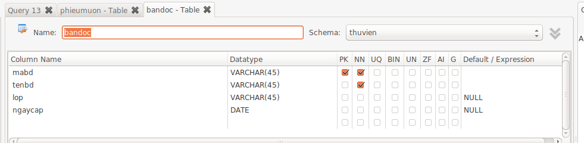

SACH (masach , tensach, tacgia, namXB, nhaXB)

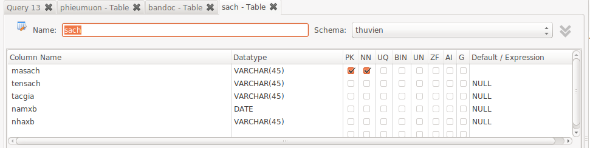

PHIEUMUON (maBD , masach, ngaymuon, ngaytra, datra)

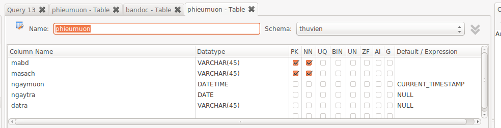

- Kiểu dữ liệu của các trường sinh viên tự thiết kế
- Các trường có gạch chân là khóa chính của bảng
- Ngày mượn (ngaymuon ) có giá trị mặc định là ngày hệ thống.
- Tên bạn đọc không được để trống.
2. Thiết lập mối quan hệ giũa các bảng vừa tạo ra.

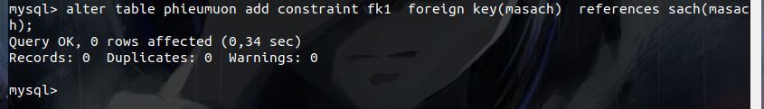

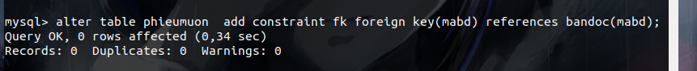

3. Nhập dữ liệu vào các bảng trên, mỗi bảng ít nhất 3 bản ghi.
- Phieumuon

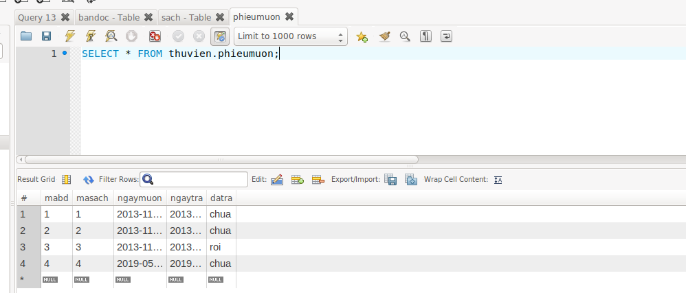

- bandoc

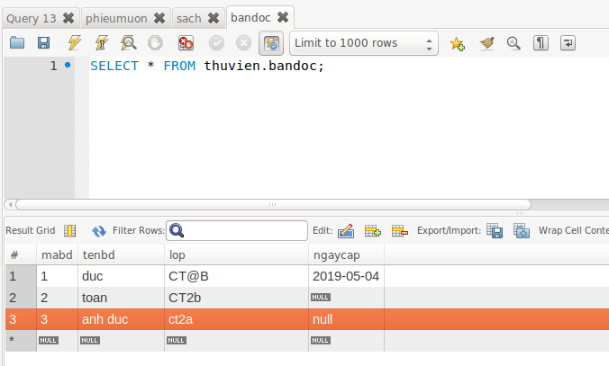

- sach

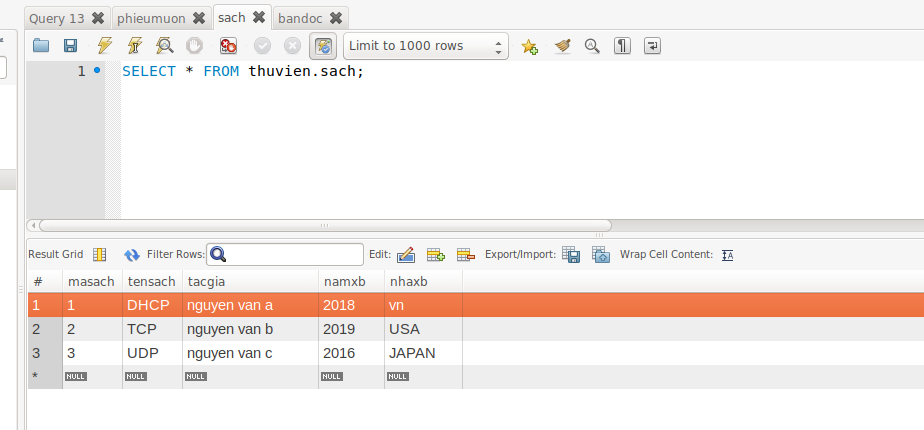

4. Cho biết những tên sách của nhà xuất bản Giáo dục được xuất bản vào năm 2000. Kết quả là trống và không có.

5. Liệt kê những tên sách mà bạn đọc có tên là ‘AAA’ đã mượn của thư viện. Kết quả là trống và không có ai

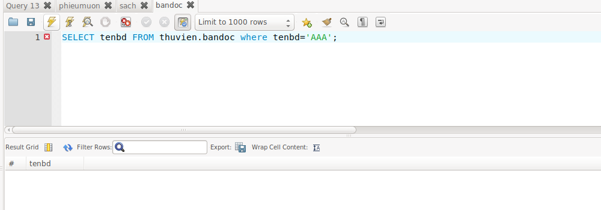

6. Danh sách những bạn đọc đã đăng ký thẻ nhưng chưa có lần nào mượn sách. kết quả là không có ai.

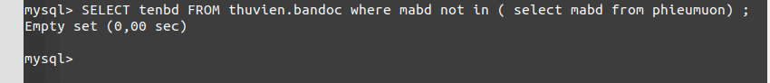

7. Tạo một view để hiển thị các thông tin về mã bạn đọc, tên bạn đọc và lớp của bạn đọc mượn sách quá hạn. Có thể dùng view này để bố sung dữ liệu vào bảng BANDOC được không?
- Không thể bổ sung dữ liệu vào bảng bandoc được.
- Ta thực hiện lệnh sau: 

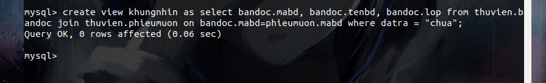

