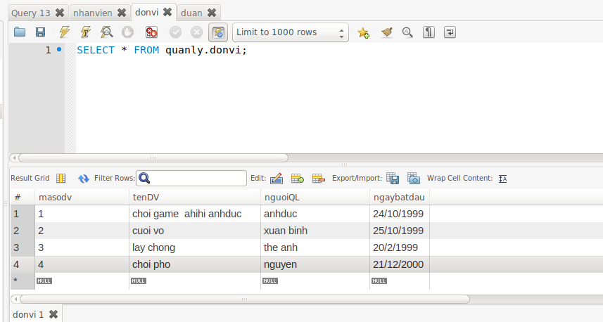
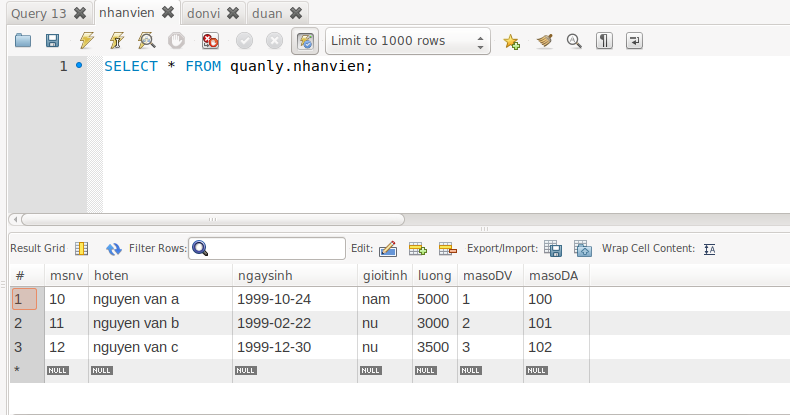
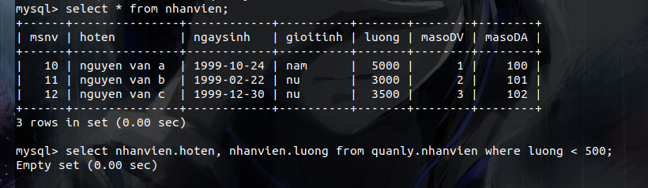
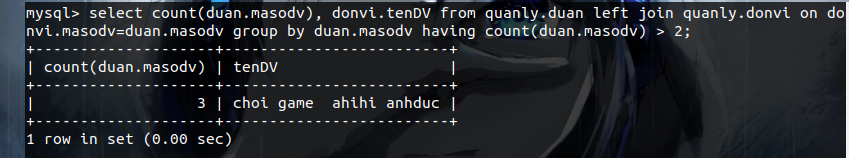
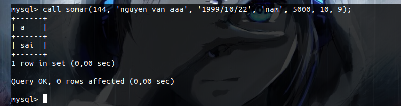

# Đề bài 

1. Lập các bảng như ảnh dưới đây

Ta có các table như sau 

2. Hiển thị họ tên, lương của nhân viên nữ có lương <500
- Theo bảng lập ra không có nhân viên nào có lương dưới 500 và dưới đây là kết quả thực thi lệnh truy vấn.

3. Hiển thị tên và địa điểm của các dự án của một đơn vị cụ thể nào đó

4.  Cho biết tên những đơn vị đang thực hiện trên 2 dự án

5. Tạo thủ tục lưu trũ để thông qua thủ tục này có thể bổ sung thêm 1 bản ghi vào NHANVIEN (thủ tục phải thực hiện kiểm tra tính hợp lệ của dữ liệu cần)

ta có đoạn tạo thủ tục như sau 

Đây là kết quả của khi nhập dữ liệu không trùng và bị trùng với mã nhân viên trong bảng nhân viên.

