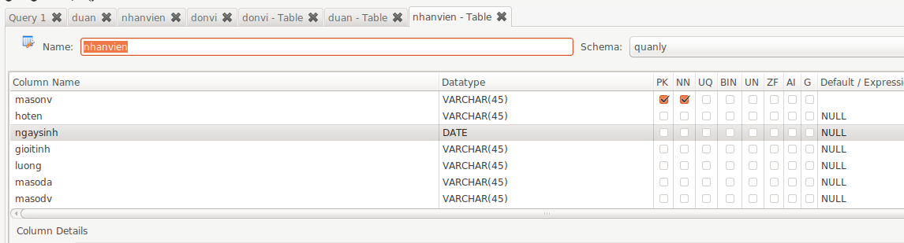
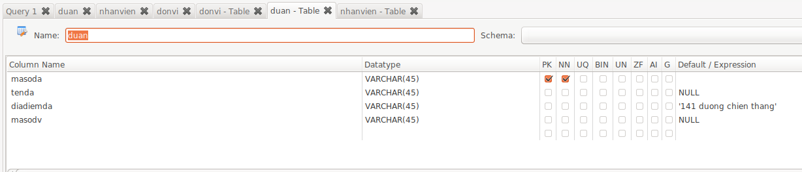
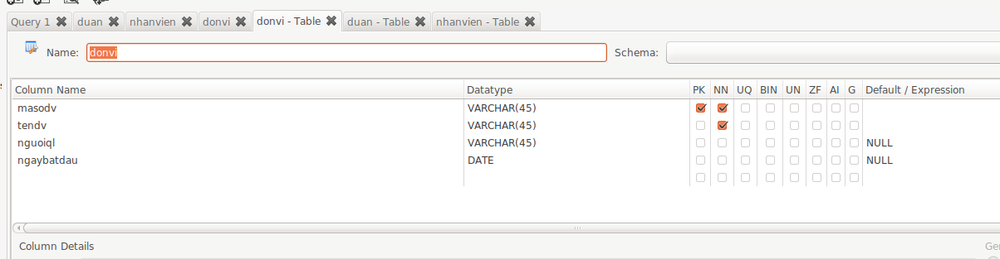
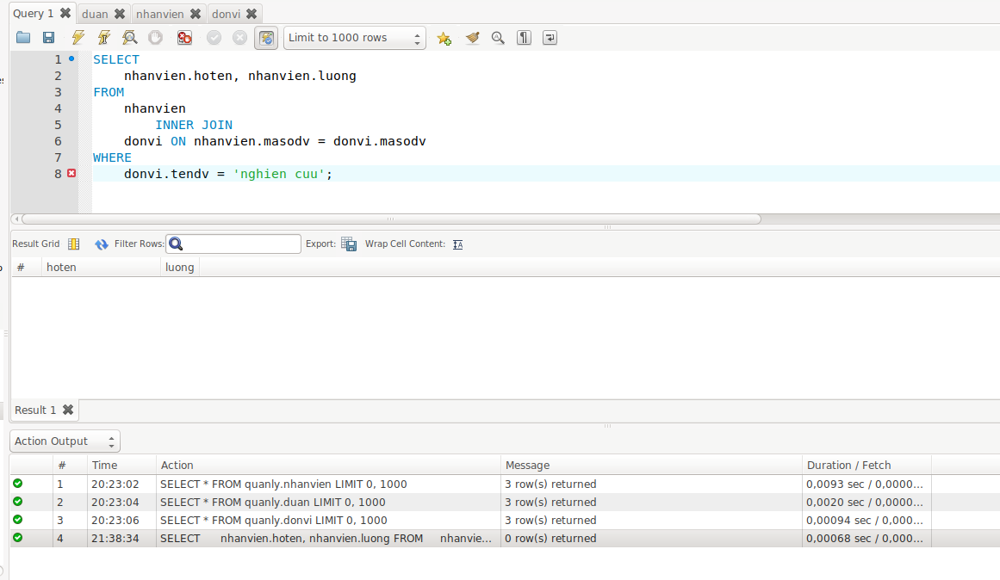
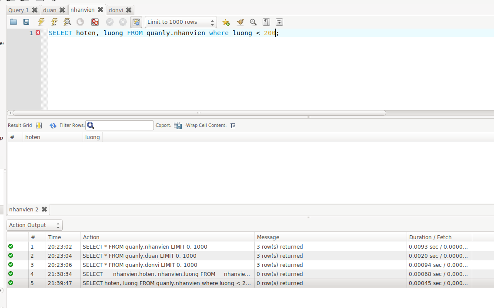
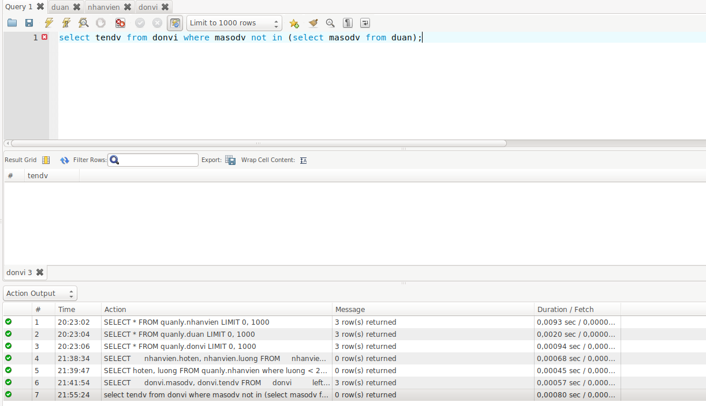
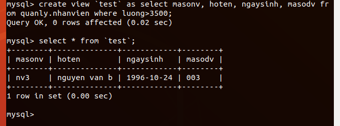

# Đề bài
1. Lập các bảng giống như bảng sau
 

2. Đưa ra họ tên, lương của các nhân viên có trong đơn vị ‘nghien cuu’

3. Cho biết số nhân viên có lương dưới 200 của từng đơn vị

4. Đưa ra danh sách các đơn vị chưa có dự án nào

5. Tạo một view để đưa ra mã nhân viên, họ tên, ngày sinh, tên đơn vị của những nhân viên có lương trên 3500. Có thể dùng view này để bổ sung dữ liệu cho bảng NHANVIEN hay không?
- Không thể bổ sung dữ liệu cho bảng bằn view

