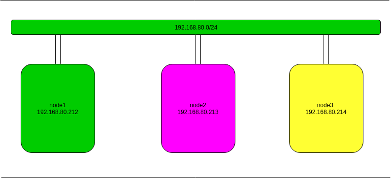

Mô hình 



| Hostname | IP | OS | RAM | DISK | 
|---|----|---|---|----|
| node1 | 192.168.80.212 | ubuntu 16.04 | 2G | 20G |
| node2 | 192.168.80.213 | ubuntu 16.04 | 2G | 20G |
| node3 | 192.168.80.214 | ubuntu 16.04 | 2G | 20G |

## Cài đặt trên tất cả các node
1. Thêm repo của mariadb 
```
apt-key adv --recv-keys --keyserver hkp://keyserver.ubuntu.com:80 0xF1656F24C74CD1D8

add-apt-repository 'deb [arch=amd64,i386,ppc64el] 
http://nyc2.mirrors.digitalocean.com/mariadb/repo/10.1/ubuntu xenial main'

apt-get update
```

2. Download mariadb 
```
apt-get install mariadb-server
```
3. Tắt file wall 
```
systemctl stop ufw
systemctl disable ufw
```
4. Tắt dịch vụ mariadb 
```
systemctl stop mysql
```

## Cấu hình trên node1
Tạo và sửa file dưới đây 
```
vi /etc/mysql/conf.d/galera.cnf
``` 
Với thông tin 
```
[mysqld]
binlog_format=ROW
default-storage-engine=innodb
innodb_autoinc_lock_mode=2
bind-address=0.0.0.0

# Galera Provider Configuration
wsrep_on=ON
wsrep_provider=/usr/lib/galera/libgalera_smm.so

# Galera Cluster Configuration
wsrep_cluster_name="test_cluster"
wsrep_cluster_address="gcomm://192.168.80.212,192.168.80.213.192.168.80.214"

# Galera Synchronization Configuration
wsrep_sst_method=rsync

# Galera Node Configuration
wsrep_node_address="192.168.80.212"
wsrep_node_name="galera-node1"
```

*Lưu ý* 
- Cần sửa ip đúng theo các node cài đặt 
- Tên các node đúng như các node đã lưu để dễ dàng phân biệt 

## Cấu hình trên node 2
Tạo và sửa file sau 
```
vi /etc/mysql/conf.d/galera.cnf
```
Ghi vào với thông tin 
```
[mysqld]
binlog_format=ROW
default-storage-engine=innodb
innodb_autoinc_lock_mode=2
bind-address=0.0.0.0

# Galera Provider Configuration
wsrep_on=ON
wsrep_provider=/usr/lib/galera/libgalera_smm.so

# Galera Cluster Configuration
wsrep_cluster_name="test_cluster"
wsrep_cluster_address="gcomm://192.168.80.212,192.168.80.213.192.168.80.214"

# Galera Synchronization Configuration
wsrep_sst_method=rsync

# Galera Node Configuration
wsrep_node_address="192.168.80.213"
wsrep_node_name="galera-node2"

```

## Cấu hình trên node3 
Tạo và sửa file sau 
```
vi /etc/mysql/conf.d/galera.cnf
```
Ghi vào với thông tin 
```
[mysqld]
binlog_format=ROW
default-storage-engine=innodb
innodb_autoinc_lock_mode=2
bind-address=0.0.0.0

# Galera Provider Configuration
wsrep_on=ON
wsrep_provider=/usr/lib/galera/libgalera_smm.so

# Galera Cluster Configuration
wsrep_cluster_name="test_cluster"
wsrep_cluster_address="gcomm://192.168.80.212,192.168.80.213.192.168.80.214"

# Galera Synchronization Configuration
wsrep_sst_method=rsync

# Galera Node Configuration
wsrep_node_address="192.168.80.214"
wsrep_node_name="galera-node3"
```
## Kiểm tra kết quả
1. Tại node1 
Bật galera
```
galera_new_cluster
```
Bật mariadb 
```
systemctl start mysql
```
2. Tại node2 và node3 bật dịch vụ mariadb 
```
systemctl start mysql
```
3. Kiểm tra xem đã được hay chưa bằng lệnh dưới đây
```
mysql -u root -p -e "SHOW STATUS LIKE 'wsrep_cluster_size'"
```
```
Output
+--------------------+-------+
| Variable_name      | Value |
+--------------------+-------+
| wsrep_cluster_size | 3     |
+--------------------+-------+
```


# Link tham khảo 
https://news.cloud365.vn/huong-dan-cai-dat-galera-mariadb-tren-ubuntu-16/#more-123