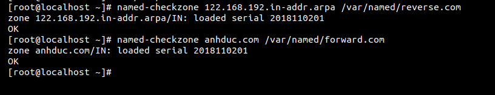

# I. Command rndc
`rndc` là lệnh dùng để controls a name server. Nó được sử dụng cho dịch vụ `ndc` của các phiên bản BIND cũ 

| Option |  DESCRIPTION |
|--------|--------------|
| -c(config) | Sử  dụng file config-file mặc định `/etc/rndc.config` đề làm file configuration |
| -k(key) | Sử dụng khóa `/etc/rndc.key` làm khóa xác thực | 
| -s(server) | Là một địa chỉ hoặc tên của server. Nếu ko có nó sẽ xử dụng defaut |
| -p(port) | Sử dụng port TCP để thay thế cho port control channel mặc định của BIND 9 |
| -V | Cho pháp ghi nhật ký chi tiết |
| flush | xóa cache trong DNS |
| halt  | Dừng server lại |
| flushname | Sử dụng để xóa một tên được cache trong file cache của DNS |
|flushtree | Xóa một tên và tất cả các subdomain của domain trong file cache |
| querylog | Bật tắt query logging |
| reload | Khởi động lại config và zone |
| status | Hiển thị trạng thái của server | 
| Stop  | Dừng server lại như halt |

# II. Command named-check
1. named-checkconf
- Được sử dụng để check syntaxyn errors của named configuration file. 

| option |  DESCRIPTION  |
|--------|---------------|
| -h     | Tóm tắt cách sử dụng của lệnh và out |
| -v     | In ra phiên bản của checkconf trong BIND |
| filename| check file mà ta chỉ định. Nếu không có chỉ định thì mặc định sẽ là /etc/named.config| 

2. Named-checkzone 
Được sử dụng để check các cấu hình của các zone mà ta đã cài đặt 
```
named-checkzone (option) zonename filename 
```


Hệ thống tên miền (DNS) là danh bạ của Internet. Con người truy cập thông tin trực tuyến thông qua các tên miền. Các trình duyệt web tương tác thông qua các địa chỉ Giao thức Internet (IP). DN S dịch tên miền thành địa chỉ IP để trình duyệt có thể tải tài nguyên Internet.

# Link tham khảo 

https://www.interserver.net/tips/kb/what-and-how-to-use-rndc/

https://ftp.isc.org/isc/bind9/cur/9.11/doc/arm/man.rndc.html

https://tecadmin.net/check-dns-configuration-file-bind/

https://www.cyberciti.biz/tips/howto-linux-unix-check-dns-file-errors.html

