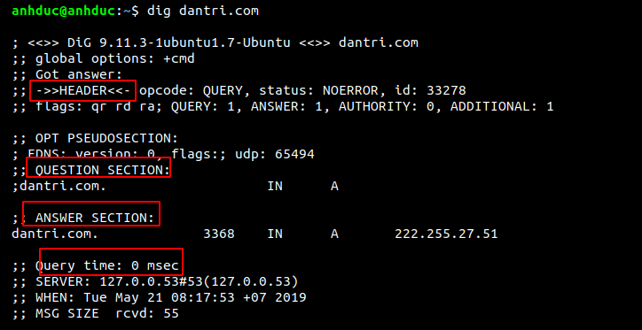
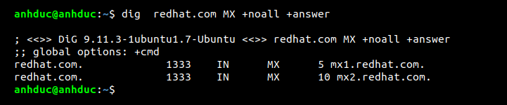
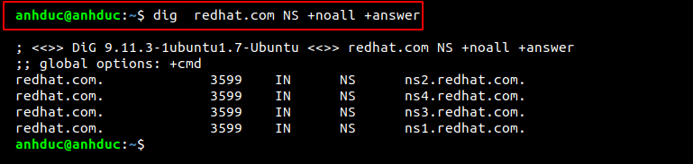

# Khái niệm 
Định nghĩa : `dig` là một lệnh dùng để  truy vấn máy chủ DNS để biết thêm thông tin về địa chỉ DNS. Việc sử dụng dig điển hình nhất là chỉ cần truy vấn một máy chủ duy nhất.

1. Dig đơn giản 

Trong đó: 
- Header: Hiển thị số phiên bản của lệnh dig và các tùy chọn được sử dụng bởi dig và một số thông tin bổ sung 
- Question section: Hiện thị câu hỏi mà nó đã hỏi DNS. 
- Answer section : Phần trả lời câu hỏi ở phần question 
- Query time: thời gian trả lời truy vấn 
- when : là thời điểm truy vấn 
2. Lệnh dig với câu trả lời rút gọn 
Có những người cảm thấy câu trả lời quá dài và chỉ muốn hiển thị những cái chính thì cần thêm các option sau 
- `+nocomments` : tắt các dòng ghi chú 
- `+noauthority` : tắt phần ghi phiên bản lệnh dig và lệnh truy vấn 
- `+noadditional` : Tắt phần bổ sung 
- `+nostats` : Tắt phần thống kê 
- `+noanswer` : Không có câu trả lời 
- `+noall` : tắt tất cả các phần 
3. Truy vấn bản ghi MX

4. Truy vấn bản ghi NS

5. Để chỉ cần xem phần chính của câu truy vấn 

6. Truy vấn ngược 

7. Chọn máy chủ để truy vấn 

- Ta đã chọn máy chủ ns1 để trả lời truy vấn câu hỏi địa chỉ của `redhat.com`

8. Truy vấn DNS bằng một file sử dụng option -f. Bằng cách này ta có thể truy vấn nhiều trang web cùng một lúc 

9. Nếu không muốn gõ các option bớt ở phần hiển thị thì ta sẽ tạo ra file $HOME/.digrc để ghi option ta thường sử dụng 

# Link tham khảo 
https://www.rootusers.com/12-dig-command-examples-to-query-dns-in-linux/

https://www.tecmint.com/10-linux-dig-domain-information-groper-commands-to-query-dns/

