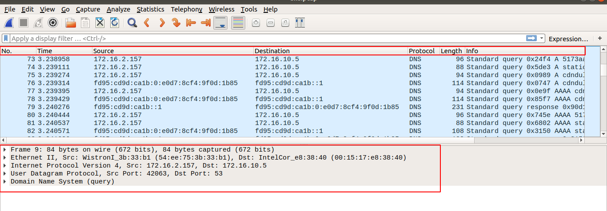
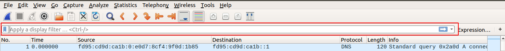

# 1.Tổng quan 
## Khái niệm 
Wireshark là một bộ phân tích gói mạng. Một bộ phân tích gói mạng sẽ cố gắng bắt các gói mạng và cố gắng hiển thị dữ liệu gói đó càng chi tiết càng tốt.

Trước đây, những công cụ như vậy rất đắt tiền, độc quyền hoặc cả hai. Tuy nhiên, với sự ra đời của Wireshark, điều đó đã thay đổi. Wireshark có sẵn miễn phí, là nguồn mở và là một trong những máy phân tích gói tốt nhất hiện nay.

## Tính năng, đặc điểm
Sau đây là một số tính năng mà Wireshark cung cấp:
- Có sẵn cho UNIX và Windows .
- Lọc các gói trên nhiều tiêu chí.
- Lưu dữ liệu gói được chụp.
- Hiển thị các gói với thông tin giao thức rất chi tiết .
- Mở tệp chứa dữ liệu gói được chụp bằng tcpdump / WinDump, Wireshark và nhiều chương trình chụp gói khác.
- Tìm kiếm các gói trên nhiều tiêu chí.
- Cho phép kiểm tra nội dung gói tin 

## Danh sách gói tin 


Phần trên là về các nội dung khi bắt một gói tin sắp xếp theo. 
- time : thời gian gói tin bắt 
- no : số thứ tự
- source: Địa chỉ đầu 
- Destination : Địa chỉ đích 
- Protocol : giao thức 
- Length : Độ dài mỗi gói tin 
- info : thông tin bổ sung thêm vào gói tin ban đầu 

## Hướng dẫn cách filter gói tin 


Ta có thể thêm điều kiện của gói tin vào để giảm bớt những gói tin mà ta chưa sử dụng đến.

Chỉ hiển thị những gói có src xác định cú pháp. des tưởng tự và thay src = des
```
ip.src == ip 
```
Hiển thị theo giao thức ta chỉ cần gõ giao thức mà ta muốn vào thanh lọc 