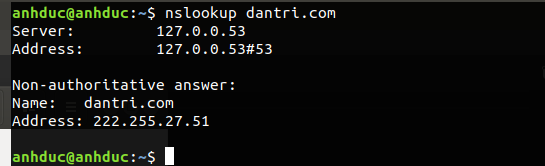
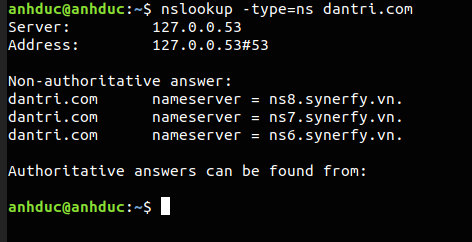
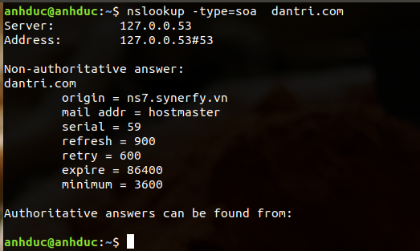
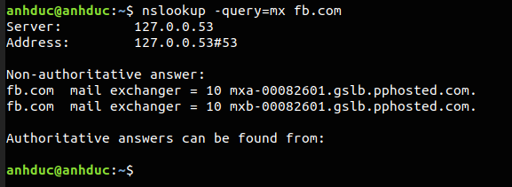
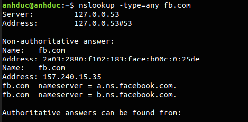
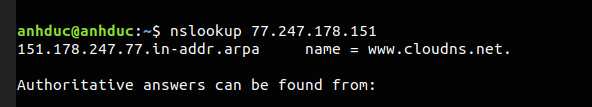
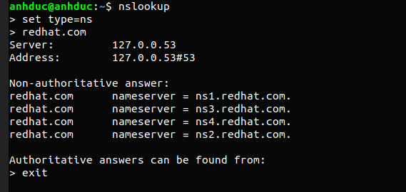
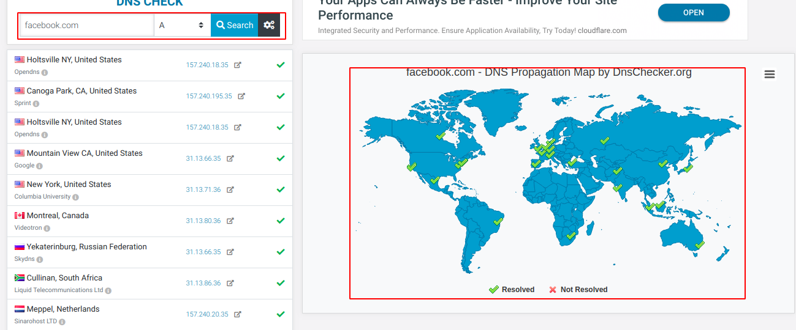
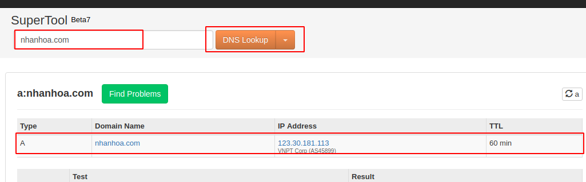

Định nghĩa: nslookup là một lệnh có tác dụng quản trị mạng. Một số option và chức năng của lệnh
# 1. Kiểm tra bản ghi A của một trang web
Cú pháp 
```
nslookup <tên trang web>
```


# 2. Kiểm tra bản ghi NS 
Cú pháp 
```
nslookup -type=ns <tên trang web>
```



# 3. Kiểm tra bản ghi SOA
Cú pháp 
```
nslookup -type=soa <tên trang web>
```



# 4. Kiểm tra bản ghi MX 
Cú pháp 
```
nslookup -query=mx <tên trang web>
```



# 5.Kiểm tra tất cả bản ghi có sẵn 

Cú pháp 
```
nslookup -type=any <tên trang web>
```



# 6.Tra cứu ngược 



# 7. Interactive mode



# Kiểm tra bản ghi bằng web 
## 1. DNS checker
Là một trang web dùng để tra cứu địa chỉ IP của một domain bằng các DNS server trên các khu vực thế giới. Nó sẽ thực hiện truy vấn bản ghi A của trang domain được nhập vào bằng cách trỏ đến các con DNS đã được chỉ định của trang domain

 

Chúng ta có thể tuy chọn xem truy vấn bản ghi nào bằng cách thay thế nó ở bản ghi A cạnh tên domain ta muốn truy vấn 

Bản đồ  sẽ tích những địa điểm DNS mà ta truy vấn tới, bên cạnh là tên các nước đặt DNS ta truy vấn tới

## 2.mxtoolbox
Là một trang web dùng để check các bản ghi của các domain mà ta muốn biết 



Muốn tìm kiếm thông tin của domain nào ta nhập domain ví dụ `nhanhoa.com` và có thể thay đổi bản ghi bằng cách thay đổi giá trị `DNS Lookup` 

Còn rất nhiều trang web khác có thể check được như thế như các web trong link tham khảo 

# link tham khảo 
https://www.hongkiat.com/blog/dns-propogation-check/

https://www.cloudns.net/blog/10-most-used-nslookup-commands/

