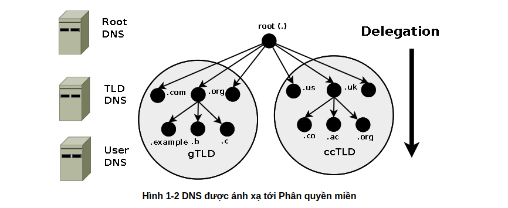
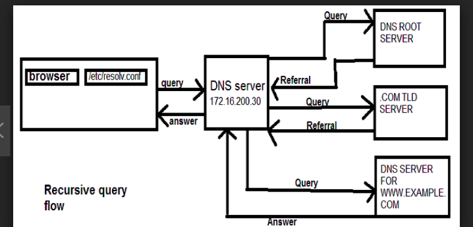

# Mục lục 
1. [khái niệm](#a)
2. [phân loại](#b)
3. [Cấu trúc DNS](#c)
4. [Zone và Zone file ](#d)
5. [Luồng hoạt động của DNS](#e)

<a name="a">

# 1. Khái niệm về DNS </a>
DNS là viết tắt của từ Domain Name System(hệ thống tên miền). Được phát minh bởi các sinh viên trường đại học Berkeley của California vào năm 1984. Nó có chức năng dịch một tên sang địa chỉ IP để các máy tính sử dụng nhận dạng trên hệ thống mạng và định vị và xác định các dịch vụ và thiết bị máy tính và ngược lại. Nó liên kết thông tin khác nhau với các tên miền được gán cho mỗi thực thể tham gia.

Hệ thống tên miền được sử dụng như một danh bạ của internet. Con người truy cập thông tin trực tuyến thông qua các tên miền. Mỗi thiết bị được kết nối với Internet có một địa chỉ IP duy nhất mà các máy khác sử dụng để tìm thiết bị. Các máy chủ DNS loại bỏ sự cần thiết của con người để ghi nhớ các địa chỉ IP như 192.168.1.1 

ví dụ tên miền [www.google.com.vn](https://www.google.com.vn/) sẽ dịch sang địa chỉ `IPV4 : 8.8.8.8`. và [www.example.com](https://example.com/) dịch là 93.184.216.34. Ta thấy tên miền sẽ dễ nhớ hơn địa chỉ IP rất nhiều.

Nhờ cách sử dụng DNS nhanh nhất và hữu ích, người dùng không cần phải lưu một danh sách địa chỉ IP của riêng mình. Với mô hình phân cấp hình cây nó cũng dễ dàng quản lý hơn.

<a name="b">

# 2. Phân loại DNS </a>
Master DNS: Một máy chủ sẽ có một tên miền riêng được đăng ký trên internet. Server này là con server chính cung cấp tên miền cho người sử dụng mạng 

Slave DNS : Cũng là một DNS server. Nhưng nó là DNS server dự phòng để phòng trường hợp master DNS server gián đoạn nó sẽ thay thế  master khi các truy vấn từ người dùng vẫn tiếp tục gửi tới và đảm nhiệm vai trò ánh xạ tên miền và địa chỉ IP. Nó sử dụng slave bằng cách sao lưu dữ liệu từ master sang slave 

Caching DNS : là một server đệm. Khi một quá trình phân giải tên miền được truy vấn một lần nó sẽ lưu lại vào server này và khi truy vấn lần thứ 2 thì server này sẽ có chức năng tăng tốc độ truy vấn giảm độ trễ trên mạng và giảm đi công việc của master DNS.

Forwarding DNS : Là server chuyển tiếp nhiệm vụ cho server khác làm việc rồi lưu kết quả về  bộ nhớ local 

<a name="c">

# 3. Cấu trúc của DNS </a>


Cấu trúc DNS là mô hình cấu trúc phân cấp hình cây:
- Với root DNS là đỉnh của cấu trúc này và sau đó các miền (domain) được phân nhánh dần xuống dưới và phân quyền quản lý. Mọi tên miền đều phải thông qua root DNS. Hiện nay trên thế  giới có 13 ROOT DNS và với quá trình sử dụng anycasting để tạo ra các DNS khác được gọi là `Top level domain DNS` (TTL DNS)

- Các máy chủ TLD (ccTLD và gTLD) được vận hành bởi nhiều cơ quan và tổ chức (theo một bộ thỏa thuận khá phức tạp) được gọi là Nhà đăng ký tên miền. Có hai loại TLD được điều hành bởi Internet Corporation for Assigned Names and Numbers (ICANN):
    - ccTLD : Là tên miền thuộc quyền quản lý của một quốc gia. Mỗi quốc gia sẽ có một tên miền khác nhau ví dụ .vn sẽ là của Việt Nam và .de sẽ là tên miền của liên bang Đức 
    - gTLD : là tên miền chung không thuộc bất kì một quốc gia nào.
- DNS user là DNS local do người dùng tạo ra và sử dụng cho local

Cấu trúc của URL 


- 1 : là giao thức truy cập mạng 
- 2 : là miền mà chúng ta truy cập tới
    - a : World-Wide Web (www) Siêu liên kết  
    - b : tên miền lớn như là một web nào đó 
    - c : là chỉ nơi miền chính thuộc vào 
- 3 : Thư mục lưu trữ file 
- 4 : tên file ta đến

<a name="d">

# 4. Zone và Zone file </a>
Zone là nơi chứa các bản ghi tài nguyên mô tả domain hoặc subdomain. Được dùng để ánh xạ một tên miền thành một địa chỉ IP  Zone được chia nhỏ ra và phân quyền cho các DNS server khác khi quản lý.

## Các loại bản ghi trong zone (zone file)
**4.1 Bản ghi SOA**

Trong mỗi tập tin cơ sở dữ liệu DNS phải có một và chỉ một record SOA (Start of Authority). Bao gồm các thông tin về domain trên DNS Server, thông tin về zone transfer. 

Cú pháp 
```
[tên-miền] IN SOA [tên-DNS-Server] [địa-chỉ-email] (

Serial ;

Refresh ;

Retry ;

Experi ;

Time-to-line ; )
```
trong đó 
- `serial` :  áp dụng cho mọi dữ liệu trong zone và có định dạng YYYYMMDDNN với YYYY là năm, MM là tháng, DD là ngày, NN là số lần sửa đổi dữ liệu zone trong ngày. Luôn luôn phải tăng số này lên mỗi lần sửa đổi dữ liệu zone. Khi máy chủ Secondary liên lạc với máy chủ Primary, trước tiên nó sẽ hỏi số serial. Nếu số serial của máy Secondary nhỏ hơn số serial của máy Primary tức là dữ liệu zone trên Secondary đã cũ và sao đó máy Secondary sẽ sao chép dữ liệu mới từ máy Primary thay cho dữ liệu đang có.
- `Refresh` : chỉ ra khoảng thời gian máy chủ Secondary kiểm tra sữ liệu zone trên máy Primary để cập nhật nếu cần. Giá trị này thay đổi tùy theo tuần suất thay đổi dữ liệu trong zone. Đơn vị được tính theo giây
- `Retry ` : nếu máy chủ Secondary không kết nối được với máy chủ Primary theo thời hạn mô tả trong refresh thì máy chủ Secondary phải tìm cách kết nối lại với máy chủ Primary theo một chu kỳ thời gian mô tả trong retry.
- `Experi` : nếu sau khoảng thời gian này mà máy chủ Secondary không kết nối được với máy chủ Primary thì dữ liệu zone trên máy Secondary sẽ bị quá hạn. Khi dữ liệu trên Secondary bị quá hạn thì máy chủ này sẽ không trả lời mỗi truy vấn về zone này nữa. Giá trị expire này phải lớn hơn giá trị refresh và giá trị retry.
- `Time to line` :  giá trị này áp dụng cho mọi record trong zone và được đính kèm trong thông tin trả lời một truy vấn. Mục đích của nó là chỉ ra thời gian mà các máy chủ name server khác cache lại thông tin trả lời.

**4.2 Bản ghi NS (Name server)**

Mỗi name server cho zone sẽ có một NS record. Chứa địa chỉ IP của DNS Server cùng với các thông tin về domain đó.

Cú pháp 
```
<tên miền> IN NS <tên của máy chủ tên miền>
```
**4.3 Bản ghi A**

Dùng để ánh xạ từ một domain thành địa chỉ IP cho phép có thể truy cập website. Record A có dạng như sau
```
Domain IN A <địa chỉ IP của máy>
```
Ví dụ 
```
nhanhoa.com.		1484	IN	A	123.30.181.113
hay bản ghi A của cloud365 
cloud365.vn.		1199	IN	A	103.28.36.41
```
**4.4 Bản ghi AAAA**

Có nhiệm vụ tương tự như bản ghi A, nhưng thay vì địa chỉ IPv4 sẽ là địa chỉ IPv6.

**4.5 Bản ghi Cname**

Cho phép tên miền có nhiều bí danh khác nhau, khi truy cập các bí danh sẽ cũng về một địa chỉ tên miền. Để sử dụng bản ghi CNAME cần khai báo bản ghi A trước. Cú pháp 
```
tên domain bí danh IN CNAME tên miền chính domain
```
ví dụ bí danh của facebook: khi ta gõ đầy đủ `facebook.com` cũng có thể truy cập được mà gõ `fb.com` ta vẫn có thể truy cập được trang web của fb vì cả 2 cùng trỏ đến địa chỉ 157.240.15.35 của fb 

**4.6 Bản ghi PTR**

Hệ thống tên miền thông thường cho phép chuyển đổi từ tên miền sang địa chỉ IP. Trong thực tế, một số dịch vụ Internet đòi hỏi hệ thống máy chủ DNS phải có chức năng chuyển đổi từ địa chỉ IP sang tên miền. Bản ghi PTR sẽ có nhiệm vụ này. Tên miền ngược thường được sử dụng trong một số trường hợp xác thực email gửi đi. Cú pháp 
```
IP.in-addr.arpa             IN      PTR         (tên domain)
```

**4.7 Bản ghi MX**

- Bản ghi MX dùng để khai báo trạm chuyển tiếp thư điện tử của một tên miền. Cú pháp 
```
(tên miền ) MX (mức độ ưu tiên) (trạm chuyển tiếp)
```
Mức độ ưu tiên : trường này xác định địa chỉ nào được dùng để nhận email trước. Giá trị này sẽ chạy từ 1 đến 255 

**4.8 Bản ghi TXT**

Bản ghi TXT(text) được sử dụng để cung cấp khả năng liên kết văn bản tùy ý với máy chủ. Chủ yếu dùng trong mục đích xác thực máy chủ với tên miền.

Ví dụ như bản ghi SPF trong DNS là một dạng bản ghi TXT dùng để lưu thông tin khách hàng và dùng để xác thực danh tính mail của khách hàng.


# 5.Luồng hoạt động trong DNS 
Có hai luồng hoạt động của DNS: là đệ quy và vòng lặp 
## 5.1 Đệ quy 


Khi bạn muốn truy cập đến một server trên internet thì máy tính nó sẽ làm việc như sau. Ví dụ MygreatName.com 
1. Nó sẽ hỏi ÍSP name server địa chỉ của  MygreatName.com 2. ISP name server sẽ check.Nếu như ISP name server có địa chỉ thì sẽ gửi về cho pc 
3. Nếu không có địa chỉ của máy đó thì ISP name server sẽ hỏi DNS root nơi nào quản lý địa chỉ  MygreatName.com
4. ROOT DNS nói rằng cái name server dưới sẽ có địa chỉ của  MygreatName.com hãy hỏi nó
5. ISP lại đi hỏi name server 

# 5.2 vòng lặp


Khi muốn truy vấn theo vòng lặp thì tất cả các loại DNS server đều phải hỗ trợ truy vấn điều này làm giảm bớt đi lượng làm vệc của DNS server Như ISP ở trên. Các truy vấn cũng giống như đệ quy nhưng PC sẽ tự mình đi hỏi lần lượt các loại DNS server để tìm ra server lưu trữ thông tin mà mình muốn


# Link tham khảo 
http://www.zytrax.com/books/dns/ch4/#master

https://blog.cloud365.vn/linux/dns-record/#1-soa-start-of-authority

https://securitydaily.net/tim-hieu-he-thong-ten-mien-dns-domain-name-system/

https://www.unixmen.com/setting-dns-server-centos-7/

https://support.dnsimple.com/articles/ns-record/

https://www.slashroot.in/difference-between-iterative-and-recursive-dns-query

https://www.cloudflare.com/learning/dns/what-is-dns/

https://www.lifewire.com/what-is-a-dns-server-2625854