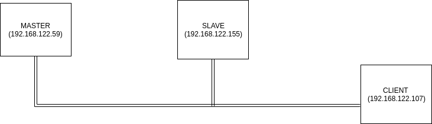
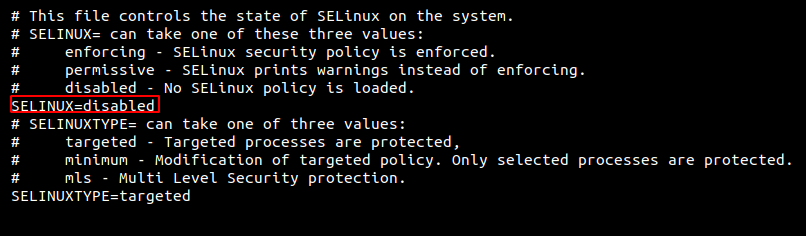
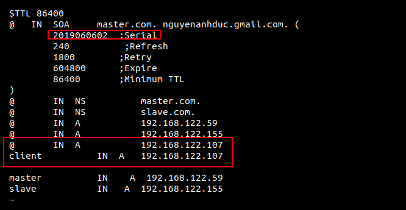
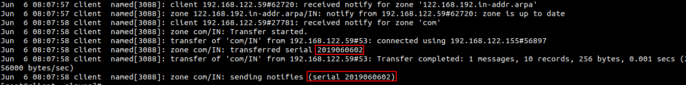
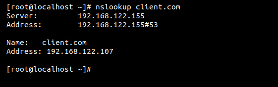

# Mô hình 



## Kịch bản
Tạo ra master và slave rồi sửa bản ghi ở master và để slave tự cập nhật rồi dùng client trỏ đến slave kiểm tra xem nó có cập nhật hay chưa

## Chuẩn bị 
DNS master: 
- IP : 192.168.122.59
- OS : Centos 7
- Cài gói : BIND 
- domain name : master.com

DNS slave: 
- IP : 192.168.122.155
- OS : centos7
- Hostname : client 
- Cài gói BIND 
- domain name : slave.com

Client 
- IP : 192.168.122.107
- OS : Centos7
- Cài gói Bind 
- domain name : client.com

## Thực hiện 
### Những việc cần thiết chung của DNS master và Slave 
cài gói bind 
```
yum install bind bind-utils -y
```
Tắt firewall
```
systemctl stop firewalld
systemctl disable firewalld
```
Disable SELinux trong file 

### DNS master 
Cần thực hiện phân quyền như sau 
```
chgrp named -R /var/named
chown -v root:named /etc/named.conf
chown -R named:named /var/named/forward.com
chown -R named:named /var/named/reverse.com
```
Chỉnh sửa file /etc/named.conf
```
//
// named.conf
//
// Provided by Red Hat bind package to configure the ISC BIND named(8) DNS
// server as a caching only nameserver (as a localhost DNS resolver only).
//
// See /usr/share/doc/bind*/sample/ for example named configuration files.
//
// See the BIND Administrator's Reference Manual (ARM) for details about the
// configuration located in /usr/share/doc/bind-{version}/Bv9ARM.html

options {
        listen-on port 53 { 192.168.122.59; };
        listen-on-v6 port 53 { ::1; };
        directory       "/var/named";
        dump-file       "/var/named/data/cache_dump.db";
        statistics-file "/var/named/data/named_stats.txt";
        memstatistics-file "/var/named/data/named_mem_stats.txt";
        recursing-file  "/var/named/data/named.recursing";
        secroots-file   "/var/named/data/named.secroots";
        allow-query     { 192.168.122.0/24; };
        allow-transfer {192.168.122.155;};

        /*
         - If you are building an AUTHORITATIVE DNS server, do NOT enable recursion.
         - If you are building a RECURSIVE (caching) DNS server, you need to enable
           recursion.
         - If your recursive DNS server has a public IP address, you MUST enable access
           control to limit queries to your legitimate users. Failing to do so will
           cause your server to become part of large scale DNS amplification
           attacks. Implementing BCP38 within your network would greatly
           reduce such attack surface
        */
        recursion yes;

        dnssec-enable yes;
        dnssec-validation yes;

        /* Path to ISC DLV key */
        bindkeys-file "/etc/named.iscdlv.key";

        managed-keys-directory "/var/named/dynamic";

        pid-file "/run/named/named.pid";
        session-keyfile "/run/named/session.key";
};

logging {
        channel default_debug {
                file "data/named.run";
                severity dynamic;
        };
};

zone "." IN {
        type hint;
        file "named.ca";
};

zone "122.168.192.in-addr.arpa" IN {
type master;
file "reverse.com";
allow-update { none; };
};

zone "com" IN {
type master;
file "forward.com";
allow-update { none; };
};
include "/etc/named.rfc1912.zones";
include "/etc/named.root.key";
```

Tạo ra dữ liệu của DNS master trong file /var/named/reverse.com và /var/named/forward.com
- Forward 
```
$TTL 86400
@   IN  SOA     master.com. nguyenanhduc.gmail.com. (
        2019060401  ;Serial
        60          ;Refresh
        1800        ;Retry
        604800      ;Expire
        86400       ;Minimum TTL
)
@       IN  NS          master.com.
@       IN  NS          slave.com.
@       IN  A           192.168.122.59
@       IN  A           192.168.122.155
master          IN    A  192.168.122.59
slave           IN   A  192.168.122.155
```
- Reverse
```
$TTL 86400
@   IN  SOA     master.com. nguyenanhduc.gmail.com. (
        2019060401  ;Serial
        60          ;Refresh
        1800        ;Retry
        604800      ;Expire
        86400       ;Minimum TTL
)
@       IN  NS         master.com.
@       IN  NS          slave.com.
@       IN  PTR         com.
master  IN  A  192.168.122.59
slave   IN  A  192.168.122.155
59     IN  PTR         master.com.
155     IN  PTR         slave.com.
```

### DNS slave 
Sửa file /etc/named.conf
```
//
// named.conf
//
// Provided by Red Hat bind package to configure the ISC BIND named(8) DNS
// server as a caching only nameserver (as a localhost DNS resolver only).
//
// See /usr/share/doc/bind*/sample/ for example named configuration files.
//
// See the BIND Administrator's Reference Manual (ARM) for details about the
// configuration located in /usr/share/doc/bind-{version}/Bv9ARM.html

options {
        listen-on port 53 { 192.168.122.155; };
        listen-on-v6 port 53 { ::1; };
        forwarders      {192.168.122.59;};
        directory       "/var/named";
        dump-file       "/var/named/data/cache_dump.db";
        statistics-file "/var/named/data/named_stats.txt";
        memstatistics-file "/var/named/data/named_mem_stats.txt";
        recursing-file  "/var/named/data/named.recursing";
        secroots-file   "/var/named/data/named.secroots";
        allow-query     { 192.168.122.0/24; };

        /*
         - If you are building an AUTHORITATIVE DNS server, do NOT enable recursion.
         - If you are building a RECURSIVE (caching) DNS server, you need to enable
           recursion.
         - If your recursive DNS server has a public IP address, you MUST enable access
           control to limit queries to your legitimate users. Failing to do so will
           cause your server to become part of large scale DNS amplification
           attacks. Implementing BCP38 within your network would greatly
           reduce such attack surface
        */
        recursion yes;

        dnssec-enable yes;
        dnssec-validation yes;

        /* Path to ISC DLV key */
        bindkeys-file "/etc/named.iscdlv.key";

        managed-keys-directory "/var/named/dynamic";

        pid-file "/run/named/named.pid";
        session-keyfile "/run/named/session.key";
};

logging {
        channel default_debug {
                file "data/named.run";
                severity dynamic;
        };
};

zone "." IN {
        type hint;
        file "named.ca";
};

zone "com" IN {
type slave;
file "slaves/forward.com";
masters {192.168.122.59; };
};

zone "122.168.192.in-addr.arpa" IN {
type slave;
file "slaves/reverse.com";
masters {192.168.122.59; };
};
include "/etc/named.rfc1912.zones";
include "/etc/named.root.key";
```

Tạo ra file forward.com và reverse.com ở trong thư mục `/var/named/slaves` và có thông tin  giống như reverse.com và forward.com của DNS master 

Sau khi tạo xong ta sẽ restart lại dịch vụ 
```
systemctl restart named
```

### Thực hiện thay đổi DNS master 
Ta thay đổi thông tin của DNS master và để sau một khoảng thời gian theo như cài đặt của tham số  `Refresh` và ở đây cài là 1 phút sẽ truy vấn đến để cập nhật cho nhanh

Thay đổi thông số sau 



Sau khi restart lại thì ta sẽ kiểm tra xem DNS slave đã cập nhật hay chưa. Thì ta có một vài cách để chứng minh

- File log được lưu ở trong `/var/log/messages`



- Kiểm tra bằng client được trỏ đến DNS slave từ đầu tra cứu bản ghi được thêm ở slave 


