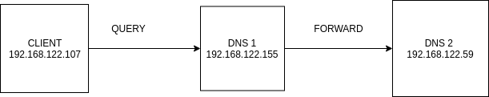
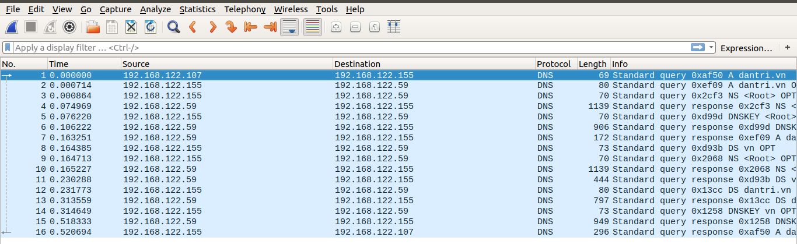
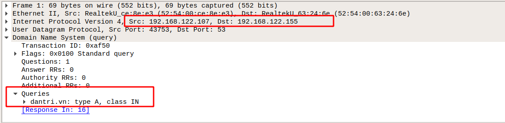
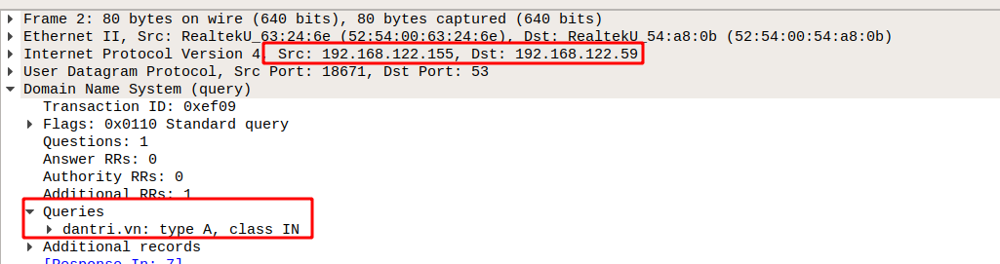
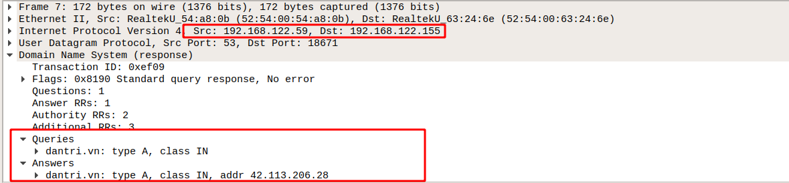
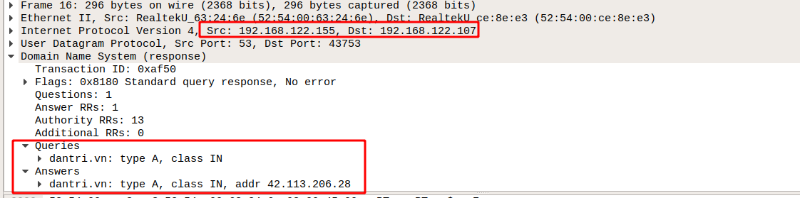
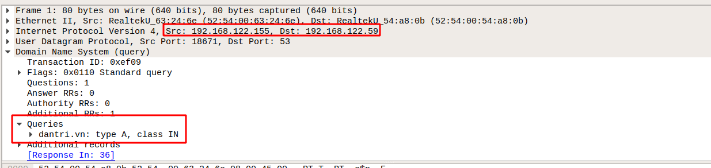
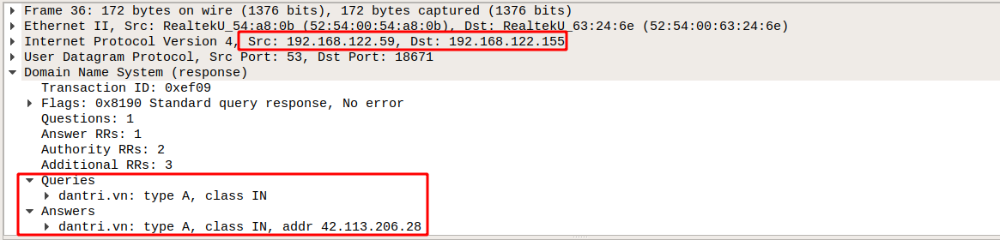

# kịch bản 
Ta sẽ tạo ra 2 DNS server và một client. Trỏ DNS của client đến DNS thứ 1 và forward cho con DNS thứ 2. Rồi ta truy vấn tới trang web dantri.vn bằng client và bắt gói tin ở đồng thời 2 DNS server và phân tích từng gói tin một 

Chuẩn bị: 
- DNS server thứ 1: Địa chỉ IP(192.168.122.155)
- DNS server thứ 2: Địa chỉ IP(192.168.122.59)
- Client có địa chỉ IP (192.168.122.107)

Mô hình 

Sau khi truy vấn và bắt gói tin tại port của 2 DNS thì ta được 2 gói tin với nội dung như dưới đây

## Gói tin của DNS 1

Ta sẽ đi phân tích từng gói tin của DNS 1 này để xem sự hoạt động của kiến trúc forward. với gói tin 1

 Ta thấy rằng gói tin được gửi đi từ client (192.168.122.107) đến DNS1 (192.168.122.155). Với query là bản ghi A của trang dantri.vn

Gói thứ 2: Do DNS 1 chúng ta đã cài đặt là nó sẽ forward cho DNS 2(192.168.122.59) Thế nên ở gói tin thứ 2 này ta thấy rằng. Gói tin sẽ được gửi đến DNS 2 hỏi về bản ghi A 

Ở gói tin thứ 3 này là câu trả lời bản ghi A của dantri.vn mặc dù cũng là truy vấn thông thường tại sao lại không giống như ví dụ mà làm ở đợt trước? thì là do nó đã forward cho DNS 2 và chỉ nhận kết quả còn DNS 2 sẽ đi tìm bản ghi A của dantri.vn

Và gói tin cuối này chính là trả về câu trả lời cho client thông tin về bản ghi A của dantri.vn

## Các gói tin trong DNS 2. 

Trong đây là những gói tin bắt tại port DNS 2 và cũng là những việc mà DNS 2 phải làm trong khi client query bản ghi A của dantri.vn

Ngay sau khi client query thì DNS 1 sẽ forward cho DNS 2 như chúng ta thấy thì gói tin đầu tiên của DNS2 được nhận từ DNS 1 với câu hỏi là bản ghi A của dantri.vn DNS2 sẽ đi tìm bản ghi A như cách mà ở ví dụ trước chúng ta phân tích. DNS 2 sẽ hỏi từ ROOT SERVE xuống dưới theo cấu trúc hình cây

Sau khi tìm được bản ghi A nó sẽ trả về cho DNS 1

