# Ví dụ 1:
kịch bản: bắt gói tin truy vấn từ client(192.168.122.155) đến DNS server(192.168.122.107)

ở client sẽ thực hiện lệnh truy vấn đến Server 
```
nslookup anhduc.com 
```


Kết quả sau khi ta bắt gói tin thì ta sẽ thấy 2 gói tin. Gói tin 1 là truy vấn bản ghi A của DNS 192.168.122.107

Gói tin query 

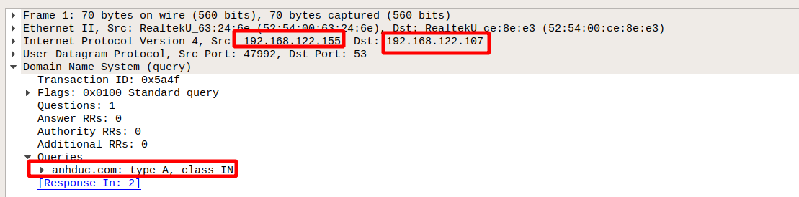

Chúng ta thấy rằng gói tin được gửi từ địa chỉ là 192.168.122.155 đến server 192.168.122.107 với nội dung query là ` anhduc.com : type A, class IN `

Gói tin answer 

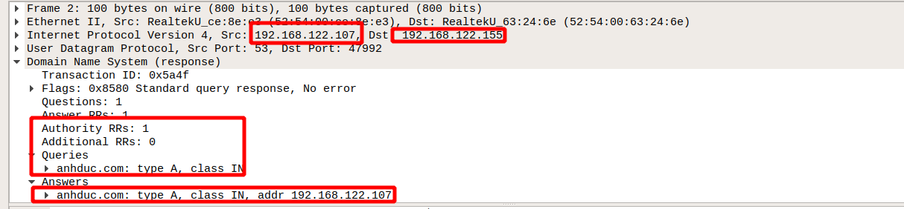

Gói tin này sẽ được trả về từ server 192.168.122.107 đến 192.168.122.155 với nội dung của gói query và có thêm phần câu trả lời answers là ` anhduc.com : type A, class IN, addr 192.168.122.107` 

# Ví dụ 2: Truy vấn ra ngoài internet 
kịch bản : client sẽ truy vấn bản ghi A đến trang dantri.vn với lệnh. Sẽ có cả bản ghi AAAA nhưng chúng ta sẽ chỉ quan tâm tới bản ghi A.
```
nslookup dantri.vn 
```
còn ở DNS server sẽ dùng tcpdump để bắt gói tin 
```
tcpdupm -i eth0 -w dns.pcap udp port 53 
```

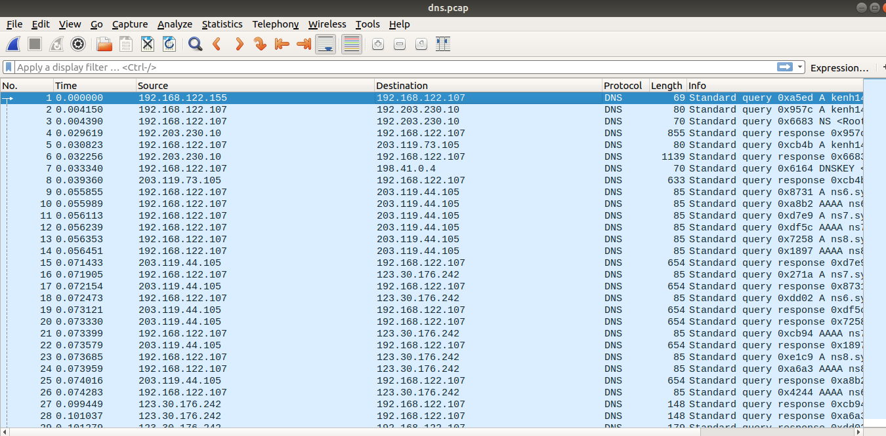

Sau khi bắt gói tin ta cùng phân tích cách làm việc của DNS server bằng cách đọc và phân tích các gói tin của nó.

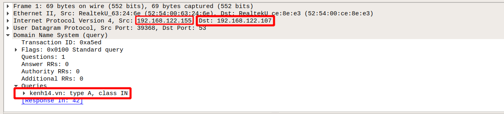

Gói 1: Sẽ được gửi yêu cầu đi từ client(192.168.122.155) đến DNS server(192.168.122.107) với nội dung là yêu cầu bản ghi A của trang web `kenh14.vn`

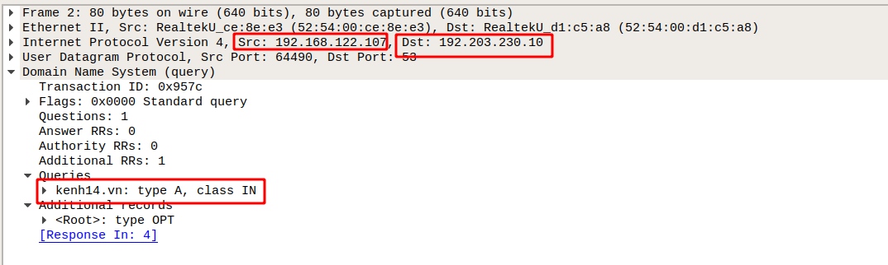

Gói 2: Trong gói thứ 2 thì DNS server không có thông tin về kenh14.vn nên DNS server cần phải đi hỏi ở bên ngoài và nó đã tìm đến DNS root. Thông tin của 13 DNS root server được lưu trong file `/var/named/namd.ca` 

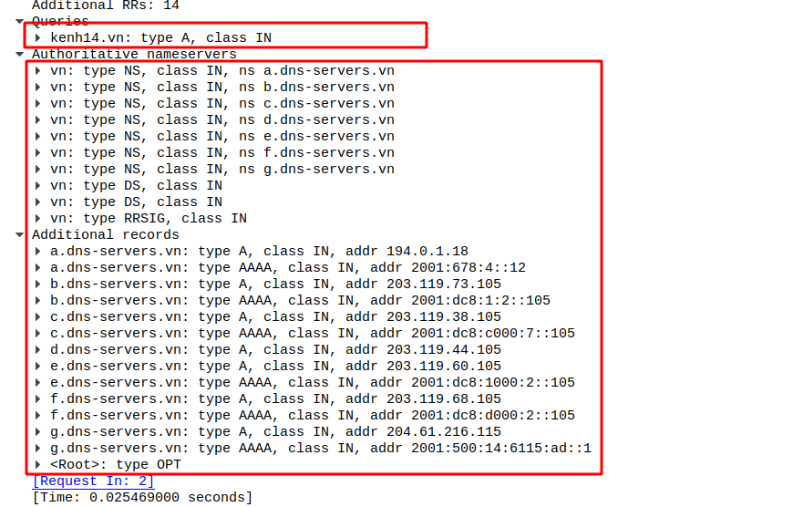

Gói 3: là gói trả lời thông tin của của gói 2. Nó thêm nội dung và cho biết  rằng `kenh14.vn` thuộc quyền quản lý của các DNS Authoritative nameserver của Việt Nam(.vn) và địa chỉ của các DNS đó được ghi kèm ở mục thông tin được bổ sung.

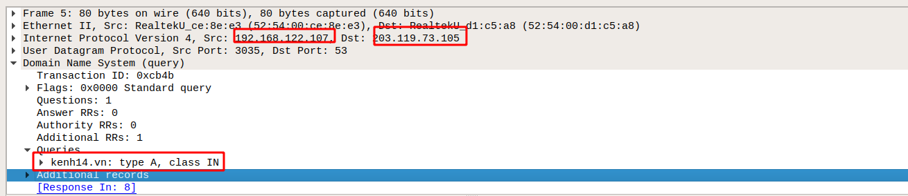

Gói 4: DNS server sẽ đi hỏi Authoritative nameserver về thông tin bản ghi A của kenh14.vn

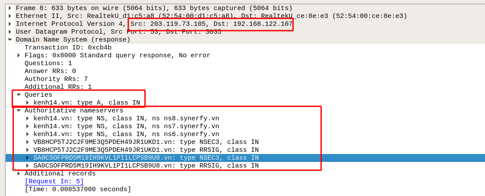

Gói 5: DNS server sẽ đưowjc trả lời với thông tin là `kenh14.vn` sẽ có thông tin bởi 3 server là `ns8.synerfy.vn` `ns7.synerfy.vn` `ns6.synerfy.vn`

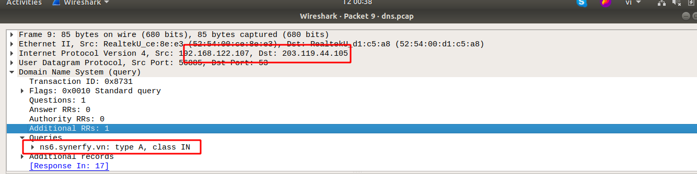

Gói 6: Do không biết bản ghi địa chỉ của các  server trên nên nó sẽ tiếp tục truy vấn đến Authoritative nameserver hỏi địa chỉ của 3 server trên đây là gói tin hỏi về ns6.synerfy.vn


Gói 7: Trả lời rằng ns6.synerfy.vn có thông tin ở DNS(123.30.176.242)

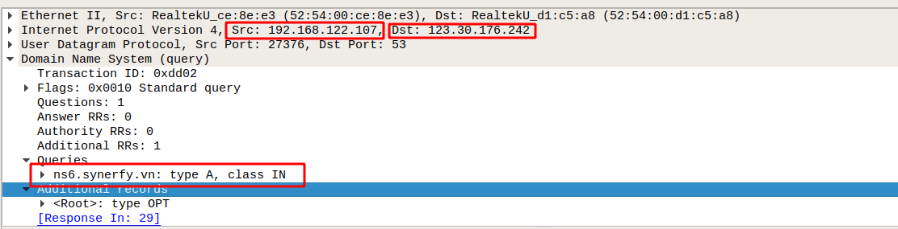

Gói 8: DNS server truy vấn đến 123.30.176.242 hỏi địa chỉ của ns6.synerfy.vn

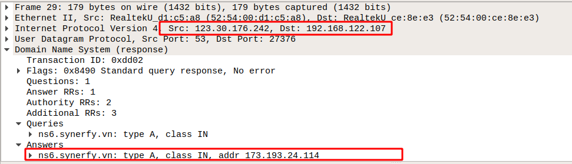

Gói 9: Sau đó gói tin sẽ được trả lời về thông tin địa chỉ của ns6.synerfy.

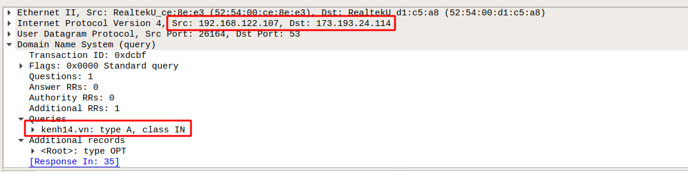

Gói 10 : DNS server sẽ truy vấn tới ns6.synerfy. để hỏi về thông tin kenh14.vn 

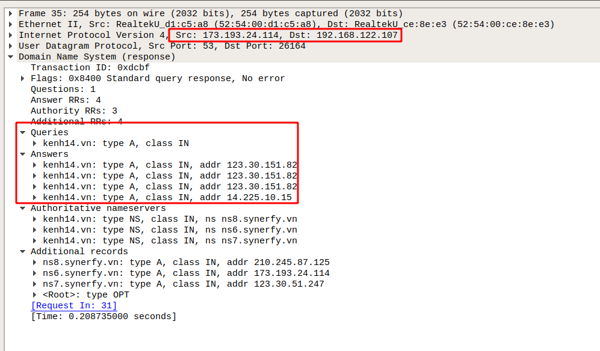

Gói 11: Là gói tin trả về từ ns6.synerfy. trong đó có thông tin của địa chỉ kenh14.vn 


Gói 12: Cuối cùng DNS server sẽ trả thông tin của kenh14.vn cho client.

# Ví dụ 3: Chứng minh hiện tượng cache dữ liệu 

Kịch bản : làm lại như ví dụ 2 một lần nữa


Sau khi làm lại như ví dụ 2 thì chỉ còn thấy 2 gói tin. Là do DNS server đã cache dữ liệu lại và khi có truy vấn tiếp theo giống như vậy nó sẽ trả về ngay lập tức 

để xóa dữ liệu được cache thì ta dùng lệnh khởi động lại namd 
```
service named restart
```
File lưu trữ cache trong default không có sẵn muốn bật được file này lên thì ta mới có thể đọc được nó 
```
rndc dumpdb -cache
```
Muốn xóa đi file cache thì ta cần thực thi một vài lệnh để có thể xóa 
```
rndc flush
```
Muốn cập nhật thay đổi trong file cache thì ta cần sử dụng lệnh 
```
rndc dumpdb -cache
```
