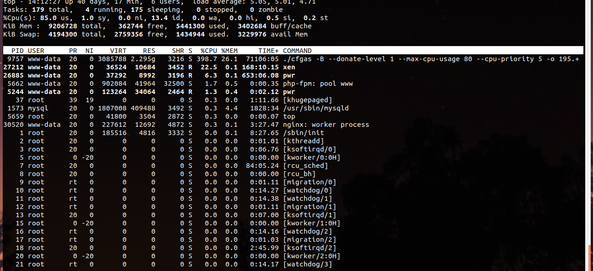
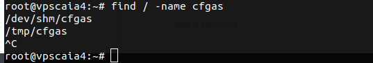

# Những thao tác đã thực hiện case 16/12
### I. Thông tin nhận được 
nhận được thông tin từ anh Công khách báo có chương trình "perl /var/tmp/kaXDsl > /dev/null 2>&1" được đặt lịch cron và chạy dưới quyền user www-data. Khách đã xóa cron.

### II. Các bước thực hiện kiểm tra
1. Thực hiện lệnh top kiểm tra 
- thấy chương trình chiếm tài nguyên của máy 

Thấy tên tiến trình sau đó tìm file bằng tên tiến trình này 

2. Tìm file 

Sau khi tìm thấy file thì vào đọc tất cả đều được mã hóa 

3. Đọc file nhận được thông tin từ khác hàng 

`/var/tmp/kaXDsI`. Nhưng mà file này đã được mã hóa 

4. Dùng TCPDUMP nhưng không phát hiện gì lạ 

5. Dùng `ps -ef` thấy 2 file lạ 

chưa kịp đọc file thì khách hàng đổi thông tin. Sau khi vào máy được clone 

6. Vào xem máy clone. Tiến trình ăn tài nguyên đã mất. Tìm kiếm file lạ cũng thấy mất theo. Còn tồn tại một file 

`/var/tmp/kaXDsI`

Dự đoán các file được sinh ra sau khi chạy đoạn script được mã hóa nhưng chạy không được. 

Chưa nghĩ đến việc file đã hash 