# I. Các trường hợp ssh xảy ra
Sử dụng `tailf /var/log/secure` để có thể nhận được các log xảy báo về 

1. Sai password user root  

```
Dec 15 09:17:23 node1 unix_chkpwd[889]: password check failed for user (root)
Dec 15 09:17:23 node1 sshd[885]: pam_unix(sshd:auth): authentication failure; logname= uid=0 euid=0 tty=ssh ruser= rhost=gateway  user=root
Dec 15 09:17:23 node1 sshd[885]: pam_succeed_if(sshd:auth): requirement "uid >= 1000" not met by user "root"
Dec 15 09:17:25 node1 sshd[885]: Failed password for root from 192.168.80.1 port 44421 ssh2
```

Khi đăng nhập sai `password` của user root thì  có 4 thông báo. ta thấy thông báo cuối cùng là đầy đủ thông tin nhất 
```
Dec 15 09:17:25 node1 sshd[885]: Failed password for root from 192.168.80.1 port 44421 ssh2
```
Bao gồm user sai và từ địa chỉ IP nào cố gắng ssh đến 

2. Đăng nhập sai `password` của `user` thường 
```
Dec 15 09:21:45 node1 unix_chkpwd[1103]: password check failed for user (user)
Dec 15 09:21:45 node1 sshd[1100]: pam_unix(sshd:auth): authentication failure; logname= uid=0 euid=0 tty=ssh ruser= rhost=gateway  user=user
Dec 15 09:21:47 node1 sshd[1100]: Failed password for user from 192.168.80.1 port 6020 ssh2
```
Khi đăng nhập sai `password` của user thường thì  có 3 thông báo. ta thấy thông báo cuối cùng là đầy đủ thông tin nhất 
```
Dec 15 09:21:47 node1 sshd[1100]: Failed password for user from 192.168.80.1 port 6020 ssh2
```
Bao gồm user sai và từ địa chỉ IP nào cố gắng ssh đến 

3. Đăng nhập với user không tồn tại 
```
Dec 15 09:23:22 node1 sshd[1183]: Invalid user user1 from 192.168.80.1 port 31145
Dec 15 09:23:22 node1 sshd[1183]: input_userauth_request: invalid user user1 [preauth]
Dec 15 09:23:24 node1 sshd[1183]: pam_unix(sshd:auth): check pass; user unknown
Dec 15 09:23:24 node1 sshd[1183]: pam_unix(sshd:auth): authentication failure; logname= uid=0 euid=0 tty=ssh ruser= rhost=gateway
Dec 15 09:23:26 node1 sshd[1183]: Failed password for invalid user user1 from 192.168.80.1 port 31145 ssh2
```

Khi đăng nhập sai `password` của user không tồn tại  thì  có 5 thông báo. ta thấy thông báo bản tin  cuối cùng là đầy đủ thông tin nhất 
```
Dec 15 09:23:26 node1 sshd[1183]: Failed password for invalid user user1 from 192.168.80.1 port 31145 ssh2
```
Bao gồm user sai và từ địa chỉ IP nào cố gắng ssh đến

4. Đăng nhập thành công user root 
```
Dec 15 09:25:30 node1 sshd[1289]: Accepted password for root from 192.168.80.1 port 31343 ssh2
Dec 15 09:25:30 node1 sshd[1289]: pam_unix(sshd:session): session opened for user root by (uid=0)
```
Khi đăng nhập thành công với user root có 2 bản tin thì ta thấy bản tin đầu tiên là đầy đủ nhất bao gồm thông báo ssh thành công với user root và từ địa chỉ IP 
```
Dec 15 09:25:30 node1 sshd[1289]: Accepted password for root from 192.168.80.1 port 31343 ssh2
```

5. Đăng nhập thành công với user thường 
```
Dec 15 09:27:28 node1 sshd[1413]: Accepted password for user from 192.168.80.1 port 53331 ssh2
Dec 15 09:27:28 node1 sshd[1413]: pam_unix(sshd:session): session opened for user user by (uid=0)
```
Khi đăng nhập thành công với user thường có 2 bản tin thì ta thấy bản tin đầu tiên là đầy đủ nhất bao gồm thông báo ssh thành công với user `user` và từ địa chỉ IP 192.168.80.1
```
Dec 15 09:27:28 node1 sshd[1413]: Accepted password for user from 192.168.80.1 port 53331 ssh2
```

## II. Cắt cột user và Địa chỉ IP 

Ta nhìn vào các bản tin thông báo của các trường hợp ssh trên để ta có cách cắt user và IP. Ta có tổng cộng 5 bản tin của 5 trường hợp. ta nhìn lên và xem phải cắt theo mấy trường hợp 
```
Dec 15 09:17:25 node1 sshd[885]: Failed password for root from 192.168.80.1 port 44421 ssh2
Dec 15 09:21:47 node1 sshd[1100]: Failed password for user from 192.168.80.1 port 6020 ssh2
Dec 15 09:23:26 node1 sshd[1183]: Failed password for invalid user user1 from 192.168.80.1 port 31145 ssh2
Dec 15 09:25:30 node1 sshd[1289]: Accepted password for root from 192.168.80.1 port 31343 ssh2
Dec 15 09:27:28 node1 sshd[1413]: Accepted password for user from 192.168.80.1 port 53331 ssh2
```

ta thấy muốn cắt IP của cả đăng nhập thành công và thất bại thì ta sẽ cần 3 cách: 
- Cắt cột địa chỉ IP 
- Cắt cột  user đã tồn tại 
- Cắt cột user chưa tồn tại 

1. Cắt cột địa chỉ IP

Ta chọn bản tin bắn về log với các trường hợp trên ta đã chọn ra. Rồi bấm vào nó. 

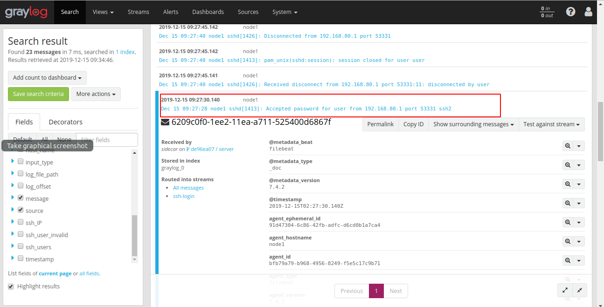

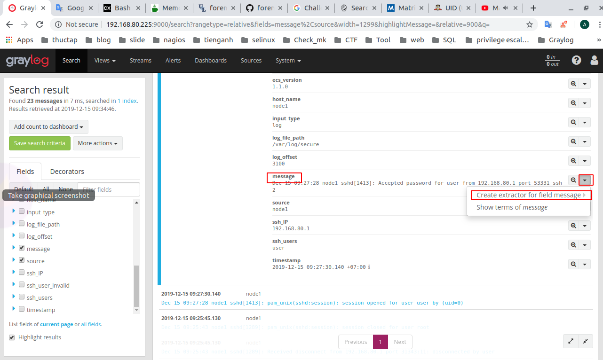

Chọn regular expression 

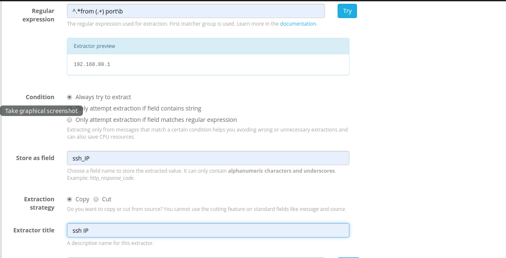

Sau đó chọn Create extractor 

2. Cắt user đã tồn tại 

Ta làm tương tự và chọn bản tin đăng nhập sai hoặc đúng với user đã tồn tại. Ví dụ 2 bản tin dưới 
```
Dec 15 09:25:30 node1 sshd[1289]: Accepted password for root from 192.168.80.1 port 31343 ssh2
Dec 15 09:27:28 node1 sshd[1413]: Accepted password for user from 192.168.80.1 port 53331 ssh2
```
Sau đó ta làm giống như cắt IP 

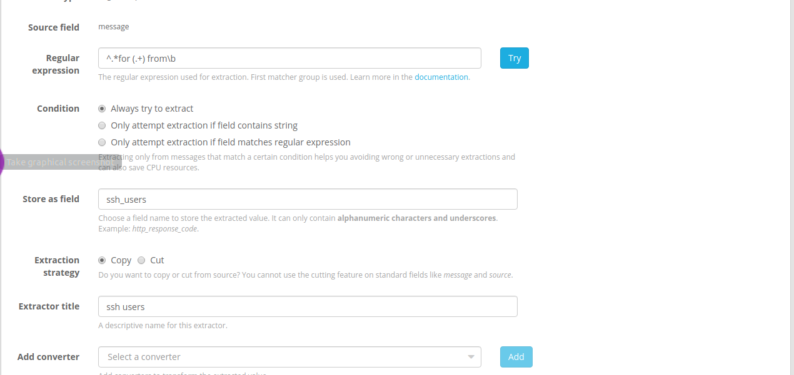

3. Cắt cột user chưa tồn tại
Ta chọn bản tin 
```
Dec 15 09:23:26 node1 sshd[1183]: Failed password for invalid user user1 from 192.168.80.1 port 31145 ssh2
```
Sau đó ta làm giống như cắt IP 

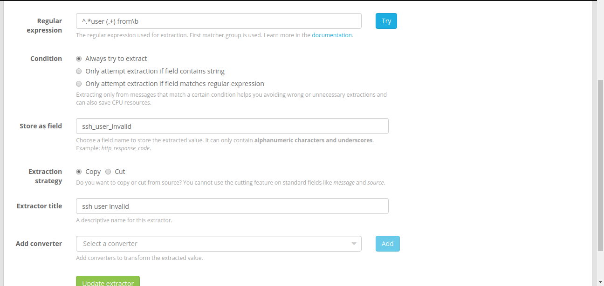

4. Kiểm tra kết quả 

Cắt IP 

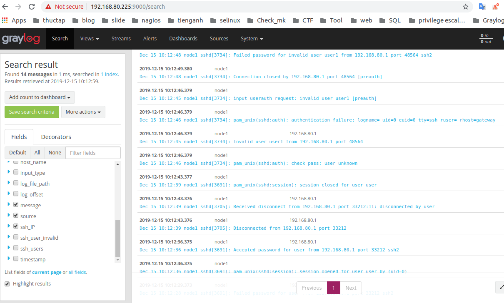

Cắt users đã tồn tại 

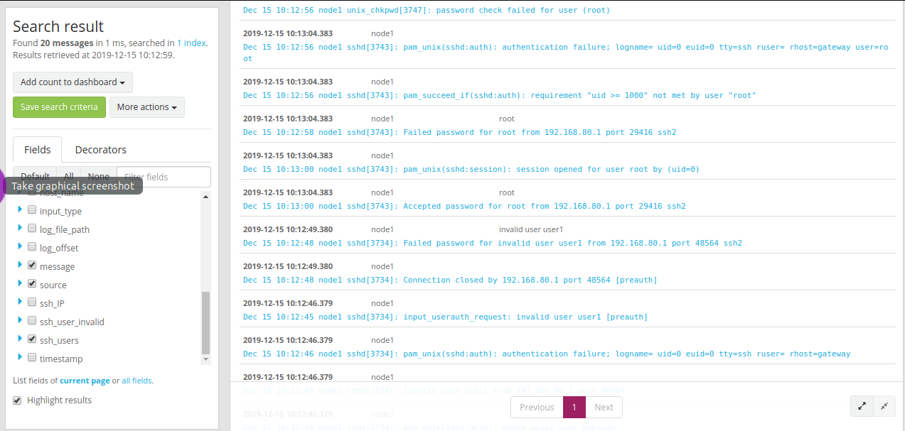

User chưa tồn tại 

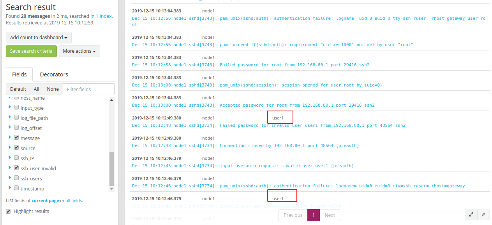

5. Biểu đồ số lần đăng nhập thành công và thất bại

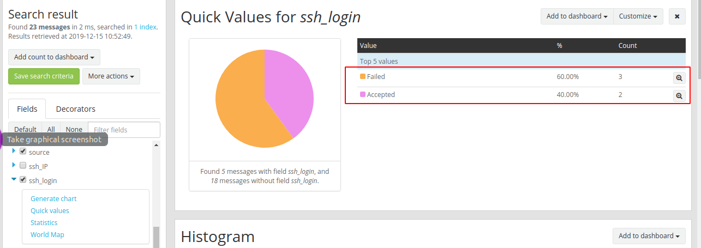

# Tạo Stream 
1. Tạo ra stream mới 

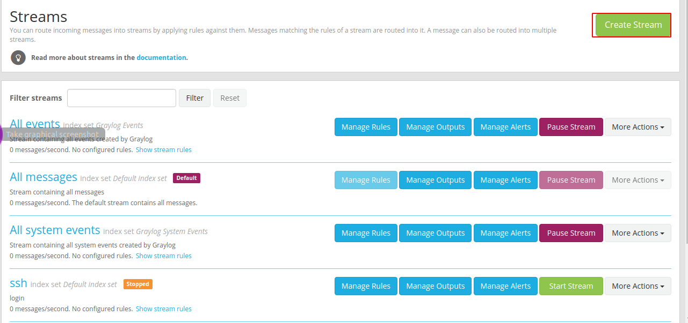

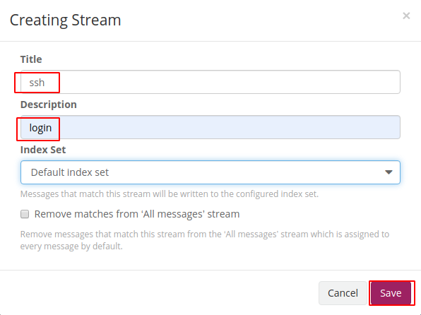

2. Tạo ra rule cho các stream 

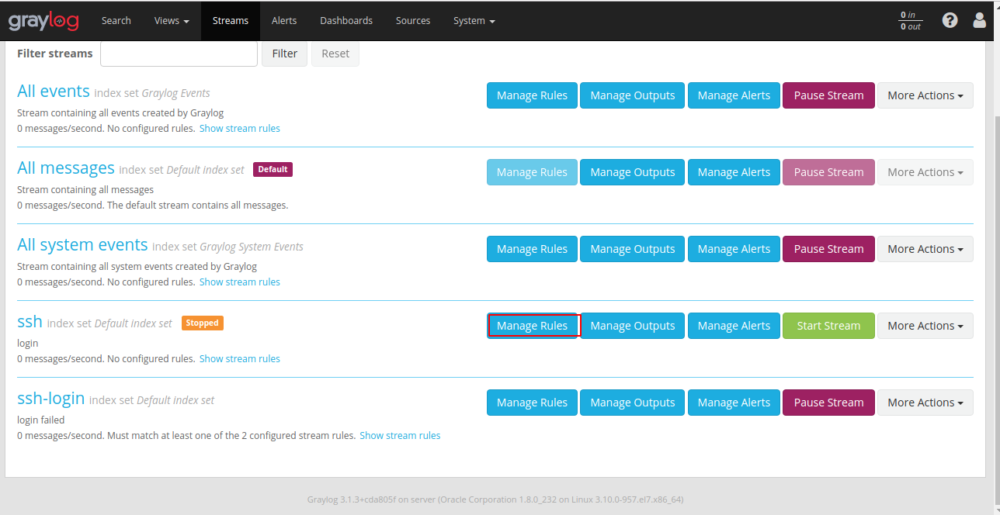

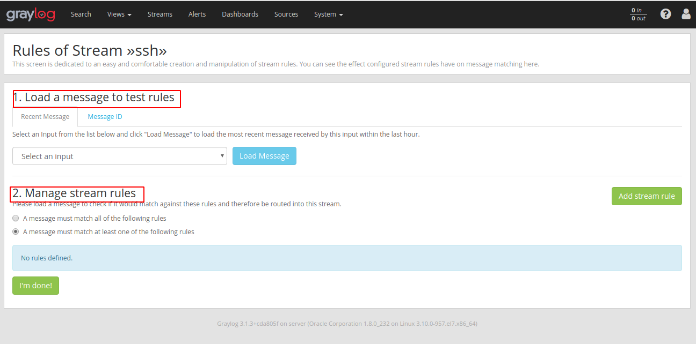

Mục 1. Là nơi ta thử các rules của mình
Mục 2. Quản lý các rules
- A message must match all of the following rules : Phải khớp với tất cả các rule mới được thông qua 
- A message must match at least one of the following rules : Khớp với một trong các trường hợp đó 
- Để thêm các quy tắt ta chọn `add stream rule` 

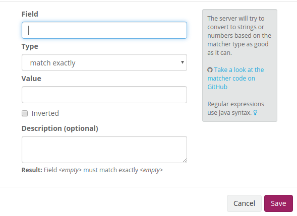

Đây là nơi ta tạo ra quy tắc riêng cho `stream` của mình sau đó chọn `I'm done!`


Sau khi xong thì ta sẽ chọn `start stream` để bắt đầu khi muốn dừng thì chọn `pause stream`. Ấn vào tên stream để xem nó hoạt động 

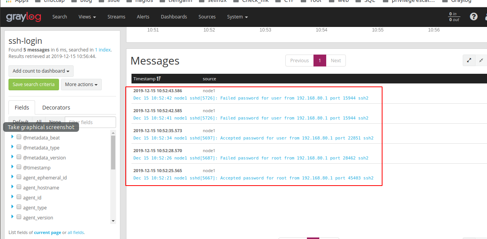

Đã chỉ còn những bản tin được chọn mới được hiển thị trong stream này mà thôi