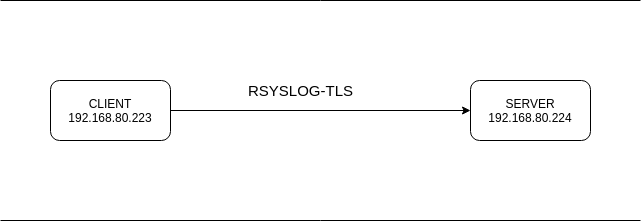
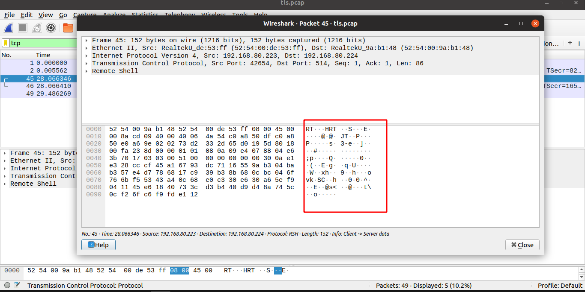
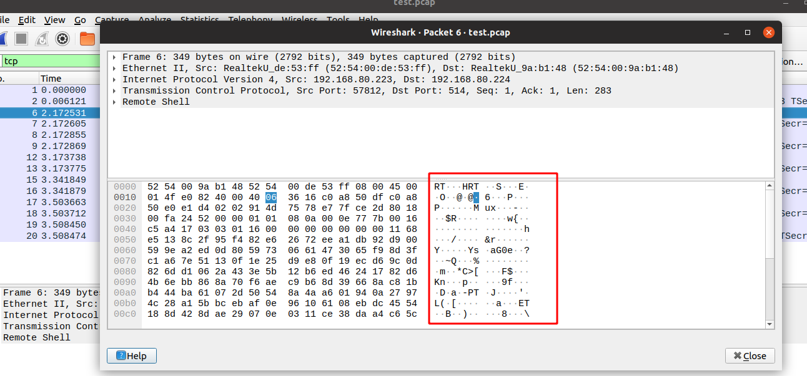

# Cài đặt Rsyslog và sử dụng TLS cho rsyslog
**NOTE**: Để làm được bài này thì bạn chắc chắn rằng đã cài đặt rsyslog cho 2 máy của mình.

| |IP |HOST NAME| RAM | DISK | CPU |
|--|---|--|---|---|---|
| Server | 192.168.80.224| node3 | 1G  |20G| 1|
| Client | 192.168.80.223 | node2 | 1G | 20G| 1|

Mô hình 



Ở bài này chỉ hướng dẫn cài thêm TLS cho dịch vụ Rsyslog. Hãy chắc chắn rằng bạn đã cài xong rsyslog cho 2 máy.Ở đây tôi đã cài đặt rsyslog cho 2 máy và client đã gửi log lên được server 

Kiểm tra thư mục log của client đã gửi lên server ở trên server. 

```
[root@node3 log]# ls /var/log/
node2
```

đã có thư mục log trong đó. Và giờ chúng ta sẽ mã hóa cho đường truyền dữ liệu của.

# Thực hiện 
## Trên client 
1. Tạo chứng chỉ CA 
- Cài đặt GnuTLS 
```
[root@node2 ~]# yum -y install gnutls-utils
```
- Tạo private key cho CA 
```
[root@node2 ~]# certtool --generate-privkey --outfile ca-key.pem
Generating a 2048 bit RSA private key...
```
- Cấp quyền cho key
```
chmod 400 ca-key.pem
```
- Kiểm tra key được tạo 
```
[root@node2 ~]# ls -l
total 136004
-rw-------. 1 root root      1431 15:40 23 Th08 anaconda-ks.cfg
-rwxrwxrwx. 1 root root      5823 09:07 22 Th11 ca-key.pem
```
- Tạo public key cho CA
```
[root@node2 ~]# certtool --generate-self-signed --load-privkey ca-key.pem --outfile ca.pem
Generating a self signed certificate...
Please enter the details of the certificate's distinguished name. Just press enter to ignore a field.
Common name: node2.example.com
UID:
Organizational unit name:
Organization name:
Locality name:
State or province name:
Country name (2 chars):
Enter the subject's domain component (DC):
This field should not be used in new certificates.
E-mail:
Enter the certificate's serial number in decimal (default: 6680410231240074733):


Activation/Expiration time.
The certificate will expire in (days): 3650


Extensions.
Does the certificate belong to an authority? (y/N): y
Path length constraint (decimal, -1 for no constraint): -1
Is this a TLS web client certificate? (y/N): n
Will the certificate be used for IPsec IKE operations? (y/N): n
Is this a TLS web server certificate? (y/N): n
Enter a dnsName of the subject of the certificate: node2.example.com
Enter a dnsName of the subject of the certificate:
Enter a URI of the subject of the certificate:
Enter the IP address of the subject of the certificate:
Enter the e-mail of the subject of the certificate:
Will the certificate be used to sign OCSP requests? (y/N): n
Will the certificate be used to sign code? (y/N): n
Will the certificate be used for time stamping? (y/N): n
Will the certificate be used to sign other certificates? (y/N): y
Will the certificate be used to sign CRLs? (y/N): y
Enter the URI of the CRL distribution point:
X.509 Certificate Information:
        Version: 3
        Serial Number (hex): 5cb595b602f325ed
        Validity:
                Not Before: Tue Apr 16 08:43:36 UTC 2019
                Not After: Fri Apr 13 08:43:44 UTC 2029
        Subject: CN=node2.example.com
        Subject Public Key Algorithm: RSA
        Algorithm Security Level: Medium (2048 bits)
                Modulus (bits 2048):
                        00:b7:d6:0b:dd:52:72:77:87:d6:16:8d:c6:93:69:6b
                        23:19:65:3e:28:cf:63:72:39:11:98:d9:6c:51:fe:da
                        2f:f3:2c:52:24:37:79:b2:36:ce:cd:8e:a2:45:51:96
                        a0:03:ef:7f:9b:f5:7f:f4:67:2e:08:25:fb:0b:69:41
                        f8:7c:15:b7:44:3d:65:a0:c8:97:51:f2:5c:fb:4f:fb
                        db:5a:c0:db:d9:78:35:c4:01:dc:68:d4:d2:9f:9b:29
                        47:4c:6e:44:d2:f4:b8:b4:f7:0a:dd:1c:45:d3:32:c8
                        cf:86:50:c3:49:4d:0f:24:61:e4:a6:10:c5:6a:f2:58
                        84:f4:94:e3:9d:65:33:c2:36:60:30:f0:f7:7a:55:9a
                        68:d4:0b:62:59:4f:9b:a0:60:e2:78:b9:1e:90:a5:95
                        9a:e9:45:c0:ba:6f:4c:09:72:d8:b0:fb:3b:77:c7:a8
                        ee:75:6e:f8:96:24:8c:14:06:57:85:73:eb:d2:e9:d9
                        a2:9e:d6:17:c0:6c:ac:ba:2a:47:49:9d:df:35:4a:75
                        be:4c:68:4e:36:43:04:a7:7c:a2:47:5d:62:24:1b:00
                        a9:10:63:90:3e:b1:8a:5c:01:e5:ac:21:7b:5e:19:ab
                        4e:04:5c:82:00:7e:27:d6:31:66:db:c7:1f:53:32:9b
                        59
                Exponent (bits 24):
                        01:00:01
        Extensions:
                Basic Constraints (critical):
                        Certificate Authority (CA): TRUE
                        Path Length Constraint: 0
                Subject Alternative Name (not critical):
                        DNSname: node2.example.com
                Key Usage (critical):
                        Certificate signing.
                        CRL signing.
                Subject Key Identifier (not critical):
                        951acec5fda12e4b438d10bb48a5ddcdea33a1f8
Other Information:
        Public Key ID:
                951acec5fda12e4b438d10bb48a5ddcdea33a1f8
        Public key's random art:
                +--[ RSA 2048]----+
                |        o        |
                |       + = =     |
                |      o = * + .  |
                |     . + B + o . |
                |      . S = o .  |
                |       . + o     |
                |      . . B .    |
                |       . . *     |
                |        E .      |
                +-----------------+

Is the above information ok? (y/N): y


Signing certificate...
```
- Kiểm tra xem đã được tạo hay chưa
```
[root@node2 ~]# ls -l
total 136004
-rw-------. 1 root root      1431 15:40 23 Th08 anaconda-ks.cfg
-rwxrwxrwx. 1 root root      5823 09:07 22 Th11 ca-key.pem
-rw-r--r--. 1 root root      1139 09:09 22 Th11 ca.pem
```

2. Tạo key cho client 
- Tạo  private key
```
[root@node2 ~]# certtool --generate-privkey --outfile node3-key.pem --bits 2048
** Note: Please use the --sec-param instead of --bits
Generating a 2048 bit RSA private key...
```
- Tạo public key
```
[root@node2 ~]# certtool --generate-request --load-privkey node3-key.pem --outfile node3-request.pem
Generating a PKCS #10 certificate request...
Common name: node3.example.com
Organizational unit name:
Organization name:
Locality name:
State or province name:
Country name (2 chars):
Enter the subject's domain component (DC):
UID:
Enter a dnsName of the subject of the certificate: node3.example.com
Enter a URI of the subject of the certificate:
Enter the IP address of the subject of the certificate:
Enter the e-mail of the subject of the certificate:
Enter a challenge password:
Does the certificate belong to an authority? (y/N):
Will the certificate be used for signing (DHE and RSA-EXPORT ciphersuites)? (Y/n): n
Will the certificate be used for encryption (RSA ciphersuites)? (Y/n): n
Will the certificate be used to sign code? (y/N): n
Will the certificate be used for time stamping? (y/N): n
Will the certificate be used for IPsec IKE operations? (y/N): n
Will the certificate be used to sign OCSP requests? (y/N): n
Is this a TLS web client certificate? (y/N): n
Is this a TLS web server certificate? (y/N): n
```
```
[root@node2 ~]# certtool --generate-certificate --load-request node3-request.pem --outfile node3-cert.pem --load-ca-certificate ca.pem --load-ca-privkey ca-key.pem
Generating a signed certificate...
Enter the certificate's serial number in decimal (default: 6680412331704980564):


Activation/Expiration time.
The certificate will expire in (days): 1000


Extensions.
Do you want to honour the extensions from the request? (y/N):
Does the certificate belong to an authority? (y/N):
Is this a TLS web client certificate? (y/N): y
Will the certificate be used for IPsec IKE operations? (y/N):
Is this a TLS web server certificate? (y/N): y
Enter a dnsName of the subject of the certificate: node3.example.com
Enter a dnsName of the subject of the certificate:
Enter a URI of the subject of the certificate:
Enter the IP address of the subject of the certificate:
Will the certificate be used for signing (DHE and RSA-EXPORT ciphersuites)? (Y/n): n
Will the certificate be used for encryption (RSA ciphersuites)? (Y/n): n
Will the certificate be used to sign OCSP requests? (y/N): n
Will the certificate be used to sign code? (y/N): n
Will the certificate be used for time stamping? (y/N): n
X.509 Certificate Information:
        Version: 3
        Serial Number (hex): 5cb5979f106a1454
        Validity:
                Not Before: Tue Apr 16 08:51:48 UTC 2019
                Not After: Mon Jan 10 08:51:53 UTC 2022
        Subject: CN=node3.example.com,DC=node3.example.com
        Subject Public Key Algorithm: RSA
        Algorithm Security Level: Medium (2048 bits)
                Modulus (bits 2048):
                        00:a4:1d:87:b0:dd:6c:53:85:a7:3e:0d:93:18:d8:fc
                        9d:a4:c3:71:4d:c1:00:74:04:9f:42:e0:83:00:5a:f0
                        4d:9e:20:77:d3:6b:4e:1a:e5:fe:95:06:80:5d:48:33
                        30:0e:d9:15:72:5e:9c:c8:c2:f4:60:59:cb:f2:cc:2d
                        58:45:64:f3:33:1d:62:c5:bd:71:a9:13:fe:89:ba:cc
                        c6:35:8a:22:6e:b4:f5:71:58:79:48:e5:1d:d0:c9:42
                        7d:fc:36:d5:fd:3f:0e:3c:b7:97:f0:e2:ca:7f:84:4f
                        6d:64:42:8b:42:c2:ed:7c:97:eb:37:d8:5a:01:da:39
                        b6:a5:82:b0:a0:cf:af:54:20:fb:6d:4b:a6:b8:83:2a
                        6c:36:2a:32:cd:fc:a6:c8:54:d3:53:29:ad:f6:0b:df
                        bd:a5:44:fa:d4:46:a9:90:53:24:5f:68:fa:cb:94:9d
                        d6:69:16:d6:14:41:9d:65:9b:9d:17:f9:37:4e:c1:3b
                        17:d9:67:8a:de:ad:44:cd:00:cc:13:40:99:a5:e3:a4
                        e2:4c:af:04:1a:4c:cd:b4:75:dd:78:b8:80:d9:43:d5
                        54:1f:3e:f0:8a:17:63:a7:f3:1a:67:ca:a2:06:dc:e7
                        80:52:d1:ea:48:dc:81:45:63:18:cb:76:a1:b1:88:58
                        d9
                Exponent (bits 24):
                        01:00:01
        Extensions:
                Basic Constraints (critical):
                        Certificate Authority (CA): FALSE
                Key Purpose (not critical):
                        TLS WWW Client.
                        TLS WWW Server.
                Subject Alternative Name (not critical):
                        DNSname: node3.example.com
                Subject Key Identifier (not critical):
                        b6c708ceaebf5e2509d57f8fe5cf9ae84d5d7b27
                Authority Key Identifier (not critical):
                        951acec5fda12e4b438d10bb48a5ddcdea33a1f8
Other Information:
        Public Key ID:
                b6c708ceaebf5e2509d57f8fe5cf9ae84d5d7b27
        Public key's random art:
                +--[ RSA 2048]----+
                |        ..       |
                |       .  .      |
                |      .    .     |
                |       . .  . . .|
                |      . S .  . =.|
                |     o o *    ..=|
                |      o + o   Eo=|
                |     . . .   + o=|
                |    .+=.   .o +. |
                +-----------------+

Is the above information ok? (y/N): y
```

3. Tạo key cho server 
- Ở đây ta đã có cặp key của client nên ta sẽ copy key từ client lên server 
```
[root@node3 ~]# mkdir /etc/rsyslog-keys
[root@node3 ~]# cd /etc/rsyslog-keys
```
- Copy key
```
[root@node2 ~]# scp node3-*.pem root@192.168.80.224:/etc/rsyslog-keys/
The authenticity of host 'node3 ()' can't be established.
ECDSA key fingerprint is SHA256:3RCFjBhKJLtOb78Jv+Yx2IPbwRT5P1hOGw9d08RlGzs.
ECDSA key fingerprint is MD5:b8:f9:09:06:91:48:de:a1:83:29:56:d5:94:3d:a6:d3.
Are you sure you want to continue connecting (yes/no)? yes
Warning: Permanently added 'node3' (ECDSA) to the list of known hosts.
root@node3's password:
node3-cert.pem                                                                            100% 1249   729.7KB/s   00:00
node3-key.pem
```
```
[root@node2 ~]# scp ca.pem node3:/etc/rsyslog-keys/
root@node3's password:
ca.pem 	
```

4. Cấu hình máy client để chuyển log đi an toàn
```
[root@node2 ~]# mkdir /etc/rsyslog-keys
[root@node2 ~]# cp ca.pem /etc/rsyslog-keys/
```
- Tạo ra một file mới với nội dung bên dưới
```
[root@node2 ~]# vim /etc/rsyslog.d/log-client.conf


# certificate files
$DefaultNetStreamDriverCAFile /etc/rsyslog-keys/ca.pem

# make gtls driver the default
$DefaultNetStreamDriver gtls
$ActionSendStreamDriverMode 1	# run driver in TLS-only mode
$ActionSendStreamDriverAuthMode anon

*.*     @@(o)node3.example.com:6514		# forward everything to remote server
```

- Cài đặt GUTLS
```
[root@node2 ~]# yum -y install rsyslog-gnutls
```
- Khởi động lại dịch vụ 
```
[root@node2 ~]# systemctl restart rsyslog
```

4. Kiểm tra băng cách gửi tin nhắn 
- Gửi tin nhắn
```
[root@node2 ~]# logger "MESSAGE FROM NODE2"
```

- Bắt gói tin và kiểm tra tin nhắn 
```
[root@node3 node2]# cat /var/log/node2/root.log 
2019-11-23T09:44:40+07:00 node2 root: MESSAGE FROM NODE2
```
- Kiểm tra gói tin bằng wireshark. Thông tin đã mã hóa 



- Kiểm tra bằng cách khởi động lại dịch vụ httpd
```
[root@node2 ~]# systemctl restart httpd
```

```
[root@node3 node2]# cat /var/log/node2/httpd.log 
2019-11-23T09:45:42+07:00 node2 httpd: AH00558: httpd: Could not reliably determine the server's fully qualified domain name, using fe80::705:cdc:8acc:d61. Set the 'ServerName' directive globally to suppress this message
```
Bắt wireshark và kiểm tra dữ liệu mã hóa 

