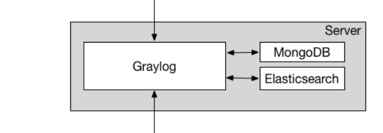
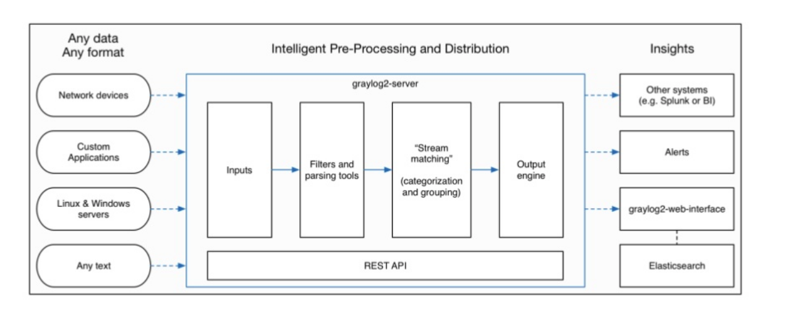
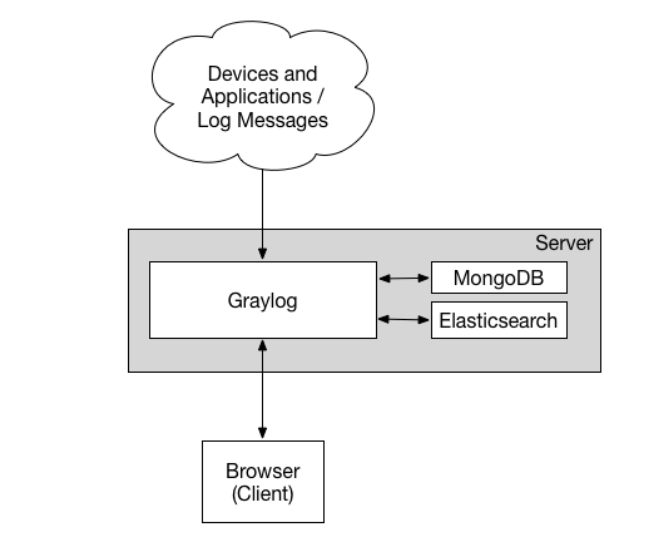
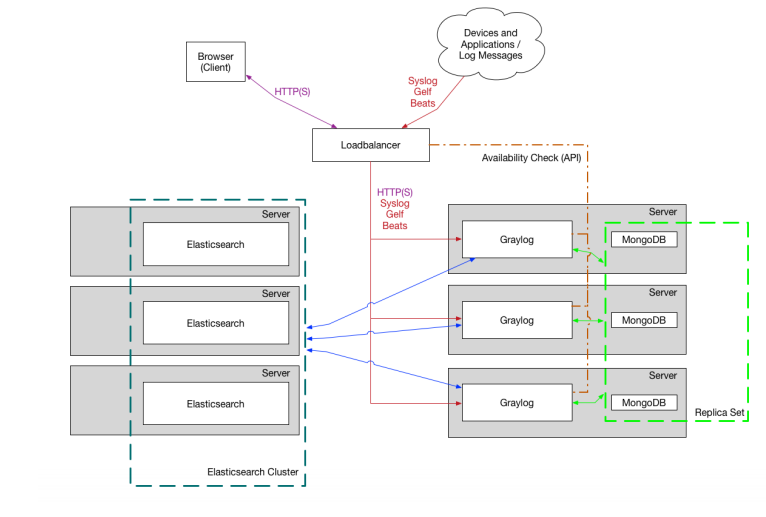

# Tìm hiểu tổng quan về graylog
## I. Khái niệm Graylog
1. Khái niệm

Graylog là một ứng dụng mà nguồn mở được sử dụng để quản lý và thu thập log.Nó có thể quản lý nhật ký cả với dữ liệu có cấu trúc và không có cấu trúc. Nó cho phép lưu trữ và phân tích thời gian thực của dữ liệu. 

Một chút về lịch sử `graylog`
- Dự án được bắt đầu từ năm 2009. Đến năm 2010 thì sản phẩm đâu tiên được ra mắt. Được công bố với cái tên `Graylog2` và là sản phầm của `Lennart Koopman`
- Phiên bản state hiện tại là phiên bản 3.1
- Graylog từ bản 2.3 trở về trước không làm việc được với Elasticsearch 5.x!
- Graylog 3.x không làm việc với Elasticsearch 7.x!

2. Một số tính năng của `graylog`
- Quản lý và tập trung log tại một điểm 
- Gửi cảnh báo qua mail, slack
- Phân tích dữ liệu ở dạng thống kê và biểu đồ
- Việc tìm kiếm log nhanh chóng và linh hoạt
- Có Web-interface
## II. Các khái niệm và thành phần trong trong Graylog
Các thành phần trong `Graylog`

1. Elasticsearch
- Là một công cụ tìm kiếm và phân tích. Nó là sản phẩm mã nguồn mở và miễn phí 
- Được phát hành năm 2010
- Được sử dung để ghi log và phân tích log
- có khả năng giám sát hiệu suất ứng dụng 
- Khả năng tìm kiếm mạnh mẽ 
- Trong Graylog nó có vai trò lưu trữ các log và messages, tìm kiếm text 

2. MongoDB
- Là một `database` và nó thuộc NoSQL 
- Nó lưu trữ dữ liệu giống như tài liệu json. Điều này giúp truy vấn nhanh hơn 
- Trong Graylog nó được sử dụng để quả lý Metadata

3. Web-interface
là một trang web được sử dụng đê cung cấp giao diện cho người dùng dễ dàng sử dụng graylog 

4. Streams (Luồng)
- Đây là một tính năng cốt lõi trong Graylog. Nó chứa các rules của dữ liệu 
- Được sử dụng để gắn thẻ những `message` được gửi đến. Định tuyến dữ liệu, kiểm soát truy cập dữ liệu, định tuyến tin nhắn 
- Một `messages` có thể thuộc một hoặc nhiều `streams`

5. Searches (Tìm kiếm)
- Là công cụ được sử dụng để tìm kiếm log trong `Graylog` 
- Kết quả tìm kiếm có thể được lưu hoặc hiện thị dưới dạng bảng điều khiển 
- Người dùng có thể tự cấu hình chế độ xem kết quả. 

6. Dashboards (Bảng điều khiển)
- Được sử dụng để tóm tắt thông tin có trong `log events`

7. Alerts(cảnh báo)
- Đây là chức năng cảnh báo của `Graylog`
- Alerts bao gồm 2 chức năng chính là: Điều kiện cảnh báo và thông báo cảnh báo 
- `Alerts conditiors` được gọi là điều kiện cảnh báo. là các điều kiện để cảnh báo lỗi hệ thống 
- `Alerts notifications` Là thông báo cảnh báo. Một cảnh báo có thể được thông báo đến một địa chỉ mail, telegram,... 

8. Graylog Collector Sidecar (Graylog Sidecar từ phiên bản 3.x)
- Là hệ thống quản lý cấu hình dành cho các quá tình thu thập log bằng cách remote 
- Như là một Plugins để định cấu hình cho từ thiết bị bằng cách remote từ server 
9. Inputs 
- Là đầu vào và xác định port được sử dụng cho graylog 
- Được sử dụng để cấu hình đầu vào, lấy số liệu,...
10. OutPuts 
- Được sử dụng để xác định cách mà dữ liệu được chuyển đến các thiết bị từ xa
- Bao gồm các cài đặt về: port, giao thức, dữ liệu cần thiết gửi đi 
11. Pipelines
- Là nơi phân tích cú pháp và thêm sửa xóa và thay đổi from hay xóa một messages 

## III. Mô hình triển khai và luồng làm việc của graylog
1. Luồng làm việc 

- Bước 1: Dữ liệu được gửi từ các nguồn về `Graylog-server`
- Bước 2: Dữ liệu được đi vào input. Nơi dữ liệu được cung cấp đường đi vào 
- Bước 3: `Graylog-server` lọc dữ liệu và xử lý xong 
- Bước 4: Xong đó dữ liệu được quyết định đi ra với outputs nào đã được cài đặt 
- Bước 5: `Graylog-server` sẽ quyết định thông báo, cảnh báo hay  đẩy ra một hệ thống khác ....

2. Mô hình triển khai trên một máy (All-in-one)

Là mô hình mà graylog, MongoDB, Elasticsearch nằm trên cùng một máy. 

3. Mô hình Triển khai mở rộng (Bigger Production)

Thông thường sẽ dựng nhiều server (3 elasticsearch, 3 MongoDB). Để đảm bảo tính sẵn sàng cao một node giữ vai trò làm primary, các node còn lại là slave. Khi primary down thì slave có thể lên thay.

# Link tài liệu tham khảo 
https://docs.graylog.org/en/3.1/pages/getting_started/explore.html

https://buildmedia.readthedocs.org/media/pdf/graylog2-docs/3.1/graylog2-docs.pdf

https://www.slideshare.net/Mnhinh2/graylog-manhdv-v15

https://www.slideshare.net/tcvn1985/mt-vi-trao-i-ngy-ng-v-graylog2

https://www.graylog.org/post/announcing-graylog-v2-0-beta-1