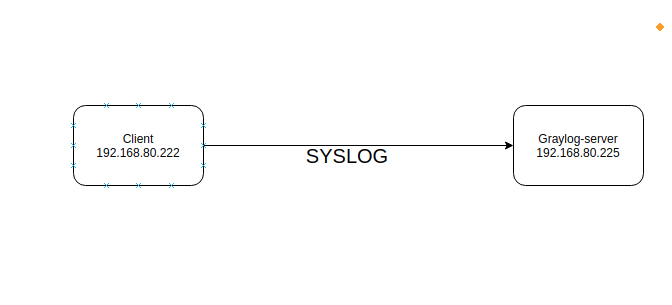
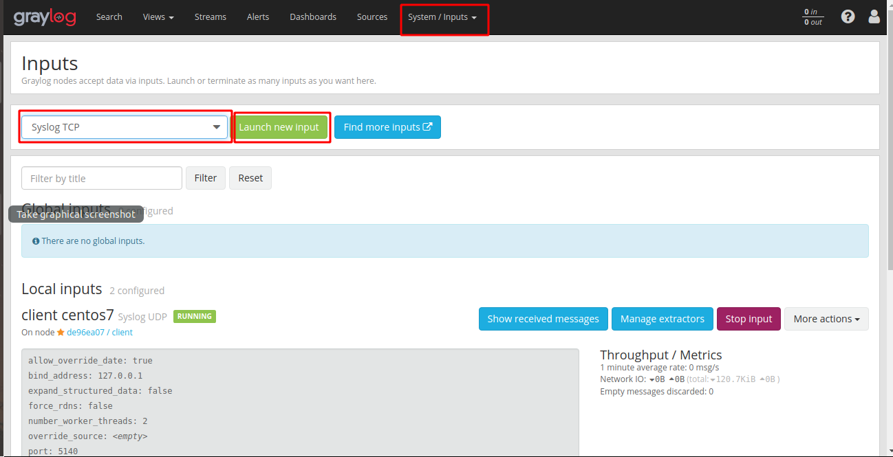
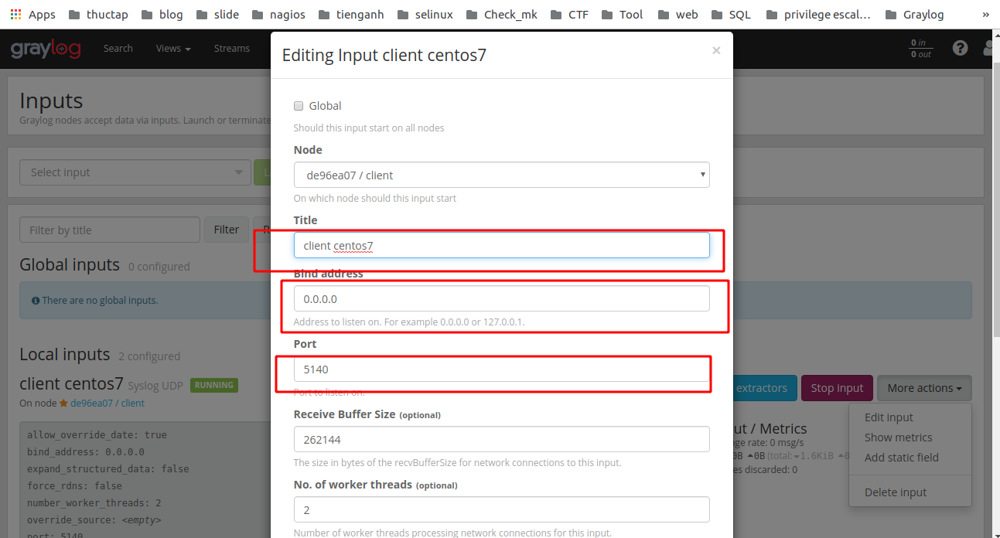
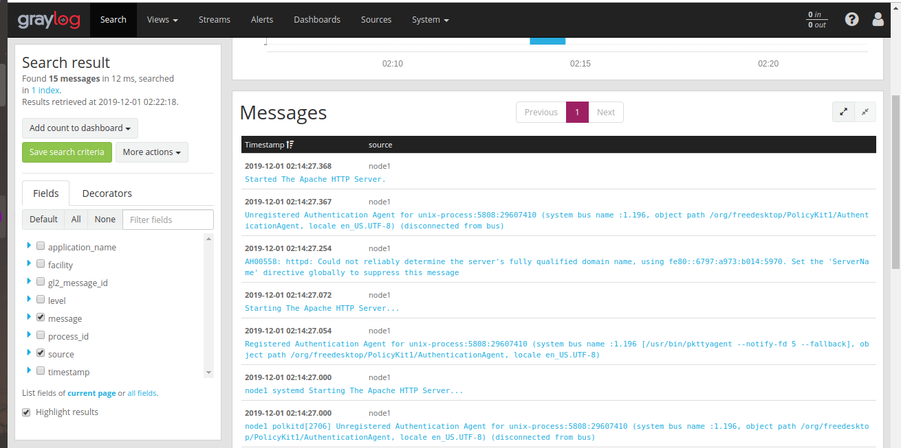

# Hướng dẫn đẩy log lên graylog-server bằng giao thức syslog trên centos7

## Mô hình 



IP Planning

| Hostname | IP | OS | RAM | DISK | CPU | 
|---|---|---|----|---|---|
| Server | 192.168.80.225 | Centos 7 | 1G | 20G | 1 | 
| Client | 192.168.80.222 | Centos 7 | 1G | 20G | 1 |

## Thực hiện trên Server và web 
1. Tạo input bằng web đăng nhập với user admin 



- Bước 1: Ta vào mục `system/input`  
- Bước 2: Ta chọn giao thức syslog TCP hoặc UDP 
- Bước 3: Ta ấn chọn `Launch new input`

2. Tạo ra kết port kết nối và thông tin tên của kết nối 



3. Mở port trên server

```
firewall-cmd --zone=public --add-port=5140/tcp --permanent
firewall-cmd --zone=public --add-port=5140/udp --permanent
firewall-cmd --reload
```

## Thực hiện Trên client 
1. Cài đặt rsyslog
```
yum install rsyslog -y 
```
Khởi động rsyslog
```
systemctl start rsyslog
systemctl enable rsyslog
```
2. Sửa file `/etc/rsyslog.conf` Với các thông tin sau
```
sed -i 's|#\*\.\* @@remote-host:514|\*\.\* @@192.168.80.225:514;RSYSLOG_SyslogProtocol23Format|' /etc/rsyslog.conf
sed -i 's|#$ModLoad imudp|$ModLoad imudp|' /etc/rsyslog.conf
sed -i 's|#$UDPServerRun 514|$UDPServerRun 514|' /etc/rsyslog.conf
sed -i 's|#$ModLoad imtcp|$ModLoad imtcp|' /etc/rsyslog.conf
sed -i 's|#$InputTCPServerRun 514|$InputTCPServerRun 514|' /etc/rsyslog.conf
```

3. Mở port firewall  trên client 
```
firewall-cmd --zone=public --add-port=5140/tcp --permanent
firewall-cmd --zone=public --add-port=5140/udp --permanent
firewall-cmd --reload
```

4. Khởi động lại dịch vụ rsyslog 
```
systemctl restart rsyslog 
```

5. Khởi động lại dịch vụ httpd để kiểm tra
```
systemctl restart httpd
```

6. Kiểm tra trên web xem log đã được đẩy lên server chưa


