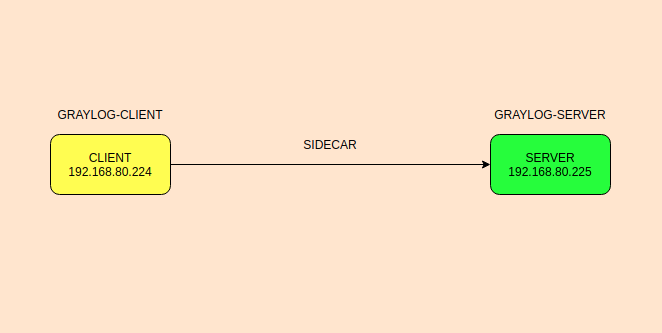
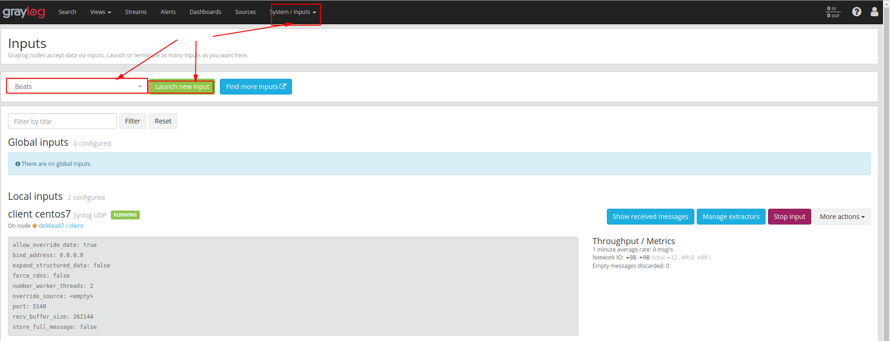
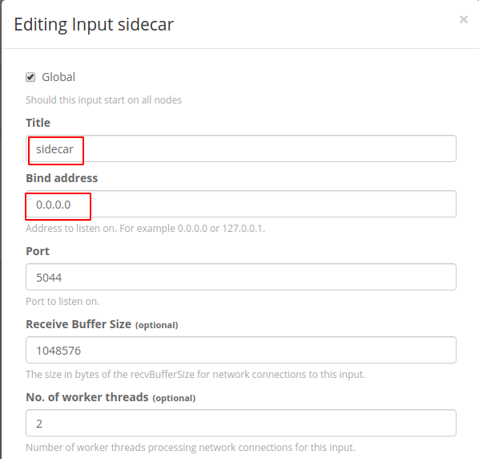
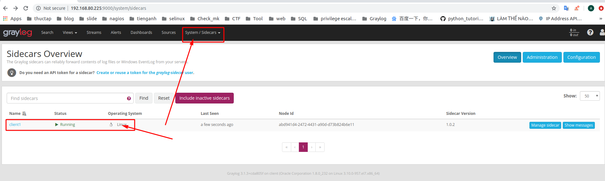

# Hướng dẫn đẩy log lên graylog-server bằng Sidecar
Hướng dẫn thực hiện trên client centos 7
## Mô hình 



IP PLANNING

| Hostname | IP | OS | RAM | DISK | CPU | 
|---|---|---|----|---|---|
| Server | 192.168.80.225 | Centos 7 | 1G | 20G | 1 | 
| Client1 | 192.168.80.224 | Centos 7 | 1G | 20G | 1 |

# Thực hiện trên client 
1. Download và cài đặt sidecar 

Chúng ta vào [link git](https://github.com/Graylog2/collector-sidecar/releases) của graylog-sidecar để chọn lấy phần phiên bản hợp với hệ điều hành của máy

chọn gói cần thiết cho hệ điều hành 
```
wget https://github.com/Graylog2/collector-sidecar/releases/download/1.0.2/graylog-sidecar-1.0.2-1.x86_64.rpm
```

Kiểm tra gói download về
```
[root@client1 ~]# ls
anaconda-ks.cfg graylog-sidecar-1.0.2-1.x86_64.rpm
```
Cài đặt 
```
rpm -i graylog-sidecar-1.0.2-1.x86_64.rpm
graylog-sidecar -service install
systemctl start graylog-sidecar.service
systemctl enable graylog-sidecar.service
```

Sửa các giá trị trong file file `/etc/graylog/sidecar/sidecar.yml`
```
sed -i 's|server_url: "http://127.0.0.1:9000/api/"|server_url: "http://192.168.80.225:9000/api/"|' /etc/graylog/sidecar/sidecar.yml

sed -i 's|server_api_token:|server_api_token: "q1n13todqvqqf3ilfoq58qo1vi8ji8jumej190kkd52fh31tg8q"|' /etc/graylog/sidecar/sidecar.yml

sed -i 's|tls_skip_verify: false|tls_skip_verify: true|' /etc/graylog/sidecar/sidecar.yml
```
**NOTE**: lấy giá trị token trên web server như sau. Đừng copy nguyên giá trị token nhé hãy lấy token của mình thay vào đó.
- Bước 1: Vào `system/sidecar` và chọn tạo một `token`


- Bước 2: Ghi tên và ấn tạo token 


- Bước 3: Copy token 


2. Download filebeat 

Tìm kiếm tại [Link này](https://www.elastic.co/fr/downloads/beats/filebeat) và tải đúng so với hệ điều hành của mình 

Với centos 7
```
wget https://artifacts.elastic.co/downloads/beats/filebeat/filebeat-7.4.2-x86_64.rpm
```
Cài đặt filebeat
```
 rpm -i filebeat-7.4.2-x86_64.rpm
```

Khởi động lại dịch vụ graylog-sidecar 
```
systemctl restart graylog-sidecar.service 
```

## Thực hiện trên web-interface 
1. Tạo input cho client 





Ta tích vào `Global` sau đó nhập tiêu đề rồi để mặc định sau đó save lại là xong 

2. Tạo cấu hình 
- Vào mục `sidecar/system` chọn `configuration`


Lấy địa chỉ là địa chỉ máy graylog-server. Rồi ấn `update` và `back`


Rồi chọn tạo ra `collectors` mới 


3. Tạo cùng tên với màu hiển thị và chọn `create` ở cuối trang 


4. Kiểm tra kết quả bằng cách vào `sidecar/overview`



 

# Link tham khảo 
https://www.youtube.com/watch?v=gjXXs0_fBzU&list=PLECxNUHStsl9nUhMyZNb3Qnpj1cWYftm5&index=24

http://docs.graylog.org/en/3.0/pages/sidecar.html#centos