# Hướng dẫn đẩy log lên graylog-server trên win-10 sử dụng sidecar 

## Mô hình và chuẩn bị 

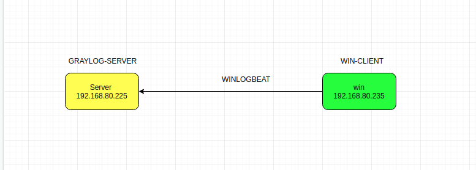

IP PLANNING

| Hostname | IP | OS | RAM | DISK | CPU | 
|---|---|---|----|---|---|
| Server | 192.168.80.225 | Centos 7 | 1G | 20G | 1 | 
| Win | 192.168.80.235 | Win 10 | 2G | 50G | 1 | 

## Các bước thực hiện 

1. Đầu tiên ta sẽ đồng bộ thời gian của server và client là hệ điều hành win 

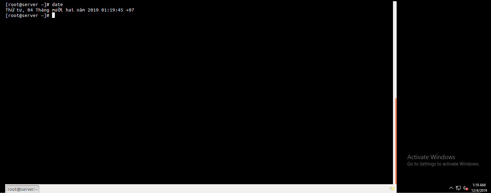

2. Chúng ta vào [link git](https://github.com/Graylog2/collector-sidecar/releases) của graylog-sidecar để chọn lấy phần phiên bản hợp với hệ điều hành của máy. Ở đây là dùng win nên tôi sẽ download file.exe 

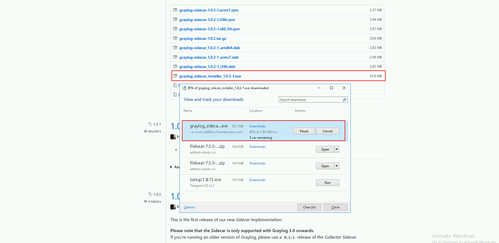

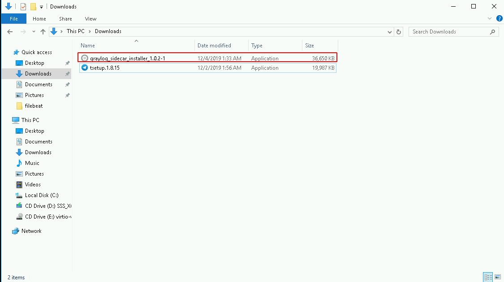

3. Tạo token cho windows

- Bước 1: Vào `system/sidecar` và chọn tạo một `token`


- Bước 2: Ghi tên và ấn tạo token 

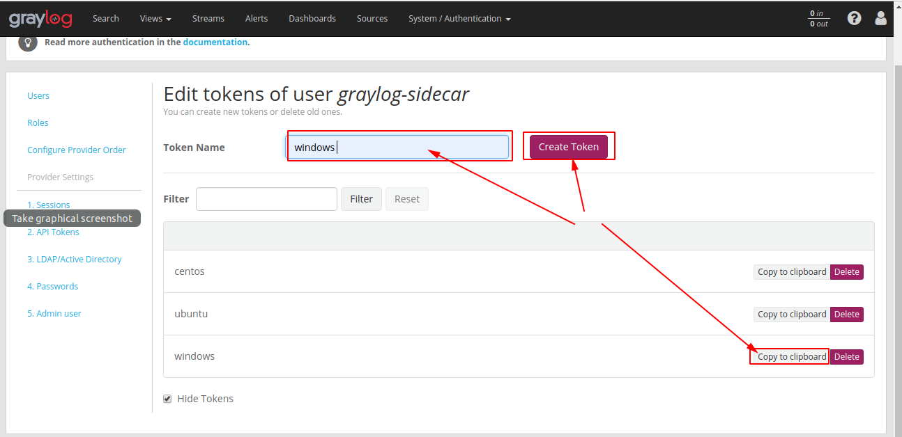

Sau khi ghi tên và tạo token thì ta có thể nhấn copy để sử dụng nó 

4. Chạy file graylog-sidecar đã download để cài đặt theo các bước ở hình dưới 

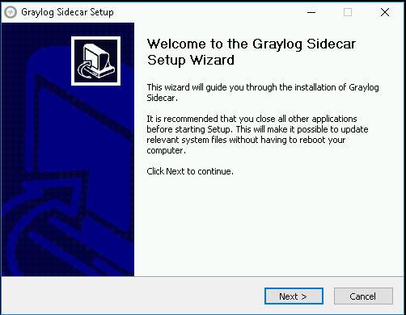

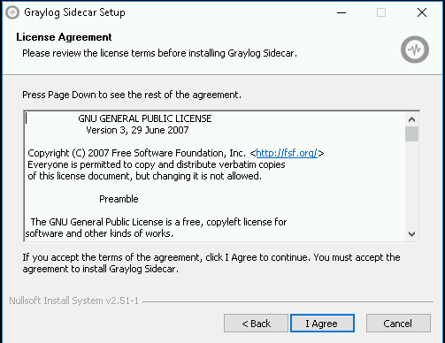

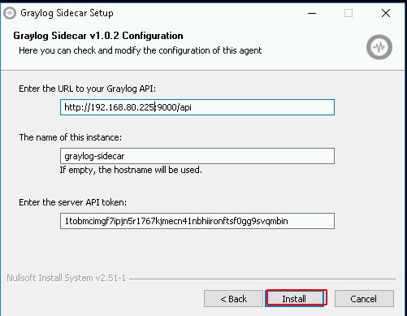

Ta ghi đủ thông tin về địa chỉ của web graylog-server tên  và token rồi ta bắt đầu cài đặt sau khi nhấn `install`. Sau đó ta chỉnh sửa file cấu hình theo cách dưới đây 


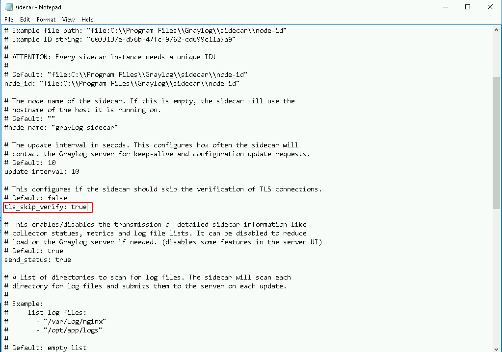

ta sử giá trị này từ `false` thành `true`

và đổi giá trị `server_url` thành ip của `graylog-server`. Thay đổi giá trị token 
```
server_url: "http://192.168.80.225:9000/api"
``` 

```
server_api_token: "1tobmcimgf7ipjn5r1767kjmecn41nbhiironftsf0gg9svqmbin"
```


Vào phần này để sử dụng được lệnh trong win. chạy 2 lệnh dưới để tải sidecar và bắt đầu dịch vụ. Tôi đã cài đặt rồi nên chỉ cần bắt đầu 
```
"C:\Program Files\graylog\sidecar\graylog-sidecar.exe" -service install
"C:\Program Files\graylog\sidecar\graylog-sidecar.exe" -service start
```

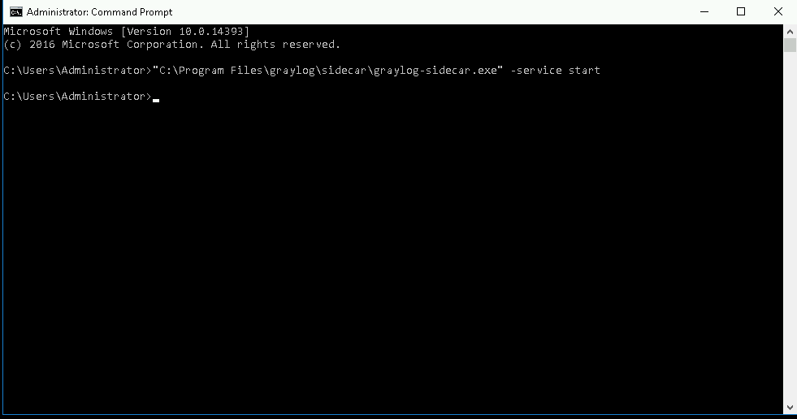

5. Tạo đầu vào input trên web. Ta thực hiện theo các bước dưới đây 


Ta tích vào `Global` sau đó nhập tiêu đề rồi để mặc định sau đó save lại là xong 

6. Tạo configuration mới trên server để win có thể đẩy log lên 

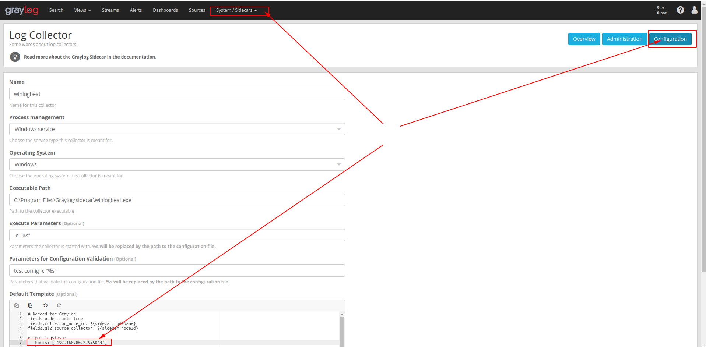

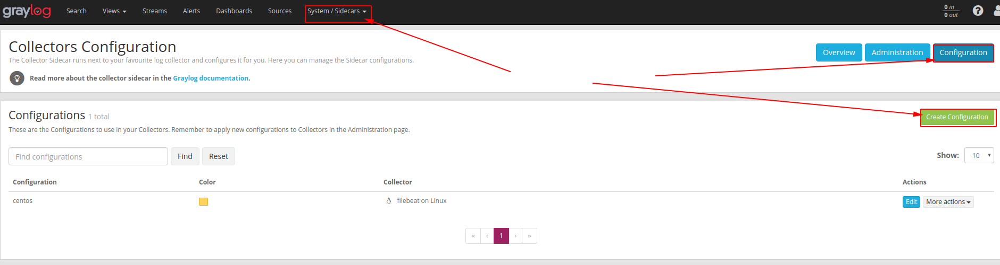

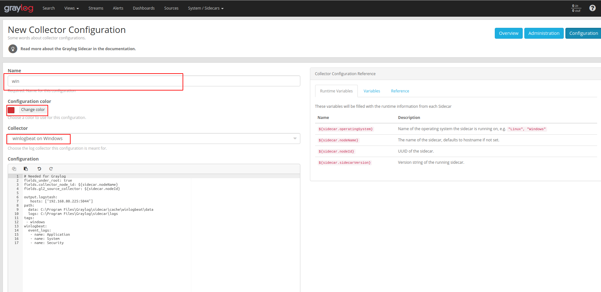

Xong đó ta nhấn `create` là được.

7. Chạy cài đặt mới 

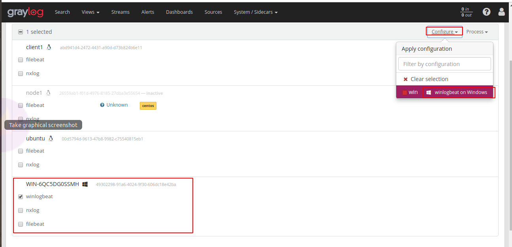

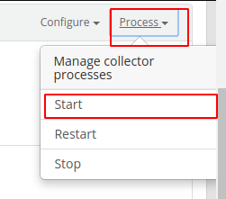

8. Kiểm tra kết quả

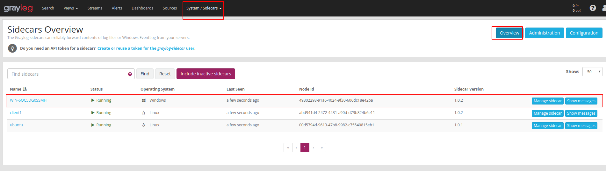

Windows 10 đã đẩy được log lên `gralog-server`


# Link tham khảo 
https://www.youtube.com/watch?v=gjXXs0_fBzU&list=PLECxNUHStsl9nUhMyZNb3Qnpj1cWYftm5&index=24

http://docs.graylog.org/en/3.0/pages/sidecar.html#centos