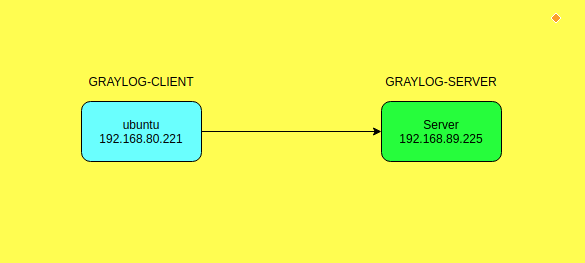
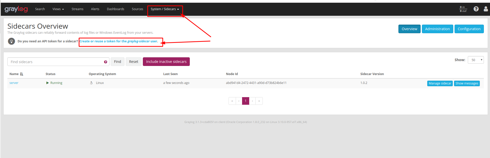
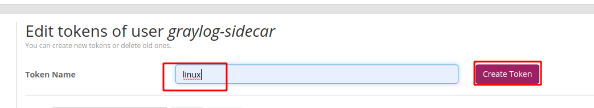
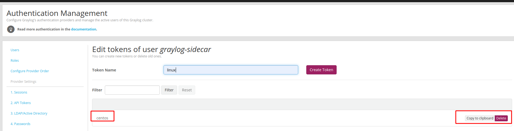
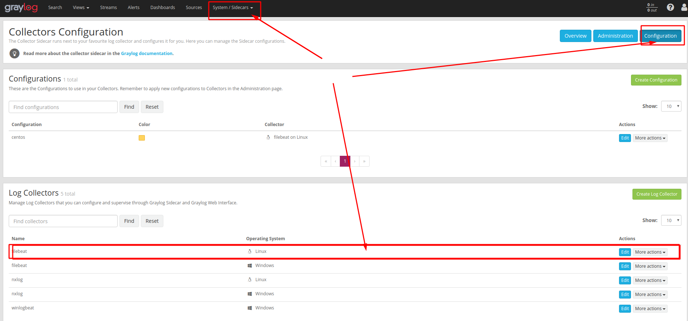
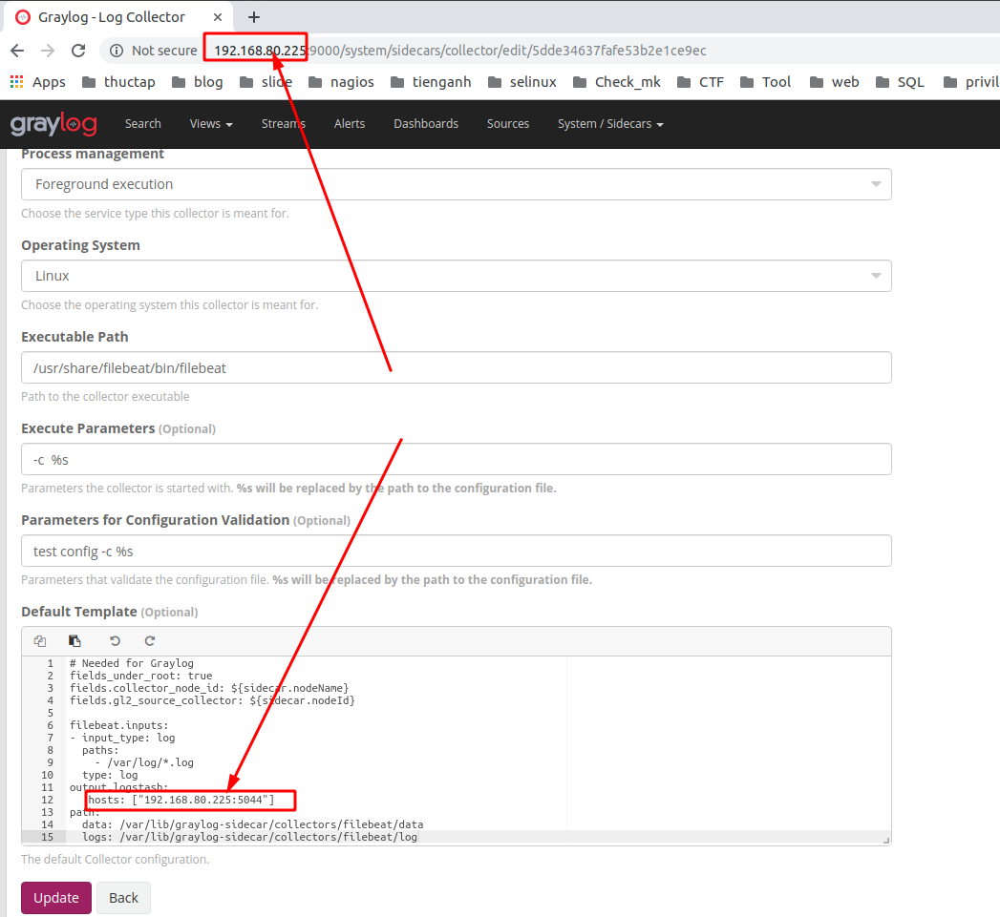
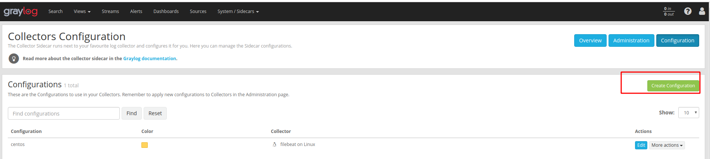
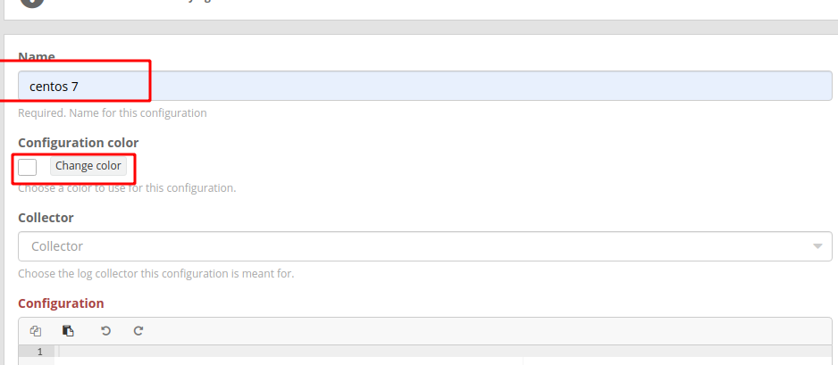
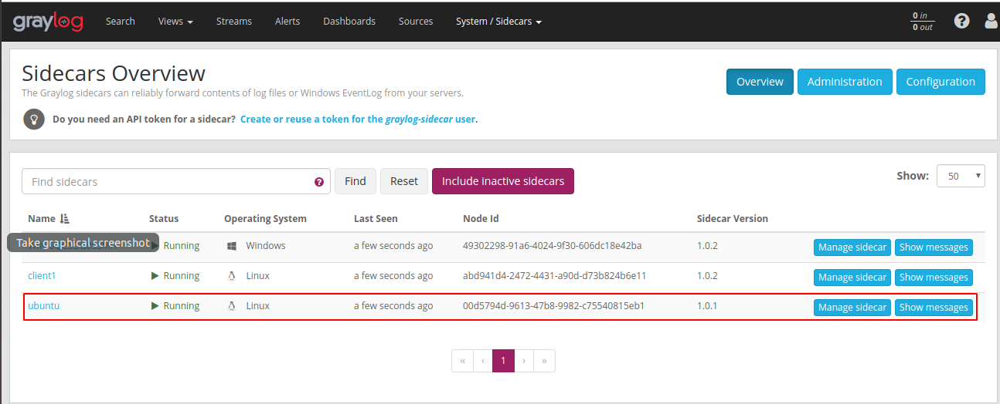

# Hướng dẫn đẩy log lên graylog-server bằng Sidecar

## Mô hình và chuẩn bị 



| Hostname | IP | OS | RAM | DISK | CPU | 
|---|---|---|----|---|---|
| Server | 192.168.80.225 | Centos 7 | 1G | 20G | 1 | 
| ubuntu | 192.168.80.224 | ubuntu 16.04  | 2G | 50G | 1 |

# Thực hiện trên client 
1. Download và cài đặt sidecar 

Chúng ta vào [link git](https://github.com/Graylog2/collector-sidecar/releases) của graylog-sidecar để chọn lấy phần phiên bản hợp với hệ điều hành của máy

chọn gói cần thiết cho hệ điều hành 
```
wget https://github.com/Graylog2/collector-sidecar/releases/download/1.0.2/graylog-sidecar_1.0.2-1_amd64.deb
```

Kiểm tra gói download về
```
root@ubuntu:~# ls
graylog-sidecar_1.0.1-1_amd64.deb
```
Cài đặt 
```
dpkg -i graylog-sidecar_1.0.1-1_amd64.deb
graylog-sidecar -service install
systemctl start graylog-sidecar.service
systemctl enable graylog-sidecar.service
```

Sửa các giá trị trong file file `/etc/graylog/sidecar/sidecar.yml`
```
sed -i 's|server_url: "http://127.0.0.1:9000/api/"|server_url: "http://192.168.80.225:9000/api/"|' /etc/graylog/sidecar/sidecar.yml

sed -i 's|server_api_token:|server_api_token: "q1n13todqvqqf3ilfoq58qo1vi8ji8jumej190kkd52fh31tg8q"|' /etc/graylog/sidecar/sidecar.yml

sed -i 's|tls_skip_verify: false|tls_skip_verify: true|' /etc/graylog/sidecar/sidecar.yml
```
**NOTE**: Nhớ là ở phần giá trị token hãy lấy giá trị token của bạn nhé đường copy đấy. Lấy giá trị token trên web server như sau
- Bước 1: Vào `system/sidecar` và chọn tạo một `token`



- Bước 2: Ghi tên và ấn tạo token 



- Bước 3: Copy token 



2. Download filebeat 

Tìm kiếm tại [Link này](https://www.elastic.co/fr/downloads/beats/filebeat) và tải đúng so với hệ điều hành của mình 

Với ubuntu
```
wget https://artifacts.elastic.co/downloads/beats/filebeat/filebeat-7.4.2-amd64.deb
```
Cài đặt filebeat
```
dpkg -i filebeat-7.4.2-amd64.deb
```

Khởi động lại dịch vụ graylog-sidecar 
```
systemctl restart graylog-sidecar.service 
```

## Thực hiện trên web-interface 
Vào mục `sidecar/system` chọn `configuration`



Lấy địa chỉ là địa chỉ máy graylog-server. Rồi ấn `update` và `back`



Rồi chọn tạo ra `collectors` mới 



Tạo cùng tên với màu hiển thị và chọn `create` ở cuối trang 



Kiểm tra kết quả bằng cách vào `sidecar/overview`



# Link tham khảo 
https://www.youtube.com/watch?v=gjXXs0_fBzU&list=PLECxNUHStsl9nUhMyZNb3Qnpj1cWYftm5&index=24

http://docs.graylog.org/en/3.0/pages/sidecar.html#centos