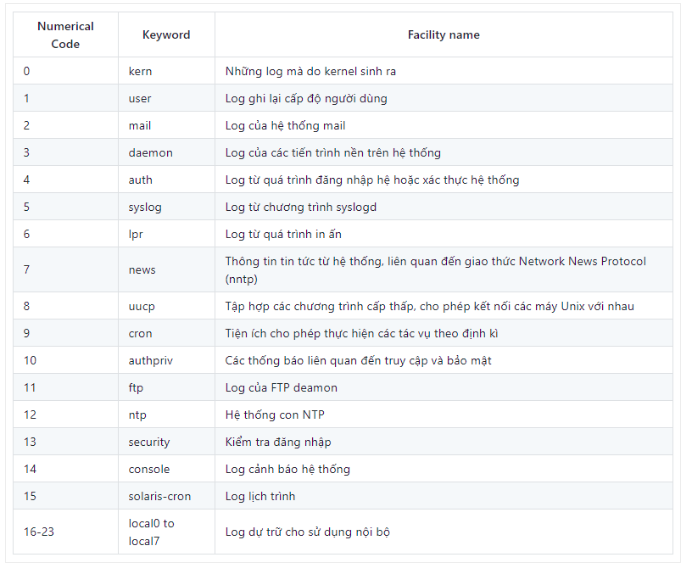
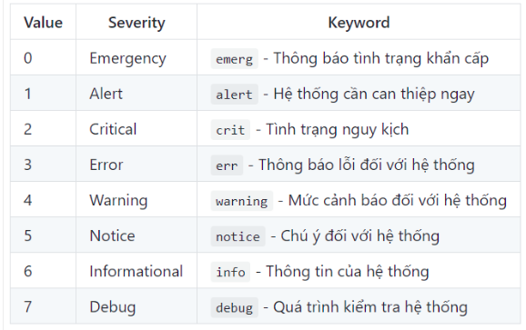
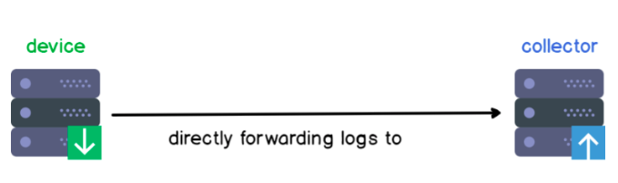
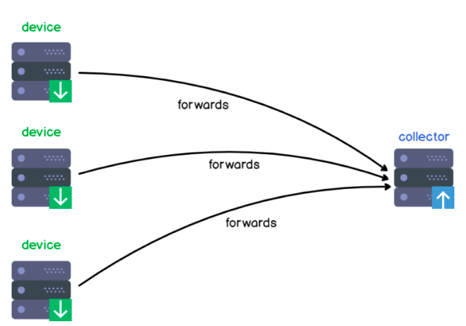

# Tìm hiểu tổng quan về giao thức syslog 
## 1. Khái niệm
Syslog là một giao thức client/server là giao thức dùng để chuyển log và thông điệp đến máy nhận log. Máy nhận log thường được gọi là syslogd, syslog daemon hoặc syslog server. Syslog có thể gửi qua UDP hoặc TCP. Các dữ liệu được gửi dạng cleartext. Syslog dùng port 514

Syslog được phát triển năm 1980 bởi Eric Allman, nó là một phần của dự án Sendmail, và ban đầu chỉ được sử dụng duy nhất cho Sendmail. Nó đã thể hiện giá trị của mình và các ứng dụng khác cũng bắt đầu sử dụng nó. Syslog hiện nay trở thành giải pháp khai thác log tiêu chuẩn trên Unix-Linux cũng như trên hàng loạt các hệ điều hành khác và thường được tìm thấy trong các thiết bị mạng như router Trong năm 2009, Internet Engineering Task Forec (IETF) đưa ra chuẩn syslog trong RFC 5424.

Trong chuẩn syslog, mỗi thông báo đều được dán nhãn và được gán các mức độ nghiêm trọng khác nhau. Các loại phần mềm sau có thể sinh ra thông báo: auth, authPriv,daemon, cron, ftp, dhcp, kern, mail, syslog, user,… Với các mức độ nghiêm trọng từ cao nhất trở xuống Emergency, Alert, Critical, Error, Warning, Notice, Info, and Debug.

## 2. Mục đích của việc sử dụng syslog 
Syslog được sử dụng như một tiêu chuẩn, chuyển tiếp và thu thập log được sử dụng trên một phiên bản Linux. Syslog xác định mức độ nghiêm trọng (severity levels) cũng như mức độ cơ sở (facility levels) giúp người dùng hiểu rõ hơn về nhật ký được sinh ra trên máy tính của họ. Log (nhật ký) có thể được phân tích và hiển thị trên các máy chủ được gọi là máy chủ Syslog. 
 
Đặc điểm về syslog:
- Sử dụng kiến trúc client-server
- Có message format 
- Sử dụng UDP và TCP để truyền tin 
- Xác thực message 
## 3. Kiến trúc thành phần. 
### 3.1 Syslog facility
- Hay còn được gọi là cấp độ cơ sở. Là các nguồn sinh ra log 

- Theo mặc định, một số phần trong hệ thống của bạn được cung cấp các mức facility như kernel sử dụng kern facility hoặc hệ thống mail của bạn bằng cách sử dụng mail facility.
- Nếu một bên thứ 3 muốn phát hành log thì cần được cài đặt và được gọi là `local user`

### 3.2 Syslog severity 
- Là những cấp độ cảnh báo 
- Có tổng cộng 7 cấp độ cảnh báo 

### 3.2Một số Kiến trúc 
- One device, one collector

- nultiple devices, one collector 

- multiple devices, one collector, one relay

# Tài liệu tham khảo 
https://en.wikipedia.org/wiki/Syslog

https://news.cloud365.vn/log-ly-thuyet-tong-quan-ve-log-syslog-rsyslog/