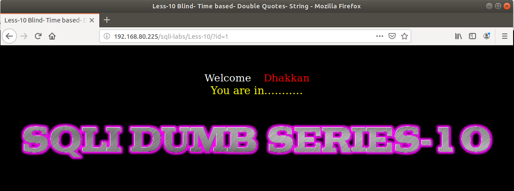
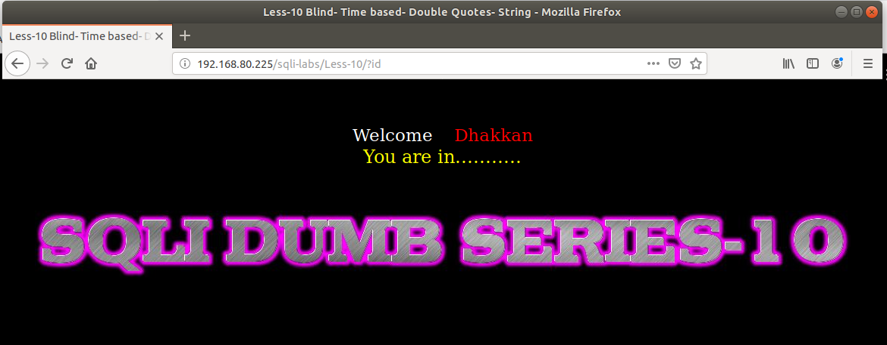
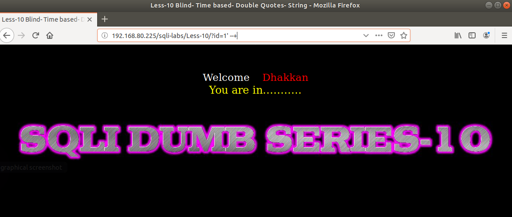
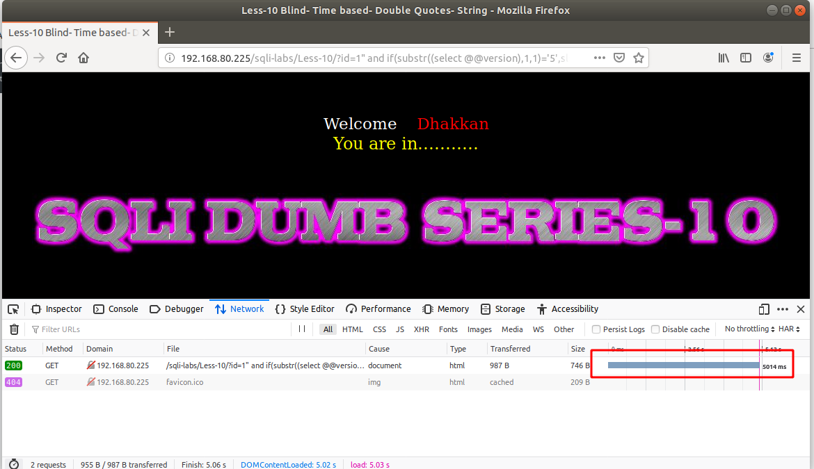

# Những việc làm được với lesson-10
Việc check xem nó là dạng DB gì thì làm giống như những lesson trước. 

Sau khi đăng nhập vào lesson-10



Ta thấy ảnh ở dưới suy ra bài này lại giống như bài 9. Ta phải dựa vào DB được tìm thấy và đi tìm cấu trúc dựa vào việc đoán phiên bản 





1. Đoán cấu trúc. Sau một hồi thử thì kết quả của bài này có cấu trúc là 
```
192.168.80.225/sqli-labs/Less-10/?id=1" and if(substr((select @@version),1,1)='5',sleep(5),false) --+
```


Sau khi ta có được cấu trúc của bài 10 này thì các thao tác ta làm giống như bài 9 và đúng với cấu trúc của nó 