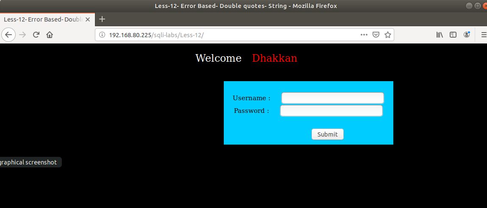
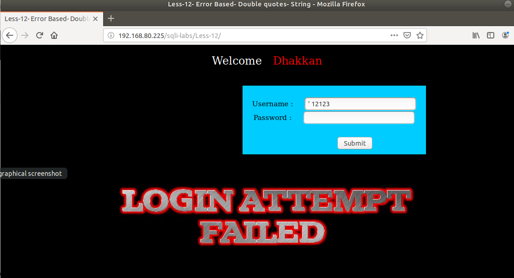
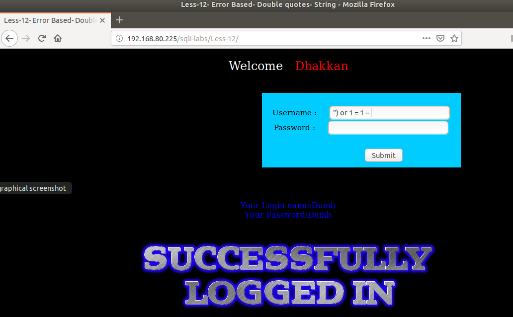
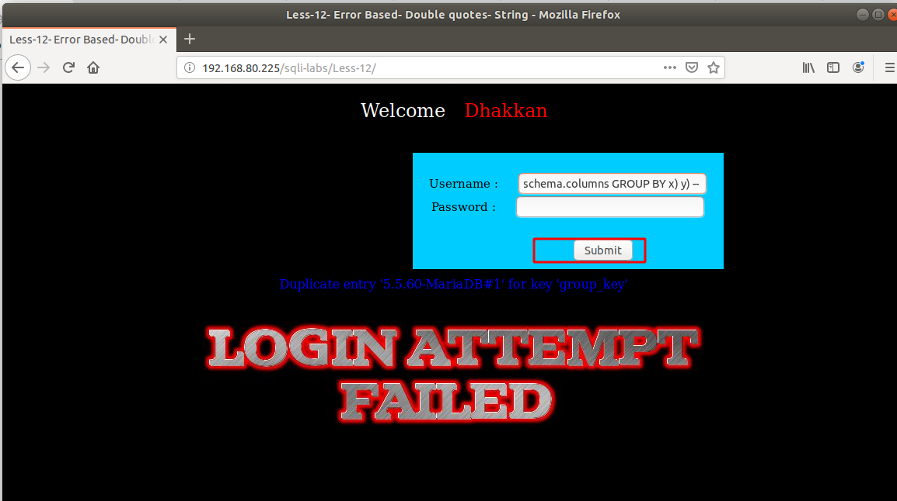

# Những việc làm được với lesson-12
Việc check xem nó là dạng DB gì thì làm giống như những lesson trước. 

Sau khi đăng nhập vào lesson-12



Ở bài này ta thấy khá là giống bài 11 ta hay thử nhập ký tự đặc biệt 



khi tôi nhập như thế này thì nó chỉ báo là `login failed`. Chứng tỏ là cấu trúc truy vấn chưa đúng. Ta tìm cấu trúc truy vấn của nó như các lesson đầu tiên chúng ta tìm vậy. Sau 1 thời gian tìm kiếm thì tôi thấy được cấu trúc truy vấn của nó 
```
") or 1 = 1 -- 
```



Tương tự như bài trước chúng ta sẽ có được cách thức tìm ra được cấu trúc cơ sở dữ liệu của nó 
```
")  and (SELECT 0 FROM (SELECT count(*), CONCAT((@@version), 0x23, FLOOR(RAND(0)*2)) AS x FROM information_schema.columns GROUP BY x) y) -- 
```



Đến đấy với cấu trúc sẵn và các câu truy vấn có thì ta sẽ làm tương tự bài 11 

