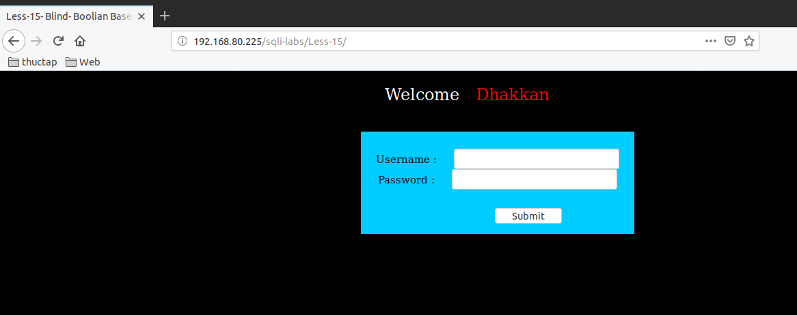
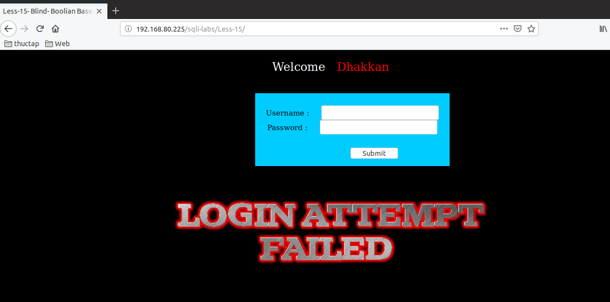
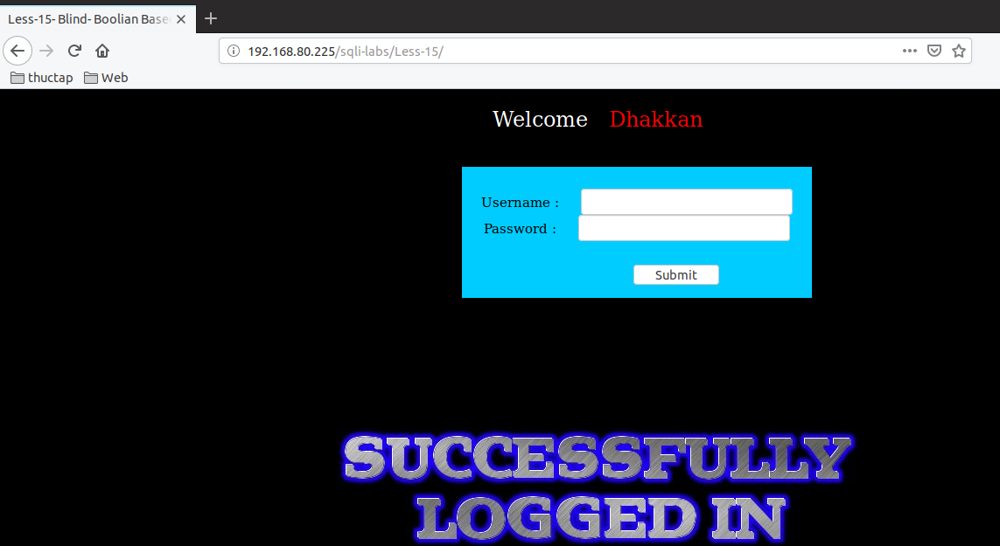
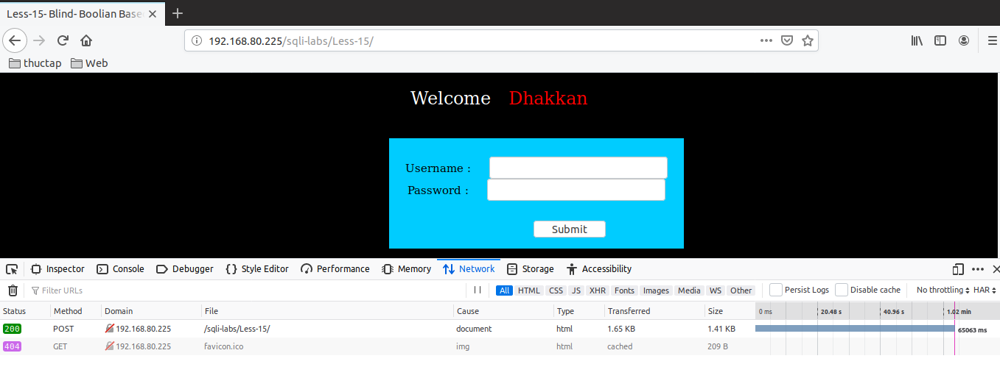
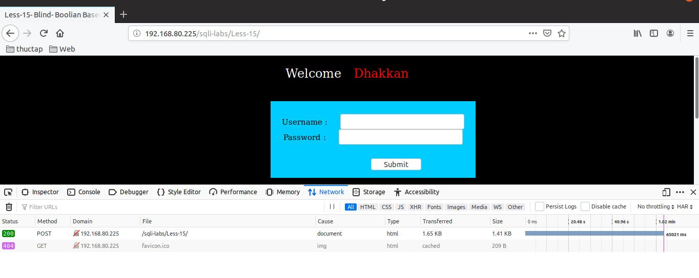

# Những việc làm được với lesson-15
Việc check xem nó là dạng DB gì thì làm giống như những lesson trước. Ta sẽ sử dụng command `nmap`

Sau khi đăng nhập vào lesson-15



Ở bài này chúng ta cũng phải đi tìm cấu trúc truy vấn của nó như các bài trước. Trong quá trình tìm cấu trúc tôi có phát hiện ra rằng bài này nó sẽ không bắn ra log để ta có thể lợi dụng nó để sử dụng error-base. Nó chỉ báo là không đăng nhập được chứ không chỉ ra lỗi sai 



Cấu trúc truy vấn của nó là 



với kiểu bài như thế này thì ta sẽ phải sử dụng time-base. 

1. Time-base với version 

```
' or if(substr((select @@version),1,1)='1',sleep(5),false) -- 
```



```
' or if(substr((select @@version),1,1)='1',sleep(5),false) -- 
```


Ta đã biết được DB sử dụng là gì thông qua việc kiểm tra ở đầu. Ta biết được đó là `MariaDB`. Thì ta thử nó với version 10 và version 5. Ta biết được version của nó là bản 5.5 ta sẽ đoán như sau 

```
' or if(substr((select @@version),1,3)='5.5',sleep(5),false) -- 
```
Ta tăng số ký tự kiểm tra từ 1 đến 3 thì sẽ kiểm tra tương ứng là 5.5 và kết quả là 



Cứ tương tự như thế ta có thể kiểm tra nó được với lại các thông tin như tên các DB và các bảng trong mỗi DB bằng cách này. Như vậy với cách này ta có thể tìm được thông tin của toàn bộ DB Nhưng có lẽ mất rất nhiều thời gian 