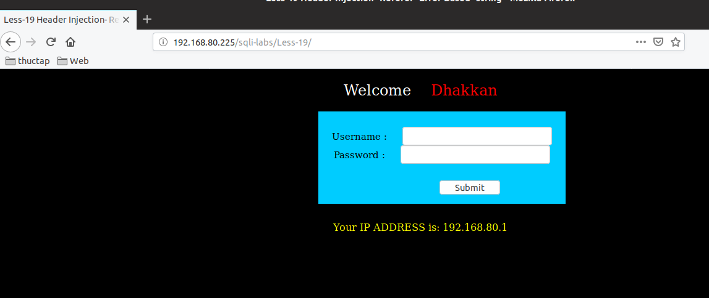
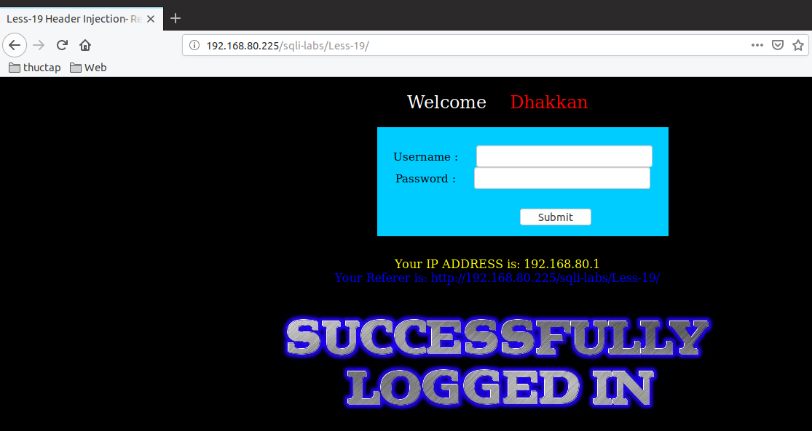
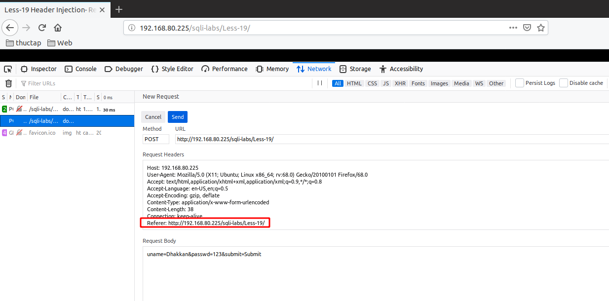
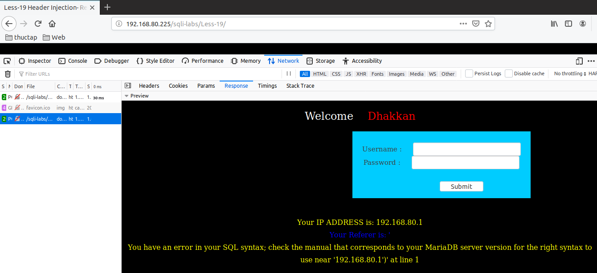
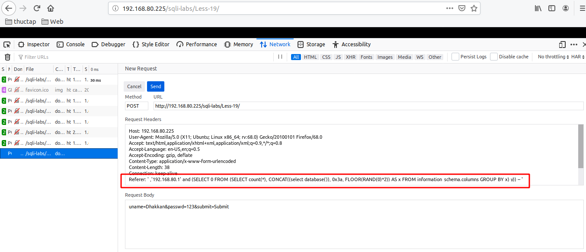
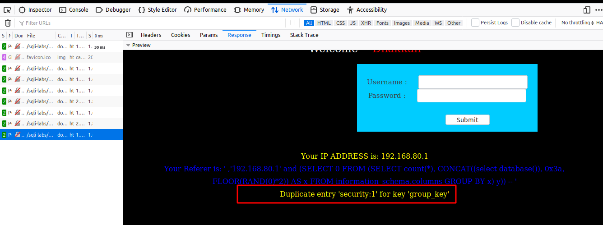

# Những việc làm được với lesson-19
Việc check xem nó là dạng DB gì thì làm giống như những lesson trước. Ta sẽ sử dụng command `nmap`

Sau khi đăng nhập vào lesson-19



Tương tự như lesson-18 thì ta đăng nhập thành công thì ta sẽ có kết quả như dưới 




Ta thấy rằng kết quả được trả về chính là giá trị `Referer` của header 



Ta làm giống như lesson 18 thì ta cũng thấy được error được trả về như sau khi thêm ký tự đặc biệt 



Ta để ý vào cách mà nó báo lỗi chỉ có thấy địa chỉ ip không giống như lesson-18 nữa. Ta phải bám vào đó để có thể biết được cấu trúc của nó. Và tôi đã tìm được cấu trúc của nó 

```
Referer: ' ,'192.168.80.1' and (SELECT 0 FROM (SELECT count(*), CONCAT((select database()), 0x3a, FLOOR(RAND(0)*2)) AS x FROM information_schema.columns GROUP BY x) y)) --  '
```





Ta thấy kết quả bắn ra thông tin DB. Tương tự như thế ta có thể show được toàn bộ thông tin của DB theo cách truy vấn trước đó ta đã làm