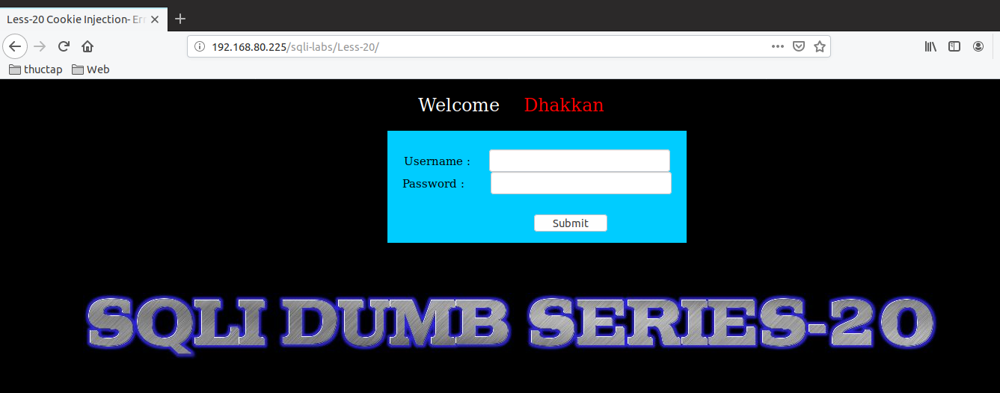
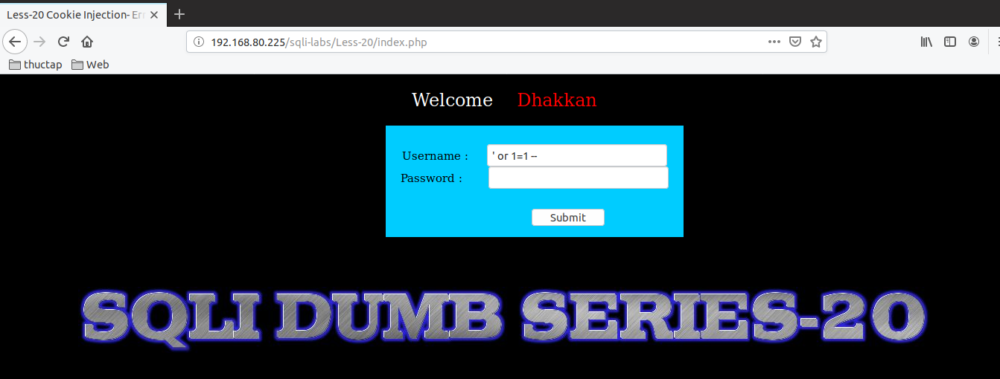
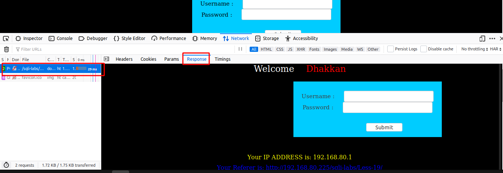
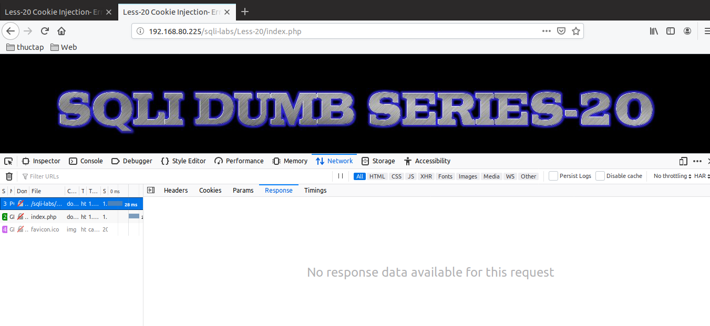
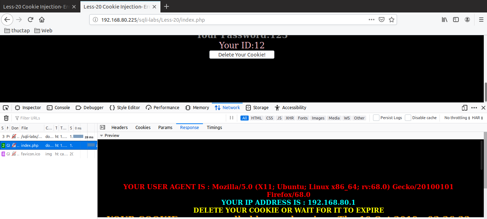
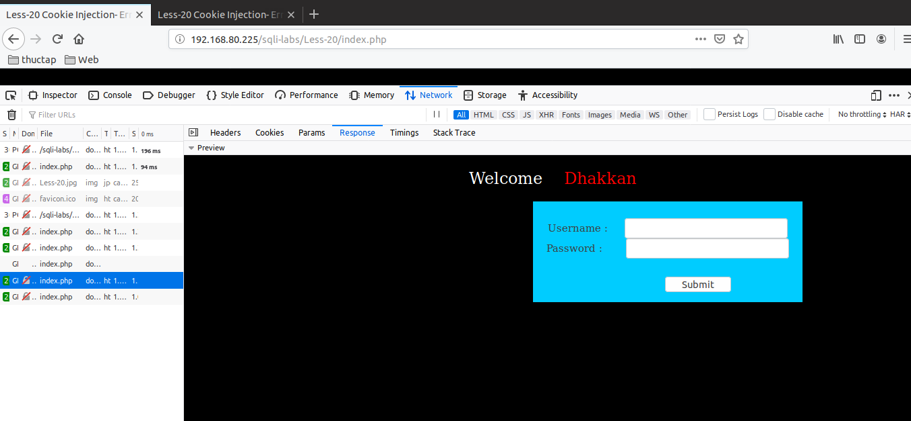
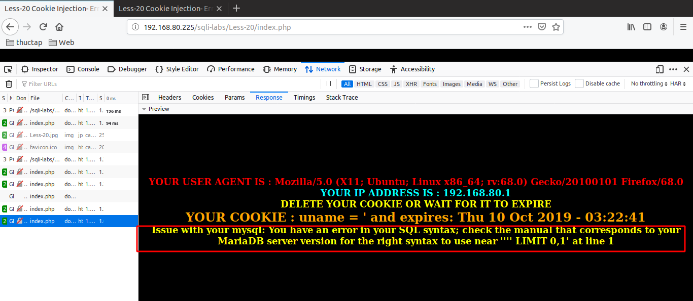
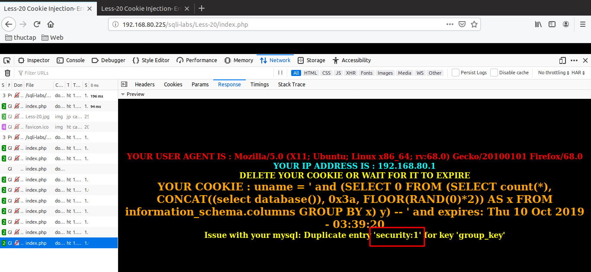
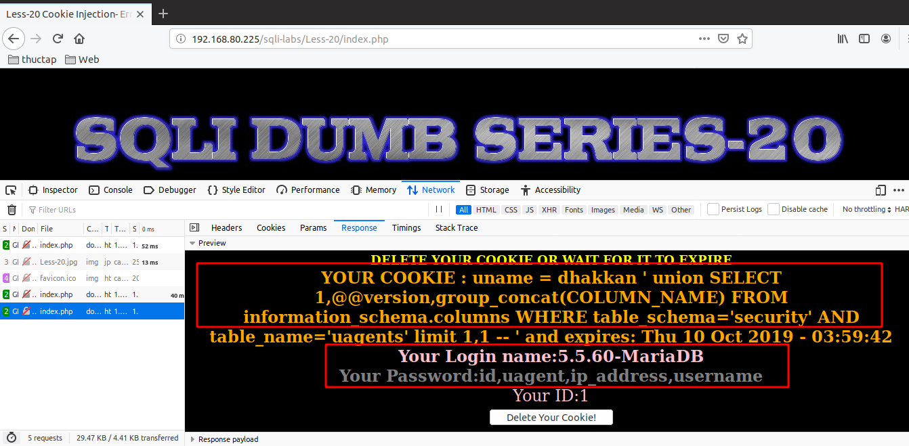
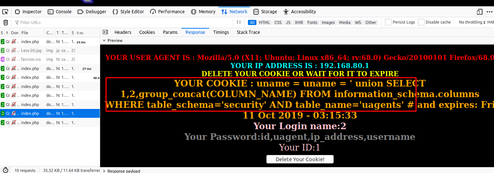

# Những việc làm được với lesson-20
Việc check xem nó là dạng DB gì thì làm giống như những lesson trước. Ta sẽ sử dụng command `nmap`

Sau khi đăng nhập vào lesson-20



Sau khi ta đăng nhập thì thử thế nào đi nữa các ký tự đặc biệt hay một vài cách các lesson trước cũng không qua được.



Và tôi thử đăng nhập bằng user và password như bài 18 và 19 


đọc dòng gợi ý thì bài này gợi ý có thể liên quan đến `cookie` và `user-agent`. Thế nên ta sẽ đi sửa 2 trường này của header xem sao. 



Như ở bài 19 thì chỉ có 2 gói tin một với method `POST` và một với `GET`. thì gói tin `POST` ở đây có `RESPONSE` nên ta có thể thay đổi header ở đây và nhận lại giá trị 

còn ở bài 20 thì ta thấy rằng có 3 gói tin 1 với `POST` và 2 với `GET`. Còn ở đây thì method `POST` không có ta phải thay ở `GET` thì ta mới nhận được giá trị trả về 





1. Kết quả của thay đổi trường trong header 
- Trường user-agent. ta không thấy gì xảy ra. Ta thay đổi giá trị của trường như bên dưới 
```
User-Agent: ' 
```




- Trường trong cookies. ta thấy có thông báo lỗi. Ta thay đổi trường thành như dưới đây 
```
Cookie: uname='
```



Sau nhiều lần thử thì cấu trúc của câu ta tìm được ra là 
```
uname = ' and (SELECT 0 FROM (SELECT count(*), CONCAT((select database()), 0x3a, FLOOR(RAND(0)*2)) AS x FROM information_schema.columns GROUP BY x) y) --  '
```



Ta tìm được kết quả với cách làm truy vấn tương tự các bài trước khi đã biết được cấu trúc 

Ta để ý rằng ở bài 20 khi đăng nhập thành công còn login còn hiển thị ra màn hình user và password của các user từ đây ta có thể sử dụng được union để check thông tin một cách nhanh hơn 

```
uname = Dhakkan  ' union SELECT 1,@@version,group_concat(COLUMN_NAME) FROM information_schema.columns WHERE table_schema='security' AND table_name='uagents' limit 1,1 -- ' 
```



```
uname = ' union SELECT 1,@@version,group_concat(COLUMN_NAME) FROM information_schema.columns WHERE table_schema='security' AND table_name='uagents' #
```



Ta có thể sử dụng cách union này như các bài đầu để có thể truy xuất được dữ liệu nhanh hơn. vì ta có thể in nhiều dữ liệu ra cùng một lúc 

