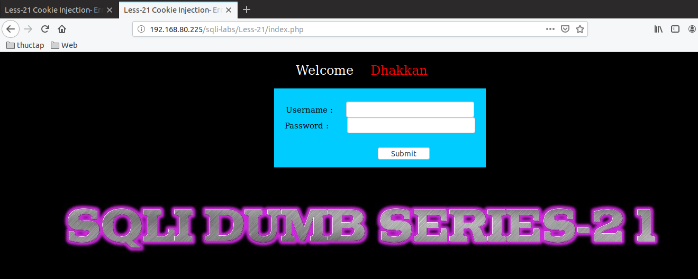
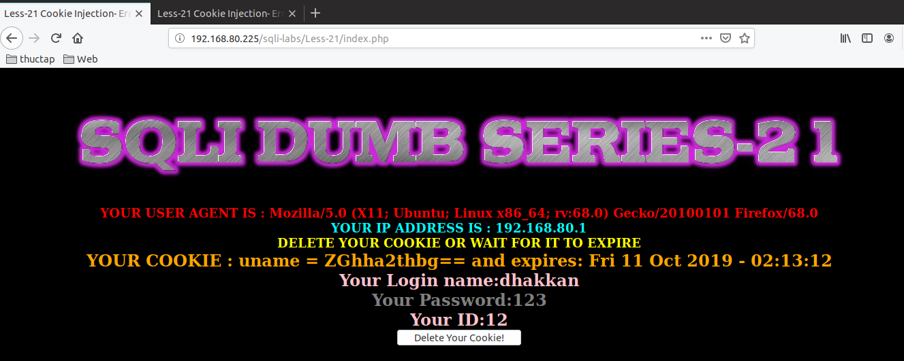
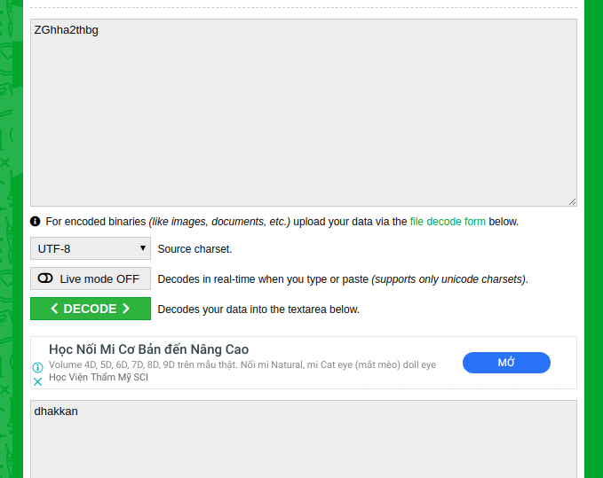
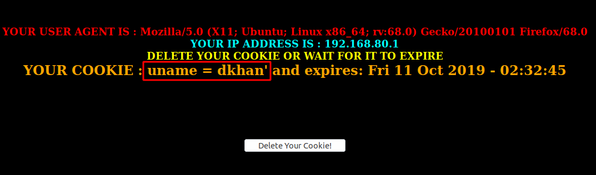
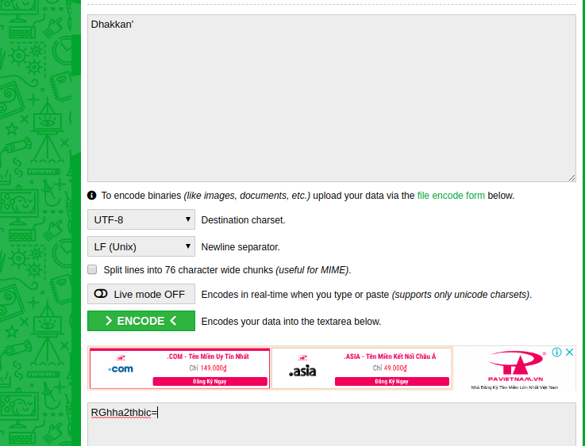
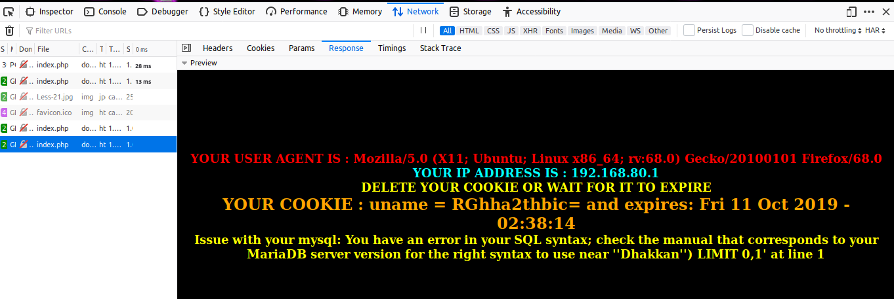
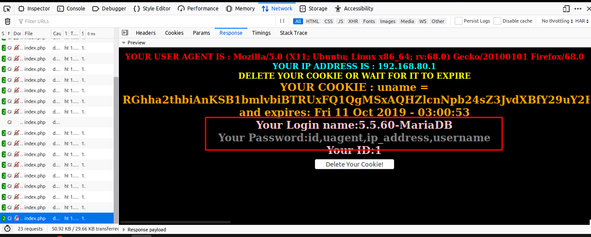

# Những việc làm được với lesson-21
Việc check xem nó là dạng DB gì thì làm giống như những lesson trước. Ta sẽ sử dụng command `nmap`

Sau khi đăng nhập vào lesson-21



Thấy bài 11 như vậy tôi thử login như 2 bài trước và được kết quả như sau 



Ta kiểm tra header và ở đây ta thấy rằng `uname` ở phần `cookie` là một chuỗi ký tự không liên quan đến nhau. Tôi đoán nó đã được encode. Ta sẽ decode nó ra để xem được gì nhé 



Sau khi decode thì ta đã được như sau. Đây là thông tin của user mà ta đã đăng  nhập vào. Ta để ý ở đây thấy rằng có hiển thị user và password ở 2 dòng `Your Login name` và `Your Password` nên vì vậy ta có thể dùng được select và union như bài trước. 

Tôi sửa `cookie` và bắt đầu truyền đi với user và ký tự đặc biệt Nhưng kết qủa là không có gì xảy ra cả 

 

Có lẽ chúng ta sẽ phải encode nó như khi chúng ta đăng nhập vừa xong. Ta sẽ encode user cùng với ký tự đặc biệt 

 

Và ta đã nhận được kết quả đáng mong đợi. Nó đã có tác dụng và đã có thông báo lỗi. Dựa vào thông báo lỗi này ta sẽ đi tìm cấu trúc của bài này tại cookie 

 

1. Cấu trúc truy vấn 
- Ta tìm cấu trúc truy vấn và rồi encode qua ta sẽ thu được cấu trúc dữ liệu như dưới đây cầu có user ở đầu 
```
Dhakkan ') union SELECT 1,@@version,group_concat(COLUMN_NAME) FROM information_schema.columns WHERE table_schema='security' AND table_name='uagents' LIMIT 1,1 -- '
```

```
RGhha2thbiAnKSB1bmlvbiBTRUxFQ1QgMSxAQHZlcnNpb24sZ3JvdXBfY29uY2F0KENPTFVNTl9OQU1FKSBGUk9NIGluZm9ybWF0aW9uX3NjaGVtYS5jb2x1bW5zIFdIRVJFIHRhYmxlX3NjaGVtYT0nc2VjdXJpdHknIEFORCB0YWJsZV9uYW1lPSd1YWdlbnRzJyBMSU1JVCAxLDEgLS0gJw==
```

 

Ta có được kết quả như dưới đây ta có thể dùng union truy vấn đến những dữ liệu mà ta mong muốn có được ở trong DB này bằng các câu lệnh truy vấn như những bài trước mà ta đã làm 