# Những việc làm được với lesson-24
Việc check xem nó là dạng DB gì thì làm giống như những lesson trước. Ta sẽ sử dụng command `nmap`

Sau khi đăng nhập vào lesson-24

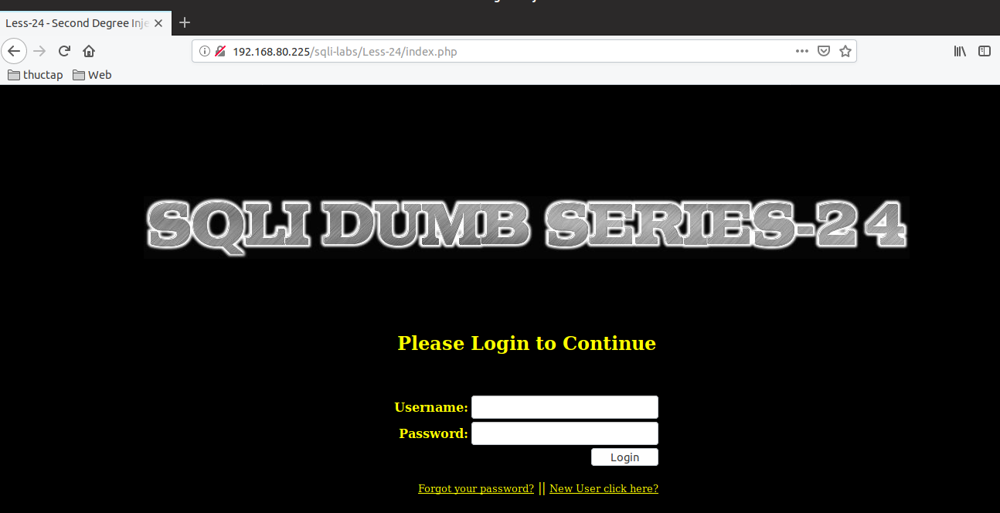

1. Thử một số trường hợp 
- Ta thử cho trường hợp luôn đúng và kết quả vẫn không được. Và đương nhiên ta không thể pass qua được vì không có user và password 

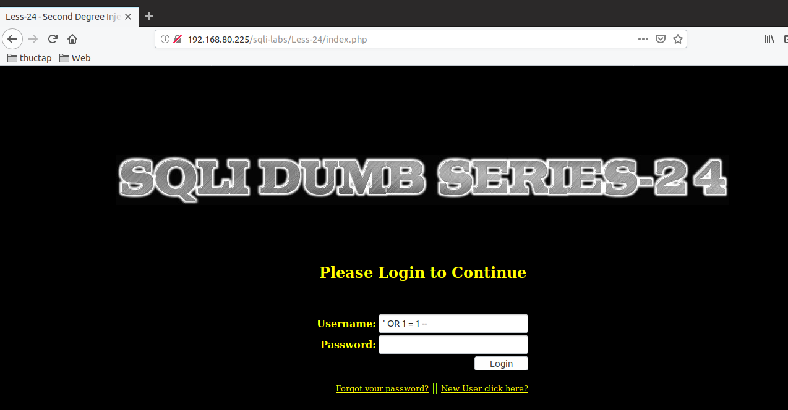

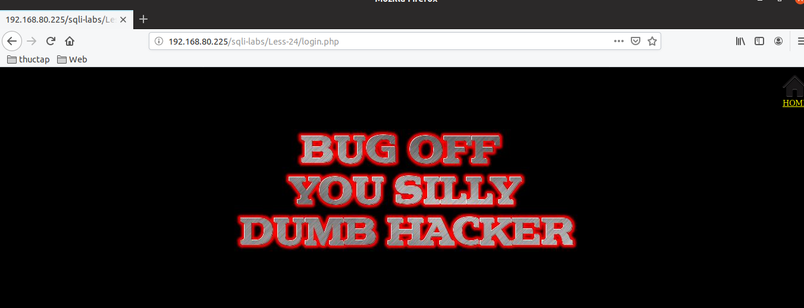

- Ta thấy có 2 mục là quên password và tạo ra tài khoản mới. Thấy rằng chỉ có thể tạo ra user mới và tôi đã tạo ra một user 

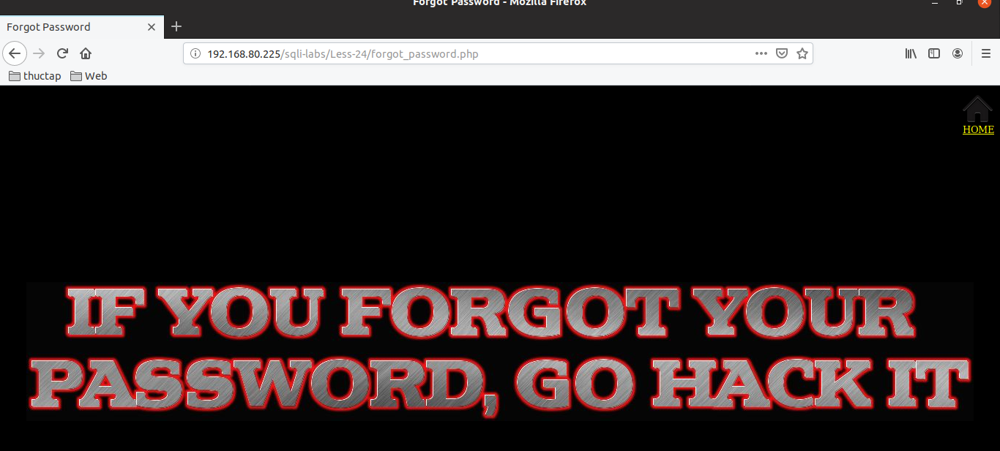

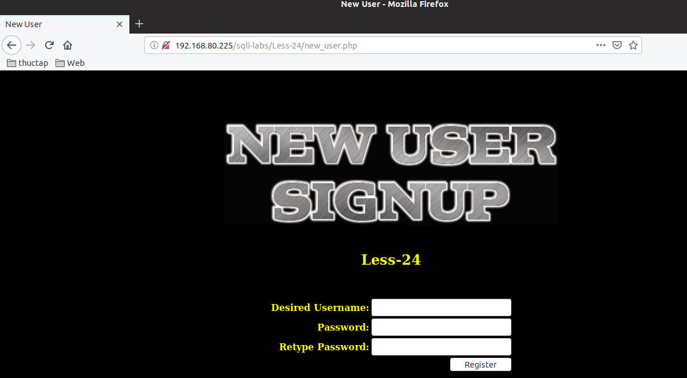

```
user: ducna
pass: 123
```
- Sau đó tôi đã có thể vào được bên trong rồi 

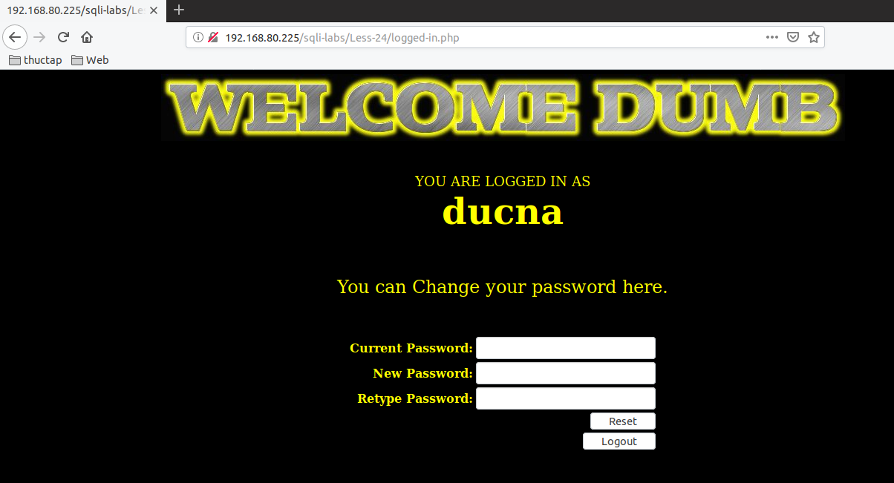


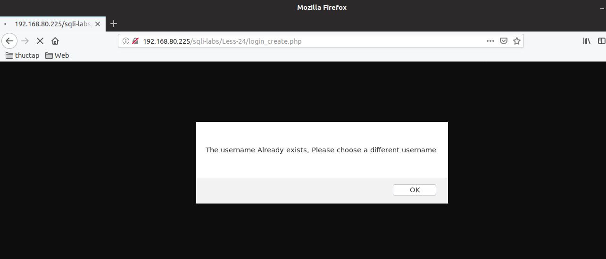

Ta không thể đăng nhập được user mà đa tồn tại sẵn. Vậy làm sao để có thể  đăng nhập được với user như thế. Chúng ta hãy xem câu truy vấn của phần thay đổi user password nhé 

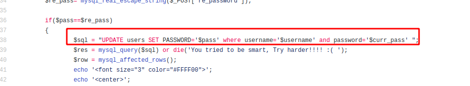

Hãy nhìn vào code của nó ta thấy rằng đây là code trong mục ta thấy được câu lệnh truy vấn của nó 

```
UPDATE users SET PASSWORD='$pass' where username='$username' and password='$curr_pass'
```

Bây giờ chúng ta lợi dụng sửa lại nó để có thể pass qua được để thay đổi user admin 
```
UPDATE users SET PASSWORD='123' where username='admin' -- ' and password='$curr_pass'
```
Tác dụng của dấu -- là bỏ các ký tự đằng sau câu update này 

với câu lệnh như thế ta tạo thêm user có tên là `admin' --` thì câu lệnh sẽ là thay đổi user admin mà ko cần biết password cũ của user này 

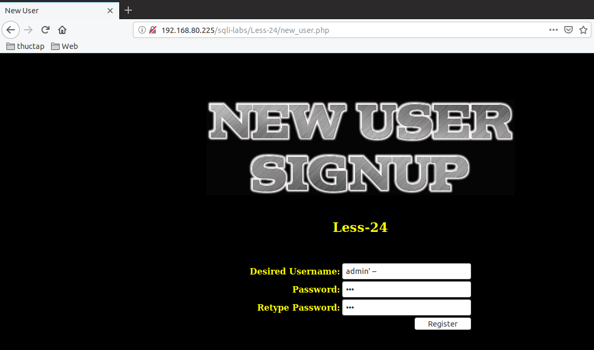

Tôi tạo ra user có pass là `anhduc` và vào đổi mật khẩu thành  `duc` và nó sẽ không thay đổi mật khẩu mà sẽ thay đổi mật khẩu của user `admin` do các chuỗi ký tự mà tôi đã viết đằng sau user `admin' --` 

- Đổi tên user mà không cần pass cũ  

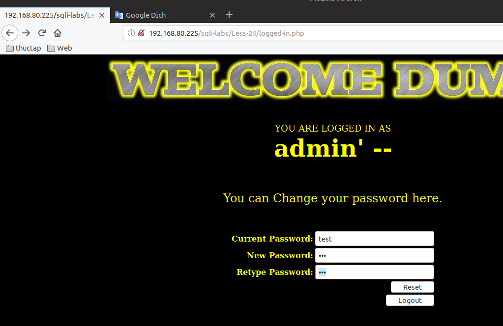

- vẫn thay đổi thành công. Nhưng là thay đổi thành công user admin

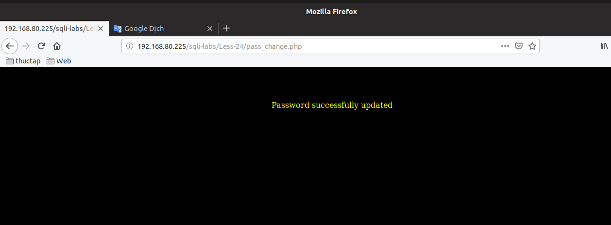

- login với user admin bằng mật khẩu thay đổi cho user `admin' --`

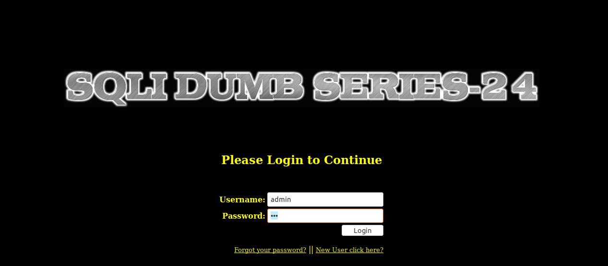

- Kết quả thành công 

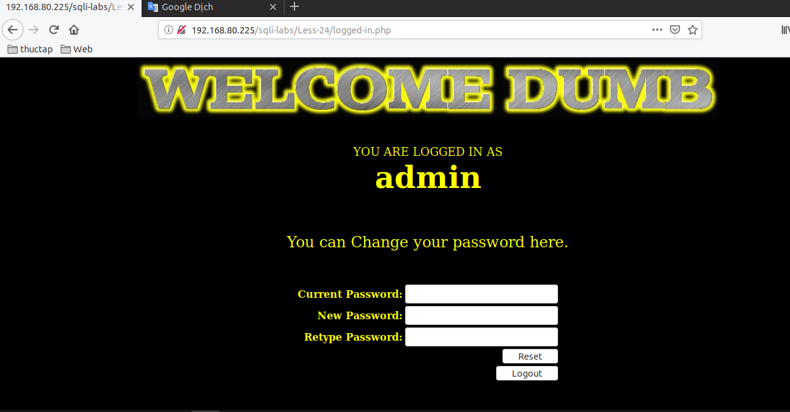

- Login user `admin' --` với mật khẩu mới 

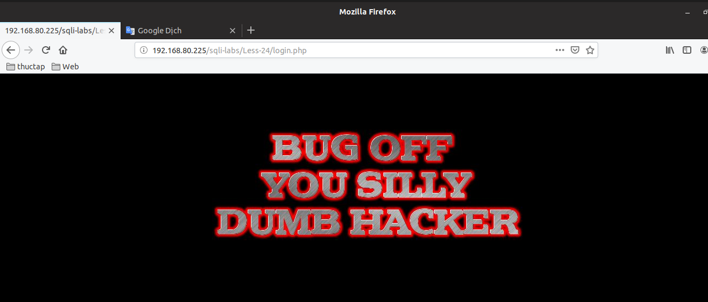

không thành công vì nó không thể đổi được pass với các ký tự đặc biệt đằng sau như thế  khi đưa vào lệnh update sẽ bị biến thành ký tự trong câu lệnh 

Ta cũng có thể làm được như thế với user có tên là `admin' #` 

